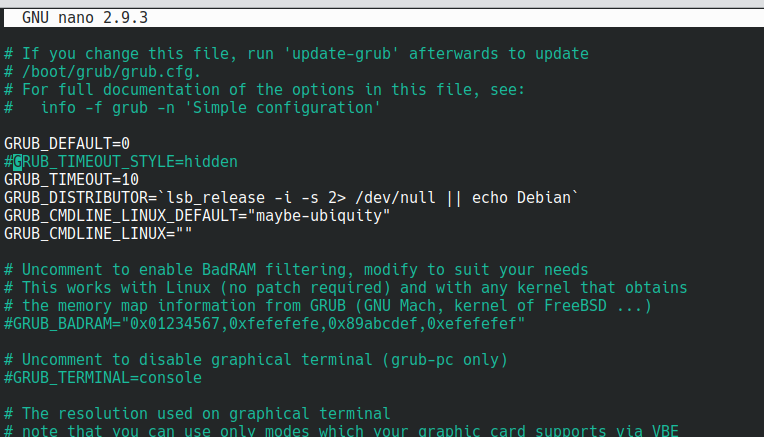
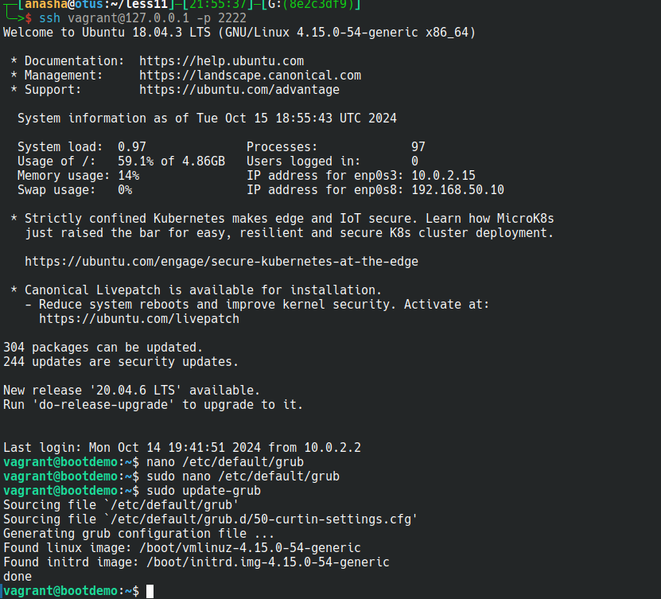
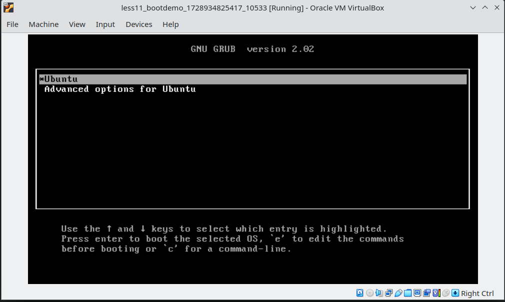
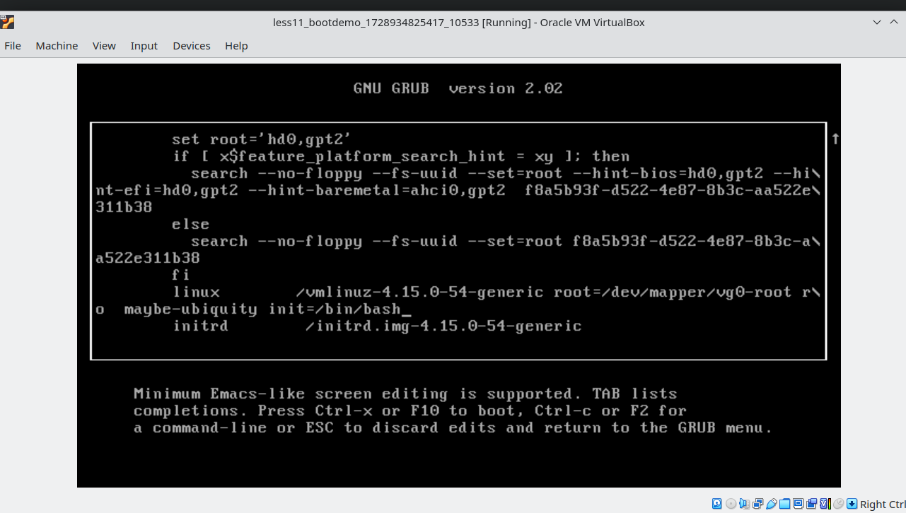
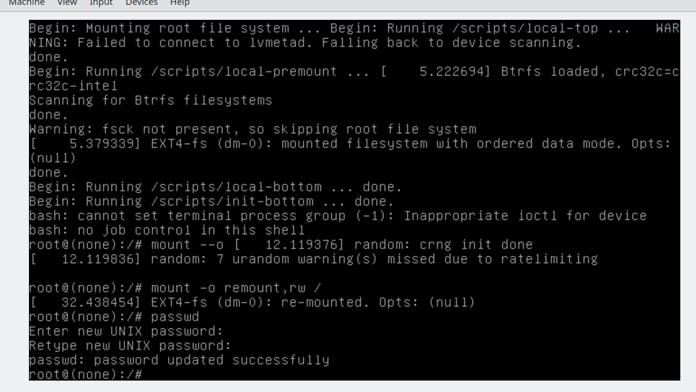
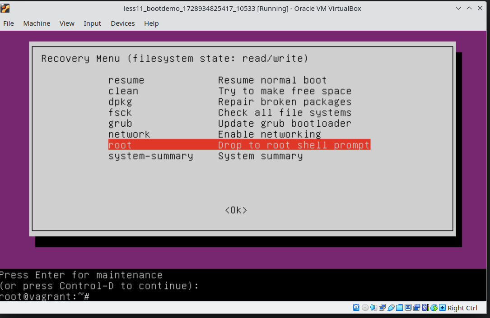
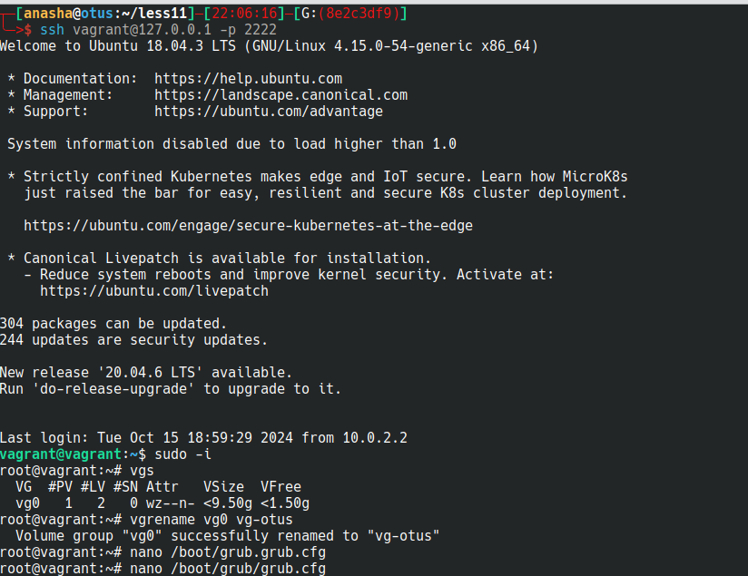
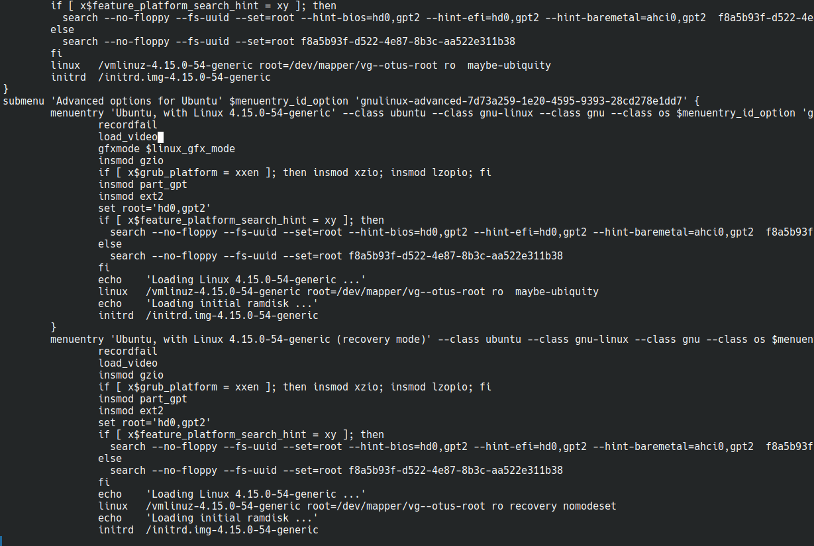
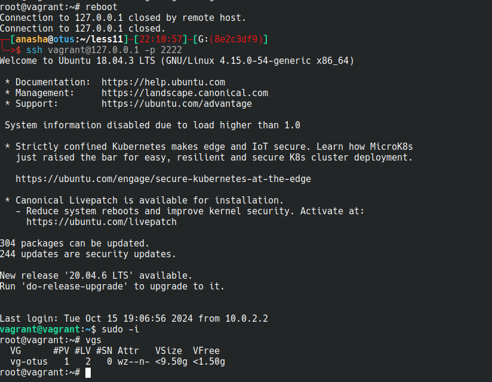

# Administrator Linux. Professional

## Урок 11. Домашнее задание

Работа с загрузчиком

### Описание домашнего задания

- Включить отображение меню Grub.
- Попасть в систему без пароля несколькими способами.
- Установить систему с LVM, после чего переименовать VG.


### Выполнение

#### Установка и настройка среды выполнения

Подготовим [Vagrant](https://github.com/anashoff/otus/blob/master/lesson11/Vagrantfile)

```ruby
# -*- mode: ruby -*-
# vi: set ft=ruby :

Vagrant.configure(2) do |config|
  config.vm.box = "dkd/ubuntu-1804-lvm"

  config.vm.provider "virtualbox" do |v|
    v.memory = 1024
    v.cpus = 1
  end

  ssh_pub_key = File.readlines("#{Dir.home}/.ssh/id_ed25519.pub").first.strip

  config.vm.define "bootdemo" do |bootdemo|
    bootdemo.vm.network "private_network", ip: "192.168.50.10", virtualbox__intnet: "net1"
    bootdemo.vm.hostname = "bootdemo"
    bootdemo.vm.provision 'shell', inline: 'mkdir -p /root/.ssh'
    bootdemo.vm.provision 'shell', inline: "echo #{ssh_pub_key} >> /root/.ssh/authorized_keys"
    bootdemo.vm.provision 'shell', inline: "echo #{ssh_pub_key} >> /home/vagrant/.ssh/authorized_keys", privileged: false

  end

end
```

Создаем ВМ

```anasha@otus:~/less11$ vagrant up```

### Включить отображение меню Grub.

Заходим на ВМ, выполняем

```vagrant@bootdemo:~$ sudo nano /etc/default/grub```

И редактируем 



Сохраняем файл, выходим из редактора и обновляем конфтгурацию загрузчика



Перезагружаем ВМ.
В окне VirtualBox видим меню загрузчика



### Попасть в систему без пароля несколькими способами

1 способ. Нажимаем 'E' и в окне в конец строки, начинаюшейся с linux дописываем init=/bin/bash. 



Нажимаем CTRL-X и попадаем в систему.

Для изменения переводим файловую систему в режим r/w и меняем пароль командой passwd



2 способ. 

При загрузке машины выбираем меню Advanced options for Ubuntu. Попадаем в Recovery menu.

Выбираем сначала network для монтирования файловой системы в режиме r/w, затем root.

Попадаем в консоль.



### Установить систему с LVM, после чего переименовать VG.

После загрузкм ВМ входим в консоль, смотрим название Volume Group - vg0



Редактируем /boot/grub/grub.cfg - меняем встречающиеся vg0-root на vg--otus-root



Потом перезагружаемся и проверяем новое название



Задание выполнено

Все файлы работы, использованные в задании, доступны на [github](https://github.com/anashoff/otus/blob/master/lesson11)
