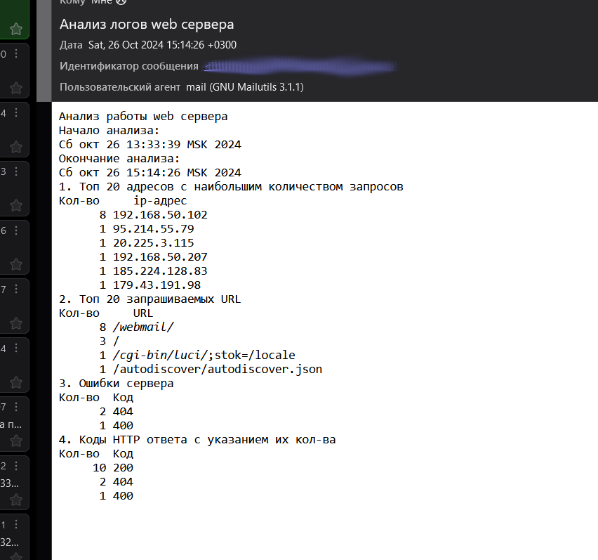

# Administrator Linux. Professional

## Урок 13. Домашнее задание

Написать скрипт на языке Bash

### Описание домашнего задания

Написать скрипт для CRON, который раз в час будет формировать письмо и отправлять на заданную почту.

Необходимая информация в письме:

- Список IP адресов (с наибольшим кол-вом запросов) с указанием кол-ва запросов c момента последнего запуска скрипта;
- Список запрашиваемых URL (с наибольшим кол-вом запросов) с указанием кол-ва запросов c момента последнего запуска скрипта;
- Ошибки веб-сервера/приложения c момента последнего запуска;
- Список всех кодов HTTP ответа с указанием их кол-ва с момента последнего запуска скрипта.

Скрипт должен предотвращать одновременный запуск нескольких копий, до его завершения.
В письме должен быть прописан обрабатываемый временной диапазон.

### Выполнение

#### Описание работы скрипта

Скрипт будет состоять из нескольких функциональных частей. В качестве параметра на вход подается имя файла лога.

Сначала скрипт проверяет не запущен ли он. Это делается проверкой на наличие временного файла-триггера **trigger**, котрый создается в начале работы основной части скрипта, удаляется после окончания работы основной части скритпа.

```bash
ls trigger
if [ $? -eq 2 ]
then
touch trigger
echo запуск...
#Основная часть скрипта
...
rm -f trigger
else
   echo занято
fi
```

Основная часть начинается с определения записей лога, созданных после времени последней проверки.

Создадим воспомогательную функцию, которая будет преобразовывать текстовый формат времени в заданной строке лога в unix-время. На вход функции подается номер строки в файле лога.

```bash
function dateval(){
text=$(awk -v x=$1 '{gsub(/[\[/]/," ",$4); sub(/:/," ",$4);if (NR==x)  print $4}' $logfile)
date --date="$text" +%s
}
```

В качестве значения для сравнения берем запомненное в файле **last.tmp** в прошлом сеансе значение unix-времени последней обработанной строки, либо 0, если это первый запуск скрипта. В этом случае будут выбраны все строки из файла лога.

```bash

logfile=$1
lasttime=0
lasttime=$(cat last.tmp)
i=$(wc -l <$1)
j=0
while [ $(dateval $i) -gt $lasttime ] && [ $i -ge 0 ]
do
  ((i--))
  ((j++))
done

```

Здесь:

- lasttime - время в unix последней обработанной строки в предыдущем сеансе;
- i - счетчик цикла
- j - указатель на номер строки

Цикл обрабатывает строки с конца лога, так как если файл лога большой, просмотр всего файла с начала займет довольно много времени.

После определения номера строки в файле лога, где начинаются новые необработанные в предыдущем сеансе записи из всего файла копируются во временный файл новые записи.

```bash
tail -n $j $1 >access.tmp
```

Затем создаем файл отчета **result** для отправки по почте

```bash
echo "Анализ работы web сервера" >result
```

Фиксируем время начала и конеца записей лога

```bash
echo "Начало анализа:" >>result
date --date @$lasttime >>result
echo "Окончание анализа:" >>result
date >>result
```

Определяем топ-20 ip адресов с наибольшим количеством запросов

```bash
echo "1. Топ 20 адресов с наибольшим количеством запросов" >> result
echo "Кол-во     ip-адрес" >>result
awk '{print $1}' access.tmp | grep -P '^((25[0-5]|(2[0-4]|1\d|[1-9]|)\d)(\.(?!$)|$)){4}$' | sort | uniq -c | sort -n -r | sed 20q >>result
```

Регулярное выражение определения ip адреса ``` '^((25[0-5]|(2[0-4]|1\d|[1-9]|)\d)(\.(?!$)|$)){4}$' ``` подсмотрено в интернете.

Определяем топ 20 запрашиваемых URL

```bash
echo "2. Топ 20 запрашиваемых URL" >> result
echo "Кол-во     URL" >>result
awk '{print $7}' access.tmp | grep -v '\*' | sed -e 's/\?[^\?]*$//' | sort | uniq -c | sort -n -r | sed 20q >>result
```

Определяем ошибки сервера

```bash
echo "3. Ошибки сервера" >>result
echo "Кол-во  Код " >>result
awk '{print $9}' access.tmp | grep -P "(4|5)[0-9]{2}" | sort | uniq -c | sort -n -r >> result
```

Определяем коды ответа и их количество

```bash
echo "4. Коды HTTP ответа с указанием их кол-ва" >>result
echo "Кол-во  Код" >>result
awk '{print $9}' access.tmp | grep -P "[0-9]{3}" | sort | uniq -c | sort -n -r >>result
```

Сохраняем отметку unix-времени последней записи в файл **last.tmp**. Он понадобится при следующем запуске.

```bash
dateval $(wc -l <$1) > last.tmp 
```

Отправляем результат по почте. Нужно указать адрес электронной почты

```bash
cat result | mail -s "Анализ логов web сервера" a******@t*****p.ru
```

Удаляем временные файлы

```bash
rm -f access.tmp
rm -f result
```

Полный текст скрипта

```bash
#!/bin/bash
function dateval(){
text=$(awk -v x=$1 '{gsub(/[\[/]/," ",$4); sub(/:/," ",$4);if (NR==x)  print $4}' $logfile)
date --date="$text" +%s
}
ls trigger
if [ $? -eq 2 ]
then
touch trigger 
echo запуск...
logfile=$1
lasttime=0
lasttime=$(cat last.tmp)
i=$(wc -l <$1)
j=0
while [ $(dateval $i) -gt $lasttime ] && [ $i -ge 0 ]
do
  ((i--))
  ((j++))
done
tail -n $j $1 >access.tmp
echo "Анализ работы web сервера" >result
echo "Начало анализа:" >>result
date --date @$lasttime >>result
echo "Окончание анализа:" >>result
date >>result
echo "1. Топ 20 адресов с наибольшим количеством запросов" >> result
echo "Кол-во     ip-адрес" >>result
awk '{print $1}' access.tmp | grep -P '^((25[0-5]|(2[0-4]|1\d|[1-9]|)\d)(\.(?!$)|$)){4}$' | sort | uniq -c | sort -n -r | sed 20q >>result
echo "2. Топ 20 запрашиваемых URL" >> result
echo "Кол-во     URL" >>result
awk '{print $7}' access.tmp | grep -v '\*' | sed -e 's/\?[^\?]*$//' | sort | uniq -c | sort -n -r | sed 20q >>result
echo "3. Ошибки сервера" >>result
echo "Кол-во  Код " >>result
awk '{print $9}' access.tmp | grep -P "(4|5)[0-9]{2}" | sort | uniq -c | sort -n -r >> result
echo "4. Коды HTTP ответа с указанием их кол-ва" >>result
echo "Кол-во  Код" >>result
awk '{print $9}' access.tmp | grep -P "[0-9]{3}" | sort | uniq -c | sort -n -r >>result
dateval $(wc -l <$1) > last.tmp 
echo выполнено.
cat result | mail -s "Анализ логов web сервера" a******@t*****p.ru
rm -f access.tmp
rm -f result
rm -f trigger
else
   echo занято
fi
```

На сервере, где будет исполняться скрипт создаем в */etc/cron.d* файл.

В нем настраиваем запуск каждый час.

```bash
0 * * * *     root    /путь_к_скрипту/имя_скрипта /полное_имя_лог_файла
```

Например в моем случае (домен скрыт)

```bash
0 * * * *   root   /home/anatoly/script.sh /var/log/apache2/domains/m**********p.ru.log
```

Перезапускаем cron

```bash
systemctl restart cron
```

Ждем результата выполнения скрипта на почте (пример скриншот из Thunderbird).



[Ссылка на скрипт](https://github.com/anashoff/otus/blob/master/lesson13/script.sh)

Все файлы работы, использованные в задании, доступны на [github](https://github.com/anashoff/otus/blob/master/lesson13)
