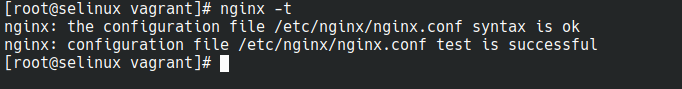
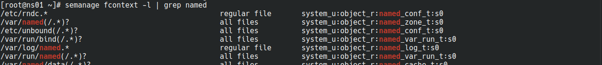

# Administrator Linux. Professional

## Урок 18. Домашнее задание

Практика с SELinux

### Описание домашнего задания

1. Запустить nginx на нестандартном порту 3-мя разными способами

- переключатели setsebool
- добавление нестандартного порта в имеющийся тип
- формирование и установка модуля SELinux

2.Обеспечить работоспособность приложения при включенном selinux.

- развернуть приложенный стенд
- выяснить причину неработоспособности механизма обновления зоны
- предложить решение (или решения) для данной проблемы
- выбрать одно из решений для реализации, предварительно обосновав выбор
- реализовать выбранное решение и продемонстрировать его работоспособность

### Запустить nginx на нестандартном порту 3-мя разными способами

#### Установка и настройка среды выполнения

Подготовим [Vagrant](https://github.com/anashoff/otus/blob/master/lesson18/Vagrantfile)

```ruby
# -*- mode: ruby -*-
# vim: set ft=ruby :
MACHINES = {
  :selinux => {
        :box_name => "centos/7",
        :box_version => "2004.01",
        #:provision => "test.sh",       
  },
}
Vagrant.configure("2") do |config|
  MACHINES.each do |boxname, boxconfig|
      config.vm.define boxname do |box|
        box.vm.box = boxconfig[:box_name]
        box.vm.box_version = boxconfig[:box_version]
        box.vm.host_name = "selinux"
        box.vm.network "forwarded_port", guest: 4881, host: 4881
        box.vm.provider :virtualbox do |vb|
              vb.customize ["modifyvm", :id, "--memory", "1024"]
              needsController = false
        end
        box.vm.provision "shell", inline: <<-SHELL
         #для корректной работы yum меняем адреса репозиториев на рабочие
         sed -i s/mirror.centos.org/vault.centos.org/g /etc/yum.repos.d/*.repo
         sed -i s/^#.*baseurl=http/baseurl=http/g /etc/yum.repos.d/*.repo
         sed -i s/^mirrorlist=http/#mirrorlist=http/g /etc/yum.repos.d/*.repo
          #install epel-release
          yum install -y epel-release
          #install nginx
          yum install -y nginx
          #change nginx port
          sed -ie 's/:80/:4881/g' /etc/nginx/nginx.conf
          sed -i 's/listen       80;/listen       4881;/' /etc/nginx/nginx.conf
          #disable SELinux
          #setenforce 0
          #start nginx
          systemctl start nginx
          systemctl status nginx
          #check nginx port
          ss -tlpn | grep 4881
        SHELL
    end
  end
end
```

Создаем ВМ

```anasha@otus:~/less18$ vagrant up```

В процессе видим ошибку при попытке запуска nginx


Доступ к порту 4881 запрещен:

```selinux: Nov 09 08:10:15 selinux nginx[2808]: nginx: [emerg] bind() to 0.0.0.0:4881 failed (13: Permission denied)```

Заходим на ВМ и проверяем:

##### Файрвол


Файрвол отключен

##### Конфигурацию nginx



Ошибок нет

##### Режим работы SELinux


Режим Enforcing

#### Разрешим в SELinux работу nginx на порту TCP 4881 c помощью переключателей setsebool

Устанавливаем инструменты для SELinux

```[root@selinux vagrant]# yum install -y setroubleshoot-server selinux-policy-mls setools-console policycoreutils-newrole```

Находим в логах (/var/log/audit/audit.log) информацию о блокировании порта


Запускаем утилиту audit2why


Утилита пердлагает поменять параметр **nis_enabled**

Включим параметр nis_enabled, проверим его статус и перезапустим nginx


Зайдем на **127.0.0.1:4881**


Nginx работает

Отключим nis_enabled

```setsebool -P nis_enabled off```

Перезапустим nginx


Nginx не работает

#### Разрешим в SELinux работу nginx на порту TCP 4881 c помощью добавления нестандартного порта в имеющийся тип

Посмотрим какие потры для http у нас открыты в SELinux


Добавим разрешение на порт 4881 для типа http_port_t, проверим результат и перезапустим nginx


Nginx работает

уберем разрешение для 4881 порта и перезапустим nginx


Nginx не работает

#### Разрешим в SELinux работу nginx на порту TCP 4881 c помощью формирования и установки модуля SELinux

Воспользуемся утилитой **audit2allow**, чтобы на основе логов SELinux сделать модуль, разрешающий работу nginx на нестандартном порту

```grep nginx /var/log/audit/audit.log | audit2allow -M nginx```

Затем выполним команду, которую предлагает утилита

```semodule -i nginx.pp```

И запустим nginx


Nginx работает

Удалим модуль

```semodule -r nginx```

И попробуем перезапустить nginx


Nginx не работает

### Обеспечить работоспособность приложения при включенном selinux

#### Установка и настройка среды выполнения

Скачиваем Vagrantfile и плейбук Ansible по ссылке

<https://github.com/mbfx/otus-linux-adm/tree/master/selinux_dns_problems>

разворачиваем стенд.

А он не разворачивается, так как:


и при попытке установить что-то из репозитория ansible ругается


фиксим эту багу, добавив в [playbook.yaml](https://github.com/anashoff/otus/blob/master/lesson18/provisioning/playbook.yml) первой задачей в блоке **tasks**

```yaml
  - name: correct yum packages pathes for old CentOS 7
      shell: "sed -i s/mirror.centos.org/vault.centos.org/g /etc/yum.repos.d/*.repo &&  sed -i s/^#.*baseurl=http/baseurl=http/g /etc/yum.repos.d/*.repo &&  sed -i s/^mirrorlist=http/#mirrorlist=http/g /etc/yum.repos.d/*.repo"
```

После чего разворачиваем стенд

```vagrant up```

```zsh
┬─[anasha@otus:~/less18_2]─[13:26:21]
╰─o$ vagrant up
Bringing machine 'ns01' up with 'virtualbox' provider...
Bringing machine 'client' up with 'virtualbox' provider...
==> ns01: Importing base box 'centos/7'...
==> ns01: Matching MAC address for NAT networking...
==> ns01: Checking if box 'centos/7' version '2004.01' is up to date...
==> ns01: Setting the name of the VM: less18_2_ns01_1731147992762_73072
==> ns01: Clearing any previously set network interfaces...
==> ns01: Preparing network interfaces based on configuration...
    ns01: Adapter 1: nat
    ns01: Adapter 2: intnet
==> ns01: Forwarding ports...
    ns01: 22 (guest) => 2222 (host) (adapter 1)
==> ns01: Running 'pre-boot' VM customizations...
==> ns01: Booting VM...
==> ns01: Waiting for machine to boot. This may take a few minutes...
    ns01: SSH address: 127.0.0.1:2222
    ns01: SSH username: vagrant
    ns01: SSH auth method: private key
    ns01: 
    ns01: Vagrant insecure key detected. Vagrant will automatically replace
    ns01: this with a newly generated keypair for better security.
    ns01: 
    ns01: Inserting generated public key within guest...
    ns01: Removing insecure key from the guest if it's present...
    ns01: Key inserted! Disconnecting and reconnecting using new SSH key...
==> ns01: Machine booted and ready!
==> ns01: Checking for guest additions in VM...
    ns01: No guest additions were detected on the base box for this VM! Guest
    ns01: additions are required for forwarded ports, shared folders, host only
    ns01: networking, and more. If SSH fails on this machine, please install
    ns01: the guest additions and repackage the box to continue.
    ns01: 
    ns01: This is not an error message; everything may continue to work properly,
    ns01: in which case you may ignore this message.
==> ns01: Setting hostname...
==> ns01: Configuring and enabling network interfaces...
==> ns01: Rsyncing folder: /home/anasha/less18_2/ => /vagrant
==> ns01: Running provisioner: ansible...
Vagrant gathered an unknown Ansible version:


and falls back on the compatibility mode '1.8'.

Alternatively, the compatibility mode can be specified in your Vagrantfile:
https://www.vagrantup.com/docs/provisioning/ansible_common.html#compatibility_mode

    ns01: Running ansible-playbook...

PLAY [all] *********************************************************************

TASK [Gathering Facts] *********************************************************
ok: [ns01]

TASK [correct yum packeges pathes for old CentOS] ******************************
changed: [ns01]

TASK [install packages] ********************************************************
changed: [ns01]

PLAY [ns01] ********************************************************************

TASK [Gathering Facts] *********************************************************
ok: [ns01]

TASK [copy named.conf] *********************************************************
changed: [ns01]

TASK [copy master zone dns.lab] ************************************************
changed: [ns01] => (item=/home/anasha/less18_2/provisioning/files/ns01/named.dns.lab)
changed: [ns01] => (item=/home/anasha/less18_2/provisioning/files/ns01/named.dns.lab.view1)

TASK [copy dynamic zone ddns.lab] **********************************************
changed: [ns01]

TASK [copy dynamic zone ddns.lab.view1] ****************************************
changed: [ns01]

TASK [copy master zone newdns.lab] *********************************************
changed: [ns01]

TASK [copy rev zones] **********************************************************
changed: [ns01]

TASK [copy resolv.conf to server] **********************************************
changed: [ns01]

TASK [copy transferkey to server] **********************************************
changed: [ns01]

TASK [set /etc/named permissions] **********************************************
changed: [ns01]

TASK [set /etc/named/dynamic permissions] **************************************
changed: [ns01]

TASK [ensure named is running and enabled] *************************************
changed: [ns01]
[WARNING]: Could not match supplied host pattern, ignoring: client

PLAY [client] ******************************************************************
skipping: no hosts matched

PLAY RECAP *********************************************************************
ns01                       : ok=15   changed=13   unreachable=0    failed=0    skipped=0    rescued=0    ignored=0   

==> client: Importing base box 'centos/7'...
==> client: Matching MAC address for NAT networking...
==> client: Checking if box 'centos/7' version '2004.01' is up to date...
==> client: Setting the name of the VM: less18_2_client_1731148109816_37462
==> client: Fixed port collision for 22 => 2222. Now on port 2200.
==> client: Clearing any previously set network interfaces...
==> client: Preparing network interfaces based on configuration...
    client: Adapter 1: nat
    client: Adapter 2: intnet
==> client: Forwarding ports...
    client: 22 (guest) => 2200 (host) (adapter 1)
==> client: Running 'pre-boot' VM customizations...
==> client: Booting VM...
==> client: Waiting for machine to boot. This may take a few minutes...
    client: SSH address: 127.0.0.1:2200
    client: SSH username: vagrant
    client: SSH auth method: private key
    client: 
    client: Vagrant insecure key detected. Vagrant will automatically replace
    client: this with a newly generated keypair for better security.
    client: 
    client: Inserting generated public key within guest...
    client: Removing insecure key from the guest if it's present...
    client: Key inserted! Disconnecting and reconnecting using new SSH key...
==> client: Machine booted and ready!
==> client: Checking for guest additions in VM...
    client: No guest additions were detected on the base box for this VM! Guest
    client: additions are required for forwarded ports, shared folders, host only
    client: networking, and more. If SSH fails on this machine, please install
    client: the guest additions and repackage the box to continue.
    client: 
    client: This is not an error message; everything may continue to work properly,
    client: in which case you may ignore this message.
==> client: Setting hostname...
==> client: Configuring and enabling network interfaces...
==> client: Rsyncing folder: /home/anasha/less18_2/ => /vagrant
==> client: Running provisioner: ansible...
Vagrant gathered an unknown Ansible version:


and falls back on the compatibility mode '1.8'.

Alternatively, the compatibility mode can be specified in your Vagrantfile:
https://www.vagrantup.com/docs/provisioning/ansible_common.html#compatibility_mode

    client: Running ansible-playbook...

PLAY [all] *********************************************************************

TASK [Gathering Facts] *********************************************************
ok: [client]

TASK [correct yum packeges pathes for old CentOS] ******************************
changed: [client]

TASK [install packages] ********************************************************
changed: [client]

PLAY [ns01] ********************************************************************
skipping: no hosts matched

PLAY [client] ******************************************************************

TASK [Gathering Facts] *********************************************************
ok: [client]

TASK [copy resolv.conf to the client] ******************************************
changed: [client]

TASK [copy rndc conf file] *****************************************************
changed: [client]

TASK [copy motd to the client] *************************************************
changed: [client]

TASK [copy transferkey to client] **********************************************
changed: [client]

PLAY RECAP *********************************************************************
client                     : ok=8    changed=6    unreachable=0    failed=0    skipped=0    rescued=0    ignored=0  
```

Проверяем статус ВМ - работают


Зайдем на клиента

```vagrant ssh client```

Попробуем внести изменения в зону

```nsupdate -k /etc/named.zonetransfer.key```


Изменения внести не получилось

Смотрим логи на client

```cat /var/log/audit/audit.log | audit2why```

В ответ - ничего

Смотрим логи на ns01


Видим ошибку контекста безопасности
Вместо system_u:system_r:named_t используется system_u:object_r:etc_t

Посмотрим каталог /etc/named


Конфигурационные файлы лежат в этом каталоге, с контекстом безопасности system_u:object_r:etc_t.

Посмотрим в каком каталоги должны лежать, файлы, чтобы на них распространялись правильные политики SELinux



Должны ллежить в каталоге /var/named

Возможные решения проблемы

- изменить тип контекста безопаности для каталога /etc/named
- перенести файлы зон в каталог /var/named/, поменяв в конфигурации /etc/named.conf их расположение

Пробуем первый вариант

Изменим тип контекста безопасности для каталога /etc/named

```chcon -R -t named_zone_t /etc/named```

На клиенте пробуем снова создать запись


Прошло успешно


Но правильнее всё-таки не менять контекст безопасности на каталог /etc/named,а переместить каталог зоны на место где он должен быть (/var/named).

Вернем настройки контекста безопаности обратно

restorecon -v -R /etc/named


И попробуем перенести файлы в правильное место

Копируем содержимое /etc/named в /var/named

```[root@ns01 ~]# rsync -a /etc/named/ /var/named/```

Восстановим контекст безопасности на файлах в каталоге /var/named

```[root@ns01 ~]# restorecon -R /var/named```

Удаляем файлы из /etc/named

```[root@ns01 ~]# rm -rf /etc/named/*```

В файле /etc/named.conf исправляем пути /etc/named на /var/named

```[root@ns01 ~]# sed -i 's#/etc/named/#/var/named/#g' /etc/named.conf```

Перезапускаем named.service

```[root@ns01 ~]# systemctl restart named```

Проверяем работу


На клиенте создаем новую запись и проверяем доступность


Задание выполнено

Все файлы работы, использованные в задании, доступны на [github](https://github.com/anashoff/otus/blob/master/lesson18)
