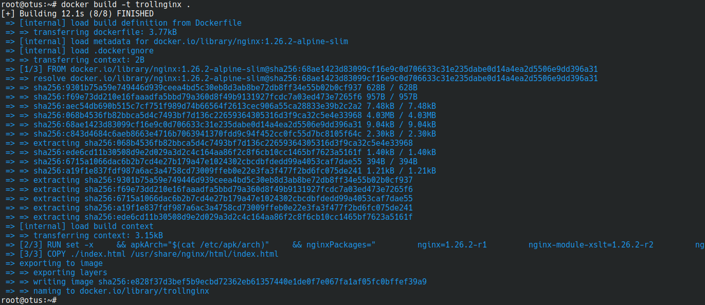
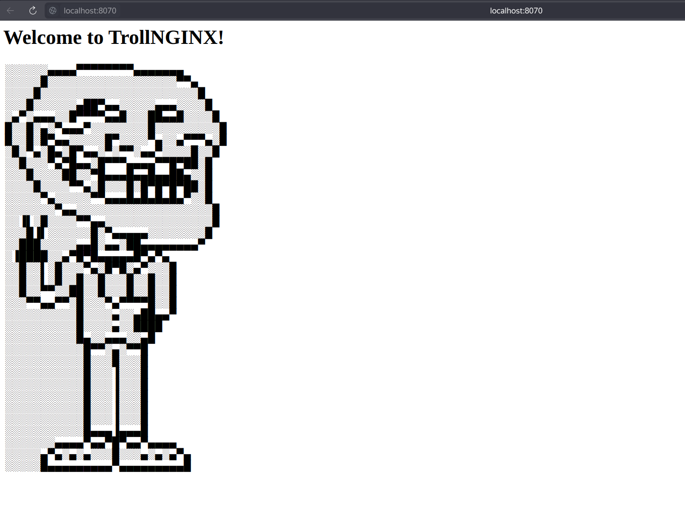

# Administrator Linux. Professional

## Урок 19. Домашнее задание

Docker

### Описание домашнего задания

1. Установите Docker на хост машину
2. Установите Docker Compose - как плагин, или как отдельное приложение
3. Создайте свой кастомный образ nginx на базе alpine. После запуска nginx должен отдавать кастомную страницу (достаточно изменить дефолтную страницу nginx)
4. Определите разницу между контейнером и образом
5. Вывод опишите в домашнем задании.
6. Ответьте на вопрос: Можно ли в контейнере собрать ядро?

### Установите Docker на хост машину

Установим Docker по официальной документации с использованием apt репозитория на хост Debian 12

```root@otus:~#  apt update```

```root@otus:~#  apt install ca-certificates curl```

```root@otus:~#  install -m 0755 -d /etc/apt/keyrings```

```root@otus:~#  curl -fsSL https://download.docker.com/linux/debian/gpg -o /etc/apt/keyrings/docker.asc```

```root@otus:~#  chmod a+r /etc/apt/keyrings/docker.asc```

```root@otus:~# echo "deb [arch=$(dpkg --print-architecture) signed-by=/etc/apt/keyrings/docker.asc] https://download.docker.com/linux/debian $(. /etc/os-release && echo "$VERSION_CODENAME") stable" | tee /etc/apt/sources.list.d/docker.list > /dev/null```

```root@otus:~#  apt-get update```

```root@otus:~# apt-get install docker-ce docker-ce-cli containerd.io docker-buildx-plugin docker-compose-plugin```

Убедимся, что установка прошла успешно, запустив hello-world образ:

```bash
root@otus:~# docker run hello-world
Unable to find image 'hello-world:latest' locally
latest: Pulling from library/hello-world
c1ec31eb5944: Pull complete 
Digest: sha256:305243c734571da2d100c8c8b3c3167a098cab6049c9a5b066b6021a60fcb966
Status: Downloaded newer image for hello-world:latest

Hello from Docker!
This message shows that your installation appears to be working correctly.

To generate this message, Docker took the following steps:
 1. The Docker client contacted the Docker daemon.
 2. The Docker daemon pulled the "hello-world" image from the Docker Hub.
    (amd64)
 3. The Docker daemon created a new container from that image which runs the
    executable that produces the output you are currently reading.
 4. The Docker daemon streamed that output to the Docker client, which sent it
    to your terminal.

To try something more ambitious, you can run an Ubuntu container with:
 $ docker run -it ubuntu bash

Share images, automate workflows, and more with a free Docker ID:
 https://hub.docker.com/

For more examples and ideas, visit:
 https://docs.docker.com/get-started/

```

Всё нормально, docker установлен

### Установите Docker Compose - как плагин, или как отдельное приложение

Плагин docker compose был установлен вместе с docker. Проверим версию

```bash
root@otus:~# docker compose version
Docker Compose version v2.29.7
```

Версия 2.29.7

### Создайте свой кастомный образ nginx на базе alpine. После запуска nginx должен отдавать кастомную страницу

За основу возьмем Dockerfile образа nginx на базе alpine с официального репозитория  и добавим в него строчку

```COPY ./index.html /usr/share/nginx/html/index.html```

[Dockerfile](https://github.com/anashoff/otus/blob/master/lesson19/Dockerfile)

```ini

# NOTE: THIS DOCKERFILE IS GENERATED VIA "update.sh"
#
# PLEASE DO NOT EDIT IT DIRECTLY.
#
FROM nginx:1.26.2-alpine-slim

ENV NJS_VERSION   0.8.5
ENV NJS_RELEASE   1

RUN set -x \
    && apkArch="$(cat /etc/apk/arch)" \
    && nginxPackages=" \
        nginx=${NGINX_VERSION}-r${PKG_RELEASE} \
        nginx-module-xslt=${NGINX_VERSION}-r${DYNPKG_RELEASE} \
        nginx-module-geoip=${NGINX_VERSION}-r${DYNPKG_RELEASE} \
        nginx-module-image-filter=${NGINX_VERSION}-r${DYNPKG_RELEASE} \
        nginx-module-njs=${NGINX_VERSION}.${NJS_VERSION}-r${NJS_RELEASE} \
    " \
# install prerequisites for public key and pkg-oss checks
    && apk add --no-cache --virtual .checksum-deps \
        openssl \
    && case "$apkArch" in \
        x86_64|aarch64) \
# arches officially built by upstream
            apk add -X "https://nginx.org/packages/alpine/v$(egrep -o '^[0-9]+\.[0-9]+' /etc/alpine-release)/main" --no-cache $nginxPackages \
            ;; \
        *) \
# we're on an architecture upstream doesn't officially build for
# let's build binaries from the published packaging sources
            set -x \
            && tempDir="$(mktemp -d)" \
            && chown nobody:nobody $tempDir \
            && apk add --no-cache --virtual .build-deps \
                gcc \
                libc-dev \
                make \
                openssl-dev \
                pcre2-dev \
                zlib-dev \
                linux-headers \
                libxslt-dev \
                gd-dev \
                geoip-dev \
                libedit-dev \
                bash \
                alpine-sdk \
                findutils \
                curl \
            && su nobody -s /bin/sh -c " \
                export HOME=${tempDir} \
                && cd ${tempDir} \
                && curl -f -O https://hg.nginx.org/pkg-oss/archive/${NGINX_VERSION}-${PKG_RELEASE}.tar.gz \
                && PKGOSSCHECKSUM=\"825f610c44dfb97166112e6d060c0ba209a74f50e42c7c23a5b8742f468596f110bb1b4ca9299547a8a3d41f3a7caa864622f40f6c7bb4d8bab3d24880bdfb6a *${NGINX_VERSION}-${PKG_RELEASE}.tar.gz\" \
                && if [ \"\$(openssl sha512 -r ${NGINX_VERSION}-${PKG_RELEASE}.tar.gz)\" = \"\$PKGOSSCHECKSUM\" ]; then \
                    echo \"pkg-oss tarball checksum verification succeeded!\"; \
                else \
                    echo \"pkg-oss tarball checksum verification failed!\"; \
                    exit 1; \
                fi \
                && tar xzvf ${NGINX_VERSION}-${PKG_RELEASE}.tar.gz \
                && cd pkg-oss-${NGINX_VERSION}-${PKG_RELEASE} \
                && cd alpine \
                && make module-geoip module-image-filter module-njs module-xslt \
                && apk index --allow-untrusted -o ${tempDir}/packages/alpine/${apkArch}/APKINDEX.tar.gz ${tempDir}/packages/alpine/${apkArch}/*.apk \
                && abuild-sign -k ${tempDir}/.abuild/abuild-key.rsa ${tempDir}/packages/alpine/${apkArch}/APKINDEX.tar.gz \
                " \
            && cp ${tempDir}/.abuild/abuild-key.rsa.pub /etc/apk/keys/ \
            && apk del --no-network .build-deps \
            && apk add -X ${tempDir}/packages/alpine/ --no-cache $nginxPackages \
            ;; \
    esac \
# remove checksum deps
    && apk del --no-network .checksum-deps \
# if we have leftovers from building, let's purge them (including extra, unnecessary build deps)
    && if [ -n "$tempDir" ]; then rm -rf "$tempDir"; fi \
    && if [ -f "/etc/apk/keys/abuild-key.rsa.pub" ]; then rm -f /etc/apk/keys/abuild-key.rsa.pub; fi \
# Bring in curl and ca-certificates to make registering on DNS SD easier
    && apk add --no-cache curl ca-certificates
COPY ./index.html /usr/share/nginx/html/index.html
```

также в текущую папку положим новую дефолтную страницу [index.html](https://github.com/anashoff/otus/blob/master/lesson19/index.html)

```html
<head>
  <meta charset="UTF-8">
</head>
<body>
<h1>
  Welcome to TrollNGINX!
</h1>
<table style="height: 482px; width: 253.133px;">
<tbody>
<tr>
<td style="width: 245.133px;">
<p>░░░░░░▄▄▄▄▀▀▀▀▀▀▀▀▄▄▄▄▄▄▄<br /> ░░░░░█░░░░░░░░░░░░░░░░░░▀▀▄<br /> ░░░░█░░░░░░░░░░░░░░░░░░░░░░█<br /> ░░░█░░░░░░▄██▀▄▄░░░░░▄▄▄░░░░█<br /> ░▄▀░▄▄▄░░█▀▀▀▀▄▄█░░░██▄▄█░░░░█<br /> █░░█░▄░▀▄▄▄▀░░░░░░░░█░░░░░░░░░█<br /> █░░█░█▀▄▄░░░░░█▀░░░░▀▄░░▄▀▀▀▄░█<br /> ░█░▀▄░█▄░█▀▄▄░▀░▀▀░▄▄▀░░░░█░░█<br /> ░░█░░░▀▄▀█▄▄░█▀▀▀▄▄▄▄▀▀█▀██░█<br /> ░░░█░░░░██░░▀█▄▄▄█▄▄█▄▄██▄░░█<br /> ░░░░█░░░░▀▀▄░█░░░█░█▀█▀█▀██░█<br /> ░░░░░▀▄░░░░░▀▀▄▄▄█▄█▄█▄█▄▀░░█<br /> ░░░░░░░▀▄▄░░░░░░░░░░░░░░░░░░░█<br /> ░░▐▌░█░░░░▀▀▄▄░░░░░░░░░░░░░░░█<br /> ░░░█▐▌░░░░░░█░▀▄▄▄▄▄░░░░░░░░█<br /> ░░███░░░░░▄▄█░▄▄░██▄▄▄▄▄▄▄▄▀<br /> ░▐████░░▄▀█▀█▄▄▄▄▄█▀▄▀▄<br /> ░░█░░▌░█░░░▀▄░█▀█░▄▀░░░█<br /> ░░█░░▌░█░░█░░█░░░█░░█░░█<br /> ░░█░░▀▀░░██░░█░░░█░░█░░█<br /> ░░░▀▀▄▄▀▀░█░░░▀▄▀▀▀▀█░░█<br /> ░░░░░░░░░░█░░░░▄░░▄██▄▄▀<br /> ░░░░░░░░░░█░░░░▄░░████<br /> ░░░░░░░░░░█▄░░▄▄▄░░▄█<br /> ░░░░░░░░░░░█▀▀░▄░▀▀█<br /> ░░░░░░░░░░░█░░░█░░░█<br /> ░░░░░░░░░░░█░░░▐░░░█<br /> ░░░░░░░░░░░█░░░▐░░░█<br /> ░░░░░░░░░░░█░░░▐░░░█<br /> ░░░░░░░░░░░█░░░▐░░░█<br /> ░░░░░░░░░░░█░░░▐░░░█<br /> ░░░░░░░░░░░█▄▄▄▐▄▄▄█<br /> ░░░░░░░▄▄▄▄▀▄▄▀█▀▄▄▀▄▄▄▄<br /> ░░░░░▄▀▄░▄░▄░░░█░░░▄░▄░▄▀▄<br /> ░░░░░█▄▄▄▄▄▄▄▄▄▀▄▄▄▄▄▄▄▄▄</p>
</td>
</tr>
</tbody>
</table>
</body>

```

Запускаем build

```root@otus:~# docker build -t trollnginx .```



Запускаем контейнер

```root@otus:~# docker run -d -p 8070:80 --name=trollweb trollnginx```

(порт 8080 у меня на машине занят, поэтому 8070)

и проверяем работу в браузере

```http://localhost:8070```



nginx работает

### Определите разницу между контейнером и образом. Вывод опишите в домашнем задании

Образ - это шаблон, который хранит в себе всё необходимое для запуска приложения которе бутет помещено в контейнер. Образ можно представить как стэк слоёв, каждый из которых доступен только для чтения. Каждый последующий слой дополняет функциональность предыдущего до нужного нам уровня. Например на первом слое может находиться операционная система, на втором - какое-либо приложение, на третьем - дополнения для этого приложения и т.д. Таким образом настроив образ как нам нужно можно использовать его для генерации контейнеров необходимой функциональности.

Контейнер - это виртуализированная  изолированная среда выполнения с запущенным в ней экземпляром образа. В концепции слоёв контейнер является верхним слоем и, в отличие от слоёв образа, доступен и для чтения, и для записи. После удаления контейнера, этот слой удаляется. На основе одного образа можно одновременно запустить несколько экземпляров контейнера.

### Ответьте на вопрос: Можно ли в контейнере собрать ядро?

Собрать ядро в контейнере можно,

По сути сборка ядра - это выполнение неких команд и скриптов в неком окружении операционной системы, что нам так же позволяет сделать и docker.

В интернете есть ряд примеров сборки различных версий ядра в docker, например:

https://github.com/artyomsoft/simple-linux

https://mgalgs.io/2021/03/23/how-to-build-a-custom-linux-kernel-for-qemu-using-docker.html

https://hub.docker.com/r/tomzo/buildkernel/

https://github.com/lsahn-gh/docker-kernel-builder

Задание выполнено

Все файлы работы, использованные в задании, доступны на [github](https://github.com/anashoff/otus/blob/master/lesson19)
