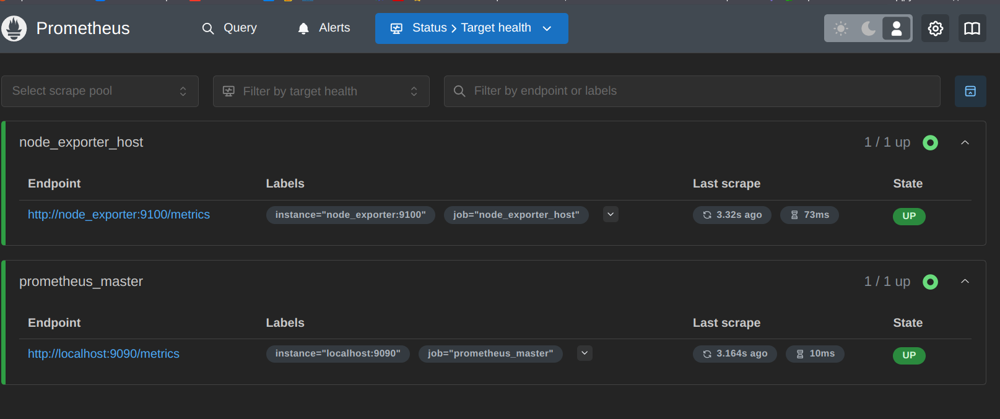
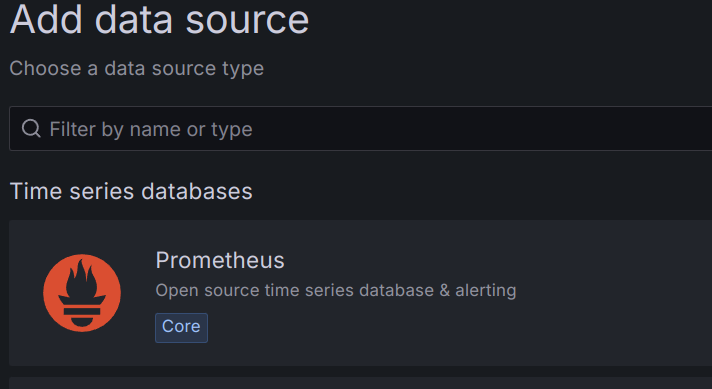
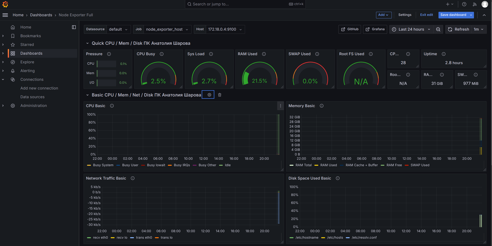
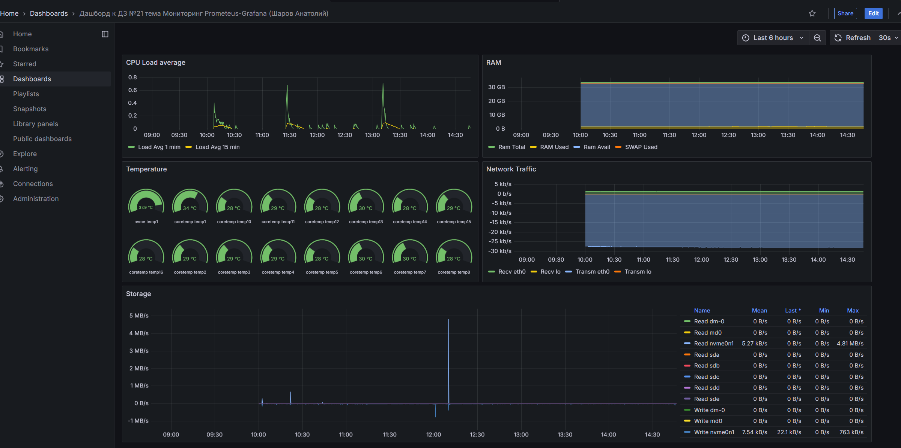

# Administrator Linux. Professional

## Урок 21. Домашнее задание

Настройка мониторинга

### Описание домашнего задания

Настроить дашборд с 4-мя графиками

- память;
- процессор;
- диск;
- сеть.

Настроить на одной из систем:

- zabbix (использовать screen (комплексный экран);
- prometheus - grafana.

### Установка grafana - prometheus

Установим в docker:

#### Создадим сеть

```docker network create --driver bridge monitoring```

В папку root кладем файл **prometheus.yml**

```yaml
global:
  scrape_interval: 15s

scrape_configs:
  - job_name: 'prometheus_master'
    scrape_interval: 5s
    static_configs:
      - targets: ['localhost:9090']
  - job_name: 'node_exporter_host'
    scrape_interval: 5s
    static_configs:
      - targets: ['localhost:9100']
```

#### Запускаем prometheus

```docker run --name prometheus -v ./prometheus.yml:/etc/prometheus/prometheus.yml  --network monitoring -d -p 9090:9090 prom/prometheus```

#### Запускаем node exporter

```docker run -d -p 9100:9100 --name=node_exporter --network monitoring  prom/node-exporter```

Проверяем работу. Заходим по адресу http://localhost:9090

Проверяем таргеты, видим ошибку

```Error scraping target: Get "http://localhost:9100/metrics": dial tcp [::1]:9100: connect: connection refused```

Ошибка возникает, потому что при работе в контейнерах localhost для контейнера является он сам, а не хост.
Исправляем, пользуясь тем, что все контейнеры работают в одном бридже. Вместо ip-адресов используем имена контейнеров

подставляем имя *node_exporter* в **prometheus.yml**

```yaml
  - job_name: 'node_exporter_host'
    scrape_interval: 5s
    static_configs:
      - targets: ['node_exporter:9100']
```

перезапускаем контейнер prometheus и снова  проверяем таргеты.



Все нормально.

#### Создаем том для grafana

```docker volume create grafana-storage```

#### Запускаем grafana

```docker run -d -p 3000:3000 --name=grafana --network monitoring --volume grafana-storage:/var/lib/grafana grafana/grafana-enterprise```

Заходим http://localhost:3000

Идем

```"Connection" - "Add new connection" - "Data source"```

выбираем



Указываем адрес http://prometheus:9090 в поле ```Connection - Prometheus server URL```

далее ```Save & test```

Successfully queried the Prometheus API.

#### Создаем дашборд

Для проверки работы связки импортируем готовый дашборд для node exporter

```Dashboard - Create - Import```

В поле Find and import dashboards for common applications at grafana.com/dashboards вводим **1860** - это стандартный официальный дашборд Node Exporter

Выбираем в поле источника наш prometheus

и получаем полный дашборд



Теперь создадим свой дашборд по заданию

На дашборд выведем метрики

- CPU - Load average 1 мин и 5 мин

- Память - Всего, использовано, доступно, SWAP

- Сеть -  Скорость приёма / отправки

- Диски - Скорость чтения / записи

Дополнительно покажем температуры NVM накопителя и ядер процессора



Экспортируем дашборд в [файл JSON](https://github.com/anashoff/otus/blob/master/lesson21/Dashboard%20lesson%2021.json)

Задание на этом выполнено

Все файлы работы, использованные в задании, доступны на [github](https://github.com/anashoff/otus/blob/master/lesson21)
