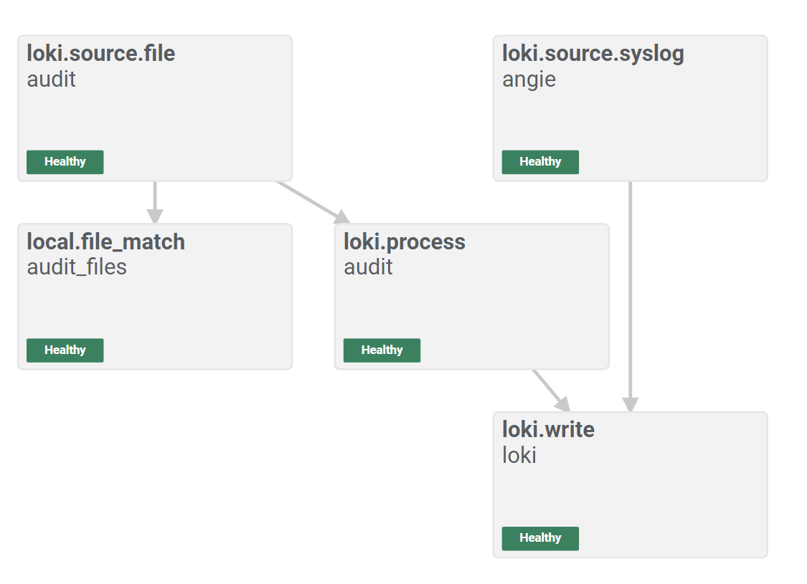
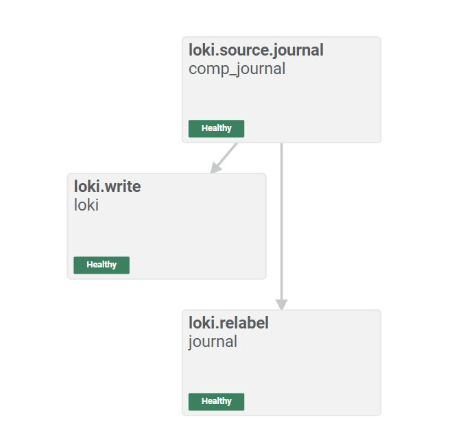
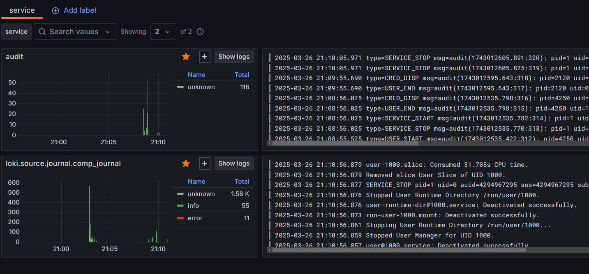
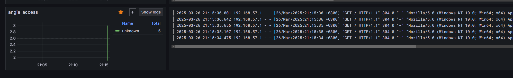
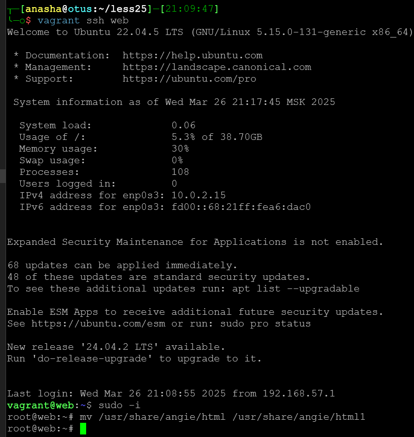
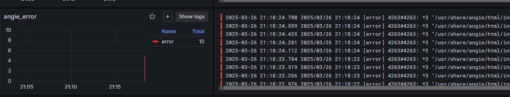
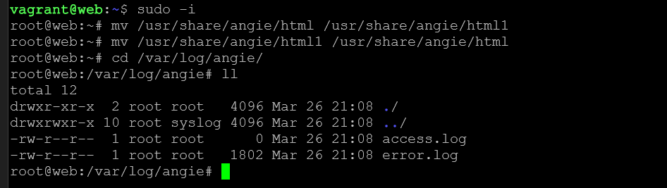

# Administrator Linux. Professional

## Урок 25. Домашнее задание

Настраиваем центральный сервер для сбора логов

### Описание домашнего задания

1. В Vagrant разворачиваем 2 виртуальные машины web и log
2. на web настраиваем nginx
3. на log настраиваем центральный лог сервер на любой системе на выбор
4. настраиваем аудит, следящий за изменением конфигов nginx 

   - Все критичные логи с web должны собираться и локально и удаленно.
   - Все логи с nginx должны уходить на удаленный сервер (локально только критичные).
   - Логи аудита должны также уходить на удаленную систему.

В тексте методического пособия есть разночтение с заданием в описании урока.
Там предлагается

5. Создать третью виртуальную машину, настроить отправку всех логов на центральный сервер
   
Сделаем это тоже

### Подготовка среды выполнения

Будем разворачивать 3 ВМ на ОС Ubuntu 22.04

Подготовим [Vagrantfile](https://github.com/anashoff/otus/blob/master/lesson25/Vagrantfile)

```ruby
# -*- mode: ruby -*-
# vim: set ft=ruby :
Vagrant.configure("2") do |config|
  config.vm.box = "ubuntu/jammy64"
  config.vm.provider :virtualbox do |v|
    v.memory = 1024
    v.cpus = 2
  end
  boxes = [
    { :name => "log",
      :ip => "192.168.57.11",
    },
    { :name => "web",
    :ip => "192.168.57.12",
    },
    { :name => "comp",
      :ip => "192.168.57.13",
    },
  ]
  boxes.each do |opts|
    config.vm.define opts[:name] do |config|
      config.vm.hostname = opts[:name]
      config.vm.network "private_network", ip: opts[:ip]
   end
  end
end
```

Создается 3 виртуальные машины 

 - log - сервер сбора логов
 - web - веб-сервер
 - comp - компьютер

## Описание работы

Система сбора логов на стенде построена на стеке Grafana-Loki-Alloy

1. [Grafana Loki](https://grafana.com/docs/loki/latest/) - сервер сбора и хранения логов
2. [Grafana Alloy](https://grafana.com/docs/alloy/latest/) - новый универсальный коллектор логов, метрик, телеметрии и т.д. Alloy пришел на замену Promtail и Grafana Agent.
3. [Grafana](https://grafana.com/docs/grafana/latest/) - средство визуализации 

Модули Grafana и Loki будет развертываться в docker с помощью docker compose на хосте log

На хост web устанавливается web-сервер angie - форк nginx и модуль сбора Alloy

Нв хост comp устанавливается модуль alloy

Конфигурация модулей настраивается в соответствии с ДЗ

Настройка стенда выполняется с помощью ansible

Данная работа положена в основу модуля мониторинга и логирования для проектной работы

#### Подготовка плейбука ansible

Подготовим плейбук ansible для выполнения работы

Структура плейбука

```text
├── roles
│   ├── install_web
│   │   ├── templates
│   │   │   ├── angie.conf
│   │   │   ├── alloy.j2
│   │   │   └── alloy_config.alloy.j2
│   │   ├── tasks
│   │   │   └── main.yml
│   │   ├── handlers
│   │   │   └── main.yml
│   │   └── defaults
│   │       └── main.yaml
│   ├── install_log
│   │   ├── templates
│   │   │   ├── loki-datasource.yml.j2
│   │   │   ├── loki-config.yaml.j2
│   │   │   └── docker-compose.yml.j2
│   │   ├── tasks
│   │   │   └── main.yml
│   │   ├── handlers
│   │   │   └── main.yml
│   │   └── defaults
│   │       └── main.yml
│   ├── install_comp
│   │   ├── templates
│   │   │   ├── alloy.j2
│   │   │   └── alloy_config.alloy.j2
│   │   ├── tasks
│   │   │   └── main.yaml
│   │   ├── handlers
│   │   │   └── main.yaml
│   │   └── defaults
│   │       └── main.yaml
│   └── common
│       ├── tasks
│       │   ├── setup_time.yml
│       │   ├── install_utils.yml
│       │   ├── install_angie.yml
│       │   └── install_alloy.yml
├── playbook.yml
├── hosts.ini
└── ansible.cfg
```

Файл конфигурации [ansible.cfg](https://github.com/anashoff/otus/blob/master/lesson25/ansible.cfg)

```ini
[defaults]
host_key_checking = false
inventory = hosts
remote_user = vagrant
```

Файл настроек хостов [hosts.ini](https://github.com/anashoff/otus/blob/master/lesson25/hosts.ini)

```ini
[all]
web ansible_port=22 ansible_host=192.168.57.12 ansible_ssh_private_key_file=./.vagrant/machines/web/virtualbox/private_key
comp ansible_port=22 ansible_host=192.168.57.13 ansible_ssh_private_key_file=./.vagrant/machines/comp/virtualbox/private_key
log ansible_port=22 ansible_host=192.168.57.11 ansible_ssh_private_key_file=./.vagrant/machines/log/virtualbox/private_key

```

Файл плейбука [playbook.yml](https://github.com/anashoff/otus/blob/master/lesson25/playbook.yml)

```yml
---
- name: Развертывание хоста log
  hosts: log
  gather_facts: true
  become: yes
  roles:
    - install_log
  tags: log

- name: Развертывание хоста web
  hosts: web
  gather_facts: true
  become: yes
  roles:
    - install_web
  tags: web

- name: Развертывание хоста comp
  hosts: comp
  gather_facts: true
  become: yes
  roles:
    - install_comp
  tags: comp
...
```
Плейбук исполняет 3 ролей:

1. install_log - настройка сервера сбора логов log
2. install_web - настройка веб-сервера web 
3. install_comp - настройка рабочей станции comp

Файлы плейбука находятся на [github](https://github.com/anashoff/otus/tree/master/lesson25/roles)

 Рассмотрим подробнее ключевые моменты, касаемые данной работы.

На каждый хост сначала устанавливается набор вспомогательных утилит, служба auditd и настраивается синхронизация времени.

Для настройки хоста **log** устанавливается и настраивается docker и docker compose, затем устанавливаются, настраиваются и запускаются контейнеры  Loki и Grafana

Для настройки хоста **web** устанавливаются и настраивается  веб-сервер angie и сборщик Alloy.

Основная часть выполнения задания - правильная настройка конфигураций angie и alloy на хостах web и comp, а также настройка сервера log

### Хост log


### Хост web

Для настройки логирования сервера angie добавляем записи в файле angie.conf

Шаблон файла настройки

[angie.conf.j2](https://github.com/anashoff/otus/blob/master/lesson25/roles/install_web/templates/angie.conf.j2)

```jinja
user angie;
worker_processes  auto;
worker_rlimit_nofile 65536;

pid        /run/angie.pid;

events {
    worker_connections  65536;
}


http {
    include       /etc/angie/mime.types;
    default_type  application/octet-stream;


    log_format  main  '$remote_addr - $remote_user [$time_local] "$request" '
                      '$status $body_bytes_sent "$http_referer" '
                      '"$http_user_agent" "$http_x_forwarded_for"';

    log_format extended '$remote_addr - $remote_user [$time_local] "$request" '
                        '$status $body_bytes_sent "$http_referer" rt="$request_time" '
                        '"$http_user_agent" "$http_x_forwarded_for" '
                        'h="$host" sn="$server_name" ru="$request_uri" u="$uri" '
                        'ucs="$upstream_cache_status" ua="$upstream_addr" us="$upstream_status" '
                        'uct="$upstream_connect_time" urt="$upstream_response_time"';


    access_log  syslog:server=127.0.0.1:55514,tag=angie_access,severity=info combined;
    error_log syslog:server=127.0.0.1:55515,tag=angie_error;
    error_log  /var/log/angie/error.log;
    sendfile        on;
    #tcp_nopush     on;

    keepalive_timeout  65;

    #gzip  on;

    include /etc/angie/http.d/*.conf;
}

#stream {
#    include /etc/angie/stream.d/*.conf;
#}
```

параметр 

```error_log  /var/log/angie/error.log;```

Сохраняет критические логи на локальный сервер 

```access_log  syslog:server=127.0.0.1:55514,tag=angie_access,severity=info combined;```

Отправляет access-логи в сокет сборщика логов alloy.

```error_log syslog:server=127.0.0.1:55515,tag=angie_error;```

Отправляет критические логи в сокет сборщика логов alloy

Разные сокеты определены для access и error логов
Запись access в локальный файл - отключена

Файл конфигурации alloy

[alloy_config.alloy.j2](https://github.com/anashoff/otus/blob/master/lesson25/roles/install_web/templates/alloy_config.alloy.j2)

```ruby
local.file_match "audit_files" {
     path_targets = [{ "__path__" = "/var/log/audit/audit.log"}]
     sync_period = "5s"
 }

loki.source.file "audit" {
    targets    = local.file_match.audit_files.targets
    forward_to = [loki.process.audit.receiver]
    tail_from_end = true
  }

loki.process "audit" {
    forward_to =  [loki.write.loki.receiver]

    stage.static_labels {
      values = {
        job  = "audit",
        service_name = "audit",
    }
  }
}

loki.source.syslog "angie" {
    listener {
       address = "127.0.0.1:55514"
       protocol = "tcp"
       labels = { job = "angie_access" }
       syslog_format = "rfc3164"

     }

    listener {
       address = "127.0.0.1:55514"
       protocol = "udp"
       labels = { job = "angie_access" }
       syslog_format = "rfc3164"
    }
    listener {
       address = "127.0.0.1:55515"
       protocol = "tcp"
       labels = { job = "angie_error" }
       syslog_format = "rfc3164"

     }

    listener {
       address = "127.0.0.1:55515"
       protocol = "udp"
       labels = { job = "angie_error" }
       syslog_format = "rfc3164"
    }

     forward_to = [loki.write.loki.receiver]
}


loki.write "loki" {
        endpoint {
                url = "http://192.168.57.11:3100/loki/api/v1/push"
        }
}
```
Рассмотрим подробнее

Файл состоит из нескольких блоков, которые определяют конвейер прохождения собраной информации и передают ее на сервер сбора Loki

в графическом виде это можно представить так



блок local.file_match

```ruby
local.file_match "audit_files" {
     path_targets = [{ "__path__" = "/var/log/audit/audit.log"}]
     sync_period = "5s"
 }
```

находит файлы в локальной файловой системе с помощью шаблонов поиска, в нашем случае файл audit.log

блок loki.source.file 

```ruby
loki.source.file "audit" {
    targets    = local.file_match.audit_files.targets
    forward_to = [loki.process.audit.receiver]
    tail_from_end = true
  }
```

считывает записи журнала из найденного файла audit.log и пересылает их следующему компоненту для обработки, в нашем случае в блок loki.process 

```ruby
loki.process "audit" {
    forward_to =  [loki.write.loki.receiver]

    stage.static_labels {
      values = {
        job  = "audit",
        service_name = "audit",
    }
  }
}
```

блок ставит на записи лога кастомные метки - это нам пригодится для удобного представления логов в grafana, и передает их дальше в блок write.recierver для отправки в loki. Этот блок рассмотрим чуть позже.

Блок 

```ruby
loki.source.syslog "angie" {
    listener {
       address = "127.0.0.1:55514"
       protocol = "tcp"
       labels = { job = "angie_access" }
       syslog_format = "rfc3164"

     }

    listener {
       address = "127.0.0.1:55514"
       protocol = "udp"
       labels = { job = "angie_access" }
       syslog_format = "rfc3164"
    }
    listener {
       address = "127.0.0.1:55515"
       protocol = "tcp"
       labels = { job = "angie_error" }
       syslog_format = "rfc3164"

     }

    listener {
       address = "127.0.0.1:55515"
       protocol = "udp"
       labels = { job = "angie_error" }
       syslog_format = "rfc3164"
    }

     forward_to = [loki.write.loki.receiver]
}
```

прослушивает сообщения системного журнала по заданным TCP и UDP сокетам и пересылает их в блок write.recierver для отправки в loki. Сокеты создаются при запуске сервиса alloy. Эти сокеты мы указывали в конфигурации angie для отправки в них логов. Передаваемые сообщения настрены на соответствие протоколу системного журнала BSD RFC3164. Также настроены метки angie_access и angie_error для для удобного представления логов в grafana.

И наконец блок

```ruby
loki.write "loki" {
        endpoint {
                url = "http://192.168.57.11:3100/loki/api/v1/push"
        }
}
```
пересылает все направленные в него логи по заданному адресу, в нашем случае на сервер Loki

### Хост comp

Для настройки хоста comp устанавливаются и настраивается  cборщик Alloy.

Стоит задача собирать все логи, настроим сборщик на работу с журналом systemd 

файл конфигурации alloy будет немного отличаться от предыдущего

[alloy_config.alloy.j2](https://github.com/anashoff/otus/blob/master/lesson25/roles/install_comp/templates/alloy_config.alloy.j2)

```ruby
loki.relabel "journal" {
  forward_to = []
  rule {
    source_labels = ["__journal__systemd_unit"]
    target_label  = "unit"
  }
}

loki.source.journal "{{ansible_facts.hostname}}_journal" {

    relabel_rules = loki.relabel.journal.rules
    forward_to =  [loki.write.loki.receiver]
}


loki.write "loki" {
        endpoint {
                url = "http://192.168.57.11:3100/loki/api/v1/push"
        }
}
```

в графическом виде конвейер выглядит так



Блок передачи логов loki.write точно такой же как и у web.

А для сбора используется блок loki.source.journal

```ruby
loki.source.journal "{{ansible_facts.hostname}}_journal" {

    relabel_rules = loki.relabel.journal.rules
    forward_to =  [loki.write.loki.receiver]
}
```
считывает данные из журнала systemd и пересылает их далее в передатчик

блок relabel

```ruby
loki.relabel "journal" {
  forward_to = []
  rule {
    source_labels = ["__journal__systemd_unit"]
    target_label  = "unit"
  }
}
```
переименовывает заданные метки в удобный нам вид. Использование этого блока включается прпаметром relabel_rules в блоке source.journal

## Выполнение работы

Создаем  виртуальную среду

```zsh
┬─[anasha@otus:~/less25]─[21:01:06]
╰─o$ vagrant up
```

Затем запускаем плейбук

```zsh
┬─[anasha@otus:~/less25]─[21:03:15]
╰─o$ ansible-playbook playbook.yml
```


Ждем когда отработает плейбук и заходим в grafana

```http:\\192.168.57.11:3000```

после  смены дефолтного пароля и приветствия попадаем на главную страницы и открываем страницу Log

Видим, что сборщик логов уже начал работу



Здесь в поле audit журнал аудита с хоста web, а в поле loki.source.journal.comp_journal - логи журнала systemd с хоста comp

Получим логи веб-сервера. Перейдем по адресу 

```http:\\192.168.57.12```

и несколько раз обновим страницу



появились логи angie_access

зайдем на хост web по ssh и переименуем домашний каталог angie



и обновим страницу несколко раз - видим 404

Теперь смотрим логи

появился блок angie_error



вернем домашниый каталог на место и зайдем в каталог /var/log/angie



в файл access.log не идут записи, всё идет на удаленный сервер loki, в файл error.log запись ведется


## Выводы

Таким образом, в данной работе мы

1. На хосте log настроили центральный лог сервер на системе Loki
2. Настроили аудит, следящий за изменением конфигов nginx:

 - Все критичные логи с web собираются и локально и удаленно.
 - Все логи с angie уходят на удаленный сервер (локально только критичные).
 - Логи аудита должны также уходят на удаленную систему.

Кроме того, 
3. Создали третью виртуальную машину, настроитли отправку всех логов на центральный сервер

Задание на этом выполнено.

Все файлы работы, использованные в задании, доступны на [github](https://github.com/anashoff/otus/blob/master/lesson25)
