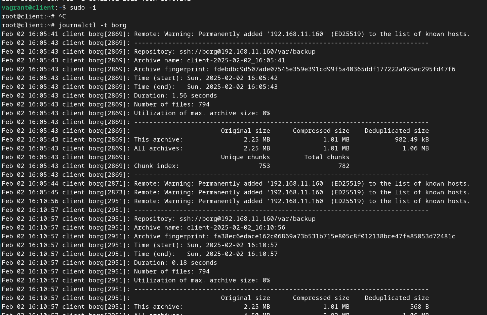
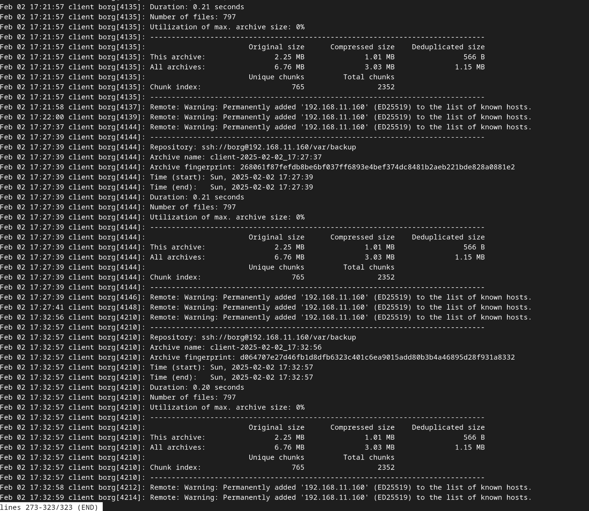
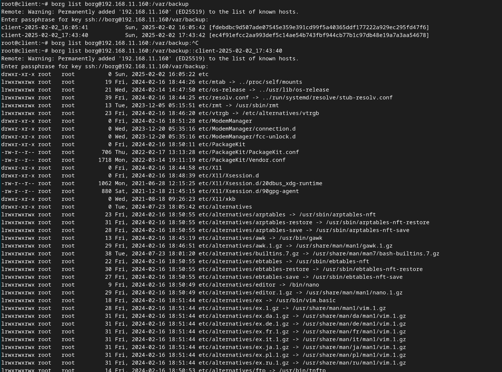

# Administrator Linux. Professional

## Урок 27. Домашнее задание

Резервное копирование

### Описание домашнего задания

1. Настроить стенд Vagrant с двумя виртуальными машинами: backup_server и client. (Студент самостоятельно настраивает Vagrant)
2. Настроить удаленный бэкап каталога /etc c сервера client при помощи borgbackup. Резервные копии должны соответствовать следующим критериям:
- директория для резервных копий /var/backup. Это должна быть отдельная точка монтирования. В данном случае для демонстрации размер не принципиален, достаточно будет и 2GB; (Студент самостоятельно настраивает)
- репозиторий для резервных копий должен быть зашифрован ключом или паролем - на усмотрение студента;
- имя бэкапа должно содержать информацию о времени снятия бекапа;
- глубина бекапа должна быть год, хранить можно по последней копии на конец месяца, кроме последних трех. Последние три месяца должны содержать копии на каждый день. Т.е. должна быть правильно настроена политика удаления старых бэкапов;
- резервная копия снимается каждые 5 минут. Такой частый запуск в целях демонстрации;
- написан скрипт для снятия резервных копий. Скрипт запускается из соответствующей Cron джобы, либо systemd timer-а - на усмотрение студента;
- настроено логирование процесса бекапа. Для упрощения можно весь вывод перенаправлять в logger с соответствующим тегом. Если настроите не в syslog, то обязательна ротация логов

### Подготовка среды выполнения

Будем разворачивать 2 ВМ на ОС Ubuntu 22.04

Подготовим [Vagrantfile](https://github.com/anashoff/otus/blob/master/lesson27/Vagrantfile)

```ruby
# -*- mode: ruby -*-
# vim: set ft=ruby :

agrant.configure("2") do |config|
  config.vm.box = "bento/ubuntu-22.04"
  config.vm.provider :virtualbox do |v|
    v.memory = 2048
    v.cpus = 2
  end
  ssh_pub_key = File.readlines("#{Dir.home}/.ssh/id_ed25519.pub").first.strip
  
  boxes = [
    { :name => "backup",
      :net => [
           ["192.168.11.160",  2, "255.255.255.0", "mynet"],
            ]
    },
    { :name => "client",
      :net => [
           ["192.168.11.150",  2, "255.255.255.0", "mynet"],
           ]
    },
  ]

  boxes.each do |opts|
    config.vm.define opts[:name] do |config|
      config.vm.hostname = opts[:name]
      opts[:net].each do |ipconf|
        config.vm.network("private_network", ip: ipconf[0], adapter: ipconf[1], netmask: ipconf[2],virtualbox__intnet: ipconf[3])
      end

      config.vm.provision 'shell', inline: 'mkdir -p /root/.ssh'
      config.vm.provision 'shell', inline: "echo #{ssh_pub_key} >> /root/.ssh/authorized_keys"
      config.vm.provision 'shell', inline: "echo #{ssh_pub_key} >> /home/vagrant/.ssh/authorized_keys", privileged: false
   end
  end

  config.vm.define "backup" do |backup|
    backup.vm.provider "virtualbox" do |vb|
      vb.customize [
        "createhd",
        "--filename", "backup_disk.vdi",
        "--size", 2048
      ]
      vb.customize [
        "storageattach", :id,
        "--storagectl", "SATA Controller",
        "--port", 1,
        "--device", 0,
        "--type", "hdd",
        "--medium", "backup_disk.vdi"
      ]
    end

    # Инициализация диска
    backup.vm.provision "shell", inline: <<-SHELL
      sudo parted /dev/sdb --script mklabel gpt
      sudo parted /dev/sdb --script mkpart primary ext4 0% 100%
      sudo mkfs.ext4 /dev/sdb1
      sudo mkdir -p /var/backup
      echo '/dev/sdb1 /var/backup ext4 defaults 0 0' | sudo tee -a /etc/fstab
      sudo mount -a
    SHELL
  end

end
```
Создается 2 виртуальные машины backup и client

На виртуальной машине backup кроме стандартного диска создается дополнительный размером 2 Гб и монтируется как /var/backup.


#### Подготовка плейбука ansible

Подготовим плейбук ansible для выполнения работы

Структура плейбука

```text
├── group_vars
│   └── all.yaml
├── roles
│   ├── init_repo
│   │   └── tasks
│   │       └── main.yaml
│   ├── install
│   │   └── tasks
│   │       └── main.yaml
│   ├── server
│   │   └── tasks
│   │       └── main.yaml
│   ├── service
│   │   ├── tasks
│   │   │   └── main.yaml
│   │   └── templates
│   │       ├── service.j2
│   │       └── timer.j2
│   └── ssh_key
│       ├── handlers
│       │   └── main.yaml
│       ├── tasks
│       │   ├── main.yaml
│       ├── templates
│       │   └── disable_kh.conf.j2
│       └── vars
│           └── all.yaml
├── ansible.cfg
├── hosts.ini
├── playbook.yaml
```

Файл конфигурации [ansible.cfg](https://github.com/anashoff/otus/blob/master/lesson27/ansible.cfg)

```ini
[defaults]
host_key_checking = false
inventory = hosts
command_warnings= false
remote_user = vagrant
```

Файл настроек хостов [hosts.ini](https://github.com/anashoff/otus/blob/master/lesson27/hosts.ini)

```ini
[all]
backup ansible_port=2222 ansible_host=127.0.0.1 
client ansible_port=2200 ansible_host=127.0.0.1 
```

Файл плейбука [playbook.yaml](https://github.com/anashoff/otus/blob/master/lesson27/playbook.yaml)

```yaml
---
- name: Install Borg 
  hosts: all
  gather_facts: true
  become: true
  roles:
    - install
- name: Configure server
  hosts: backup
  gather_facts: true
  become: true
  roles:
    - server
- name: Configure ssh
  hosts: backup
  gather_facts: true
  become: true
  roles:
    - ssh_key
- name: Init Repo
  hosts: client
  gather_facts: true
  become: true
  roles:
    - init_repo
- name: Install service & timer
  hosts: client
  gather_facts: true
  become: true
  roles:
    - service
...
```
Плейбук исполняет 5 ролей:

1. Install borg - установка borg на все ВМ
2. Configure server - настойка сервера backup
3. Configure ssh - настройка ssh-соединение между backup и client
4. Init Repo - инициализация репозитория 
5. Install service & timer - установка сервиса и таймера резервного копирования

Переменные [group_vars/all.yaml](https://github.com/anashoff/otus/blob/master/lesson27/group_vars/all.yaml)

```yaml
backup_dir: "/var/backup"     #Директория для бакапов
description: "Borg Service {{source_name}} Backup "   #   Строка описания сервиса
service_name: "borg-backup-{{source_name}}.service"    #   Название сервиса
timer_name: "borg-backup-{{source_name}}.timer"           #  Название таймера
source_name: "client"    #      Имя источника
repo_name: "borg@192.168.11.160:{{backup_dir}}"    #    Название репозитория
arch_name: "{{source_name}}"   #    имя архива
target_name: "/etc"     #     Каталог источника
keep_daily: "90"     #       срок хранения дневных архивов
keep_monthly: "12"   #       срок хранения месячных архивов 
keep_yearly: "1"     #       срок хранения годовых архивов
Timer: "OnUnitActiveSec=5min"      #   время срабатывания таймера
encript_type: "repokey"          #    тип шифрования архивов
borg_user: "borg"             #    имя пользователя на сервере backup
borg_group: "borg"            #    имя группы   -//-
backup_user_info_home: "/home/{{borg_user}}"    #   домашняя папка -//-
client_user: "root"  # Пользователь на client             
client_user_info_home: "/root"                  #  домашняя папка
borg_ssh_key_type: "ed25519"                  #  тип ключа ssh
borg_ssh_key_name: "id_{{ borg_ssh_key_type }}"                #  имя файла приватного ключа
borg_ssh_key_file_path: "{{ client_user_info_home }}/.ssh/{{ borg_ssh_key_name }}"             #  путь до ключа
borg_repo_password: "Otus1234"                #  пароль шифрования репозитария
```

#### Роль Install borg - установка borg на все ВМ ####

Файл роли [install/tasks/main.yaml](https://github.com/anashoff/otus/blob/master/lesson27/roles/install/tasks/main.yaml)

```yaml
---
- name: install_borg
  apt:
    name: borgbackup
    update_cache: yes
    state: present
...
```

#### Роль Configure server -настойка сервера backup ####

Файл роли [server/tasks/main.yaml](https://github.com/anashoff/otus/blob/master/lesson27/roles/server/tasks/main.yaml)

```yaml
---
- name: Создание пользователя borg
  user:
    name: borg
    shell: /bin/bash
    create_home: yes
    state: present
    comment: "Backup User"
- name: Проверка и настройка каталога /var/backup
  file:
    path: "{{backup_dir}}"
    state: directory
    owner: borg
    group: borg
    mode: '0755'
    recurse: yes  # Рекурсивное применение прав
- name: Очистка каталога /var/backup для использования в качестве репозитория
  shell:
    cmd: "rm -rf /var/backup/* /var/backup/.* 2>/dev/null || true"
...
```

#### Роль Configure ssh - настройка ssh-соединение между backup и client ####

Файл роли [ssh_key/tasks/main.yaml](https://github.com/anashoff/otus/blob/master/lesson27/roles/ssh_key/tasks/main.yaml)


```yaml
---
- name: Настройка службы ssh чтобы не спрашивала подтверждения при добавлении хоста в known_hosts
  delegate_to: client # Выполняем задачу на client
  template:
    src: templates/disable_kh.conf.j2
    dest: /etc/ssh/ssh_config.d/disable_kh.conf
  notify: restart_ssh

- name: Генерируем SSH-ключ на client (если его нет)
  delegate_to: client  # Выполняем задачу на client
  community.crypto.openssh_keypair:
    path: "{{borg_ssh_key_file_path}}"
    type:  "{{borg_ssh_key_type}}"
    owner: "{{ client_user }}"
    group: "{{ client_user }}"
    mode: '0600'

- name: Получаем публичный ключ с client
  delegate_to: client  # Выполняем на client
  ansible.builtin.slurp:
    src: "{{ borg_ssh_key_file_path }}.pub"
  register: public_key

- name: Создание директории, если ее нет
  file:
    path: "{{backup_user_info_home }}/.ssh"
    state: directory
    mode: 0755

- name: Добавляем публичный ключ client в authorized_keys на backup
  ansible.posix.authorized_key:
    user: "{{borg_user}}"  # Пользователь на backup
    key: "{{ public_key.content | b64decode }}"
    state: present
...
```
Хендлер

[ssh_key/handlers/main.yaml](https://github.com/anashoff/otus/blob/master/lesson27/roles/ssh_key/handlers/main.yaml)


```yaml
- name: restart_ssh
  systemd:
    name: ssh.service
    state: restarted
```

Шаблон файла настройки

[ssh_key/templates/disable_kh.conf.j2](https://github.com/anashoff/otus/blob/master/lesson27/roles/ssh_key/templates/disable_kh.conf.j2)

```jinja
   StrictHostKeyChecking no
   UserKnownHostsFile=/dev/null
```

#### Роль Init Repo - инициализация репозитория ####

Файл роли [init_repo/tasks/main.yaml](https://github.com/anashoff/otus/blob/master/lesson27/roles/init_repo/tasks/main.yaml)


```yaml
---
- name: Выполняем инициализацию репозитория
  ansible.builtin.command:
    cmd: "borg init --encryption={{encript_type}} {{repo_name}}"
    creates: "{{ repo_name }}/README"  # Проверяем, что репозиторий не создан
  environment:
    BORG_PASSPHRASE: "{{ borg_repo_password }}"
...
```

#### Роль Install service & timer - установка сервиса и таймера резервного копирования ####

Файл роли [service/tasks/main.yaml](https://github.com/anashoff/otus/blob/master/lesson27/roles/service/tasks/main.yaml)

```yaml
---
- name: Создание сервиса по шаблону из файла
  template: 
    src: templates/service.j2
    dest: /etc/systemd/system/{{service_name}}
    mode: 0644
- name: Создание таймера по шаблону из файла
  template:
    src: templates/timer.j2
    dest: /etc/systemd/system/{{timer_name}}
    mode: 0644

- name: Запускаем таймер и включаем его
  systemd:
    name: "{{ timer_name }}"
    state: started
    enabled: true
    daemon_reload: true
- name: Запускаем первый раз резервное копирование, чтобы у таймера появился первый отсчет
  systemd:
    name: "{{ service_name }}"
    state: started
    enabled: true
...
```
Шаблоны

[service/templates/service.j2](https://github.com/anashoff/otus/blob/master/lesson27/roles/service/templates/service.j2)

```jinja
[Unit]
Description={{ description }}

[Service]
Type=oneshot

# Парольная фраза
Environment=BORG_PASSPHRASE={{borg_repo_password}}
# Репозиторий
Environment=REPO={{ repo_name }}
# Что бэкапим
Environment=BACKUP_TARGET={{ target_name }}

# Создание бэкапа
ExecStart=/bin/borg create \
    --stats                \
    ${REPO}::{{ arch_name }}-{now:%%Y-%%m-%%d_%%H:%%M:%%S} ${BACKUP_TARGET}

# Проверка бэкапа
ExecStart=/bin/borg check ${REPO}

# Очистка старых бэкапов
ExecStart=/bin/borg prune \
    --keep-daily {{ keep_daily }}      \
    --keep-monthly {{ keep_monthly }}     \
    --keep-yearly {{ keep_yearly }}       \
    ${REPO}
```
[service/templates/timer.j2](https://github.com/anashoff/otus/blob/master/lesson27/roles/service/templates/timer.j2)


```jinja
[Unit]
Description={{ description }}

[Timer]
{{ Timer }}

[Install]
WantedBy=timers.target
```

## Выполнение работы

Создаем  виртуальную среду

```zsh
┬─[anasha@otus:~/less27]─[15:36:28]
╰─o$ vagrant up
```

Затем запускаем плейбук

```zsh
┬─[anasha@otus:~/less27]─[15:43:54]
╰─o$ ansible-playbook playbook.yml
```

Ждем некоторое время, чтобы создалось несколько резервных копий и заходим на client

```zsh
┬─[anasha@otus:~/less27]─[20:31:23]
╰─o$ vagrant ssh client
```

Повышаем привилегии 

```zsh
vagrant@client:~$ sudo -i
```

Смотрим логи в journalctl



............................

............................



Видим, что резервное копирование выполняется каждые 5 минут

Посмотрим репозиторий



Видим файлы резервных копий и содержимое одного архива

Задание на этом выполнено.

Все файлы работы, использованные в задании, доступны на [github](https://github.com/anashoff/otus/blob/master/lesson27)
