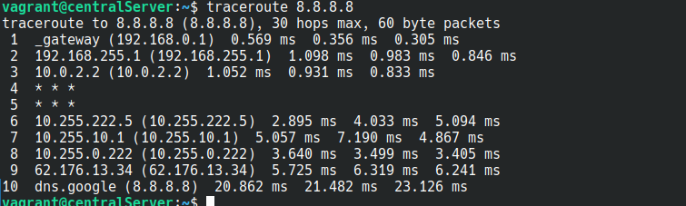
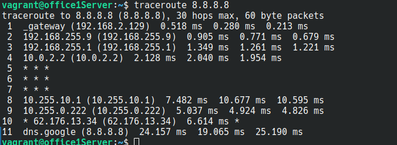
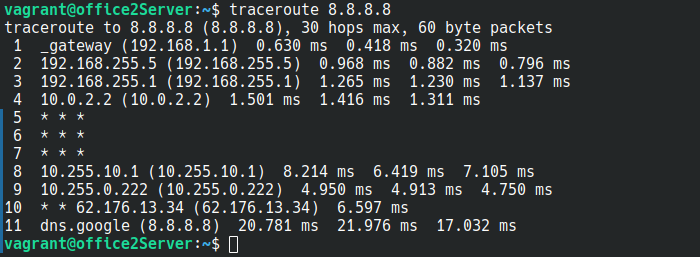
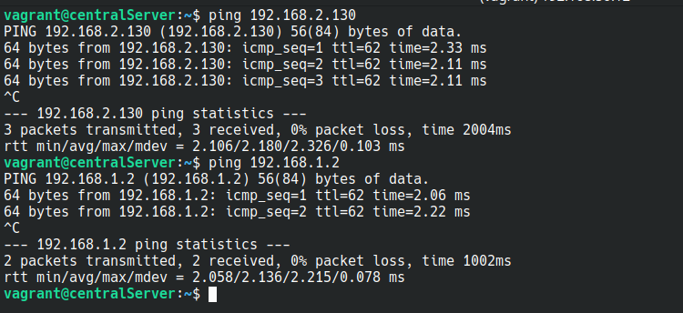
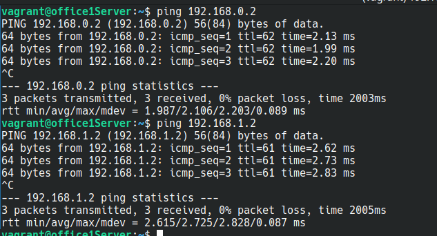
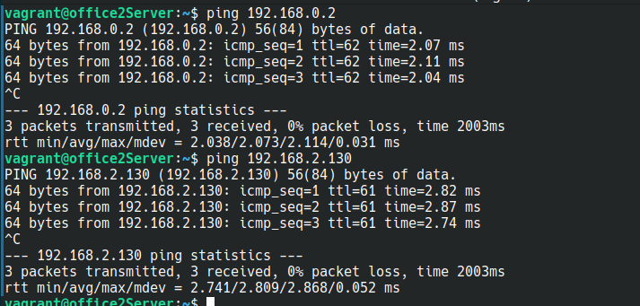

# Administrator Linux. Professional

## Урок 28. Домашнее задание

Vagrant-стенд c сетевой лабораторией

### Описание домашнего задания

Развернуть Vagrant-стенд

Построить следующую сетевую архитектуру:

#### Сеть office1

- 192.168.2.0/26      - dev
- 192.168.2.64/26     - test servers
- 192.168.2.128/26    - managers
- 192.168.2.192/26    - office hardware

#### Сеть office2

- 192.168.1.0/25      - dev
- 192.168.1.128/26    - test servers
- 192.168.1.192/26    - office hardware

#### Сеть central

- 192.168.0.0/28     - directors
- 192.168.0.32/28    - office hardware
- 192.168.0.64/26    - wifi

Итого должны получиться следующие сервера:

- inetRouter
- centralRouter
- office1Router
- office2Router
- centralServer
- office1Server
- office2Server


Выполнить теоретическую и практическую части

В теоретической части требуется:

- Найти свободные подсети
- Посчитать количество узлов в каждой подсети, включая свободные
- Указать Broadcast-адрес для каждой подсети
- Проверить, нет ли ошибок при разбиении

В практической части требуется:

- Соединить офисы в сеть согласно логической схеме и настроить роутинг
- Интернет-трафик со всех серверов должен ходить через inetRouter
- Все сервера должны видеть друг друга (должен проходить ping)
- У всех новых серверов отключить дефолт на NAT (eth0), который vagrant поднимает для связи
- Добавить дополнительные сетевые интерфейсы, если потребуется

### Теоретическая часть

На основании исходных данных составим таблицу, где будут перечислены все сети организации с указанием адреса сети, маски сети, количества узлов в сети, адреса первого и последнеого хота в сети и широковещательный адрес сети.


| Имя сети | Сеть | Маска сети | Кол-во узлов | Начальный адрес узла | Конечный адрес узла | Широковещательный адрес |
| ---  | --- | --- | --- | --- | --- | --- |
| Сеть Central |
| Directors | 192.168.0.0/28 | 255.255.255.240 | 14 | 192.168.0.1 | 192.168.0.14 | 192.168.0.15 |
| Office hardware | 192.168.0.32/28 | 255.255.255.240 | 14 | 192.168.0.33 | 192.168.0.46 | 192.168.0.47 |
| Wifi (mgt network) | 192.168.0.64/26 | 255.255.255.192 | 62 | 192.168.0.65 | 192.168.0.126 | 192.168.0.127 |
| Сеть Office1 |
| Dev | 192.168.2.0/26 | 255.255.255.192 | 62 | 192.168.2.1 | 192.168.2.62 | 192.168.2.63 |
| Test | 192.168.2.64/26 | 255.255.255.192 | 62 | 192.168.2.65 | 192.168.2.126 | 192.168.2.127 |
| Managers | 192.168.2.128/26 | 255.255.255.192 | 62 | 192.168.2.129 | 192.168.2.190 | 192.168.2.191 |
| Office hardware | 192.168.2.192/26 | 255.255.255.192 | 62 | 192.168.2.193 | 192.168.2.254 | 192.168.2.255 |
| Сеть Office2 |
| Dev | 192.168.1.0/25 | 255.255.255.128 | 126 | 192.168.1.1 | 192.168.1.126 | 192.168.1.127 |
| Test | 192.168.1.128/26 | 255.255.255.192 | 62 | 192.168.1.129 | 192.168.1.190 | 192.168.1.191 |
| Ofiice | 192.168.1.192/26 | 255.255.255.192 | 62 | 192.168.1.193 | 192.168.1.254 | 192.168.1.255 |
| Сеть inetRouter - centralRouter |
| Inet - central | 192.168.255.0/30 | 255.255.255.252 | 2 | 192.168.255.1 | 192.168.255.2 | 192.168.255.3 |

#### Свободные подсети

- 192.168.0.16/28
- 192.168.0.48/28
- 192.168.0.128/25

- 192.168.255.64/26
- 192.168.255.32/27
- 192.168.255.16/28
- 192.168.255.8/29
- 192.168.255.4/30

#### Количество узлов в каждой подсети

Указан в таблице 

#### Broadcast-адрес для каждой подсети

Указан в таблице

#### Проверить, нет ли ошибок при разбиении
 
Ошибок нет


### Практическая часть

Схема сети


#### Подготовка среды выполнения

Будем разворачивать 7 ВМ на ОС Ubuntu 22.04

Подготовим [Vagrantfile](https://github.com/anashoff/otus/blob/master/lesson28/Vagrantfile)

```ruby
# -*- mode: ruby -*-
# vim: set ft=ruby :

MACHINES = {
      :inetRouter => {
        :box_name => "bento/ubuntu-22.04",
        :vm_name => "inetRouter",
        #:public => {:ip => '10.10.10.1', :adapter => 1},
        :net => [
                    ["192.168.255.1", 2, "255.255.255.252",  "router-net"], 
                    ["192.168.50.10", 8, "255.255.255.0"],
                ]
  },

      :centralRouter => {
        :box_name => "bento/ubuntu-22.04",
        :vm_name => "centralRouter",
        :net => [
                   ["192.168.255.2",  2, "255.255.255.252",  "router-net"],
                   ["192.168.0.1",    3, "255.255.255.240",  "dir-net"],
                   ["192.168.0.33",   4, "255.255.255.240",  "hw-net"],
                   ["192.168.0.65",   5, "255.255.255.192",  "mgt-net"],
                   ["192.168.255.9",  6, "255.255.255.252",  "office1-central"],
                   ["192.168.255.5",  7, "255.255.255.252",  "office2-central"],
                   ["192.168.50.11",  8, "255.255.255.0"],
                ]
  },
  
      :centralServer => {
        :box_name => "bento/ubuntu-22.04",
        :vm_name => "centralServer",
        :net => [
                   ["192.168.0.2",    2, "255.255.255.240",  "dir-net"],
                   ["192.168.50.12",  8, "255.255.255.0"],

                ]
  },
      :office1Router => {
        :box_name => "bento/ubuntu-22.04",
        :vm_name => "office1Router",
        :net => [
                   ["192.168.255.10",  2,  "255.255.255.252",  "office1-central"],
                   ["192.168.2.1",     3,  "255.255.255.192",  "dev1-net"],
                   ["192.168.2.65",    4,  "255.255.255.192",  "test1-net"],
                   ["192.168.2.129",   5,  "255.255.255.192",  "managers-net"],
                   ["192.168.2.193",   6,  "255.255.255.192",  "office1-net"],
                   ["192.168.50.20",   8,  "255.255.255.0"],
                ]
  },

      :office1Server => {
        :box_name => "bento/ubuntu-22.04",
        :vm_name => "office1Server",
        :net => [
                   ["192.168.2.130",  2,  "255.255.255.192",  "managers-net"],
                   ["192.168.50.21",  8,  "255.255.255.0"],
                ]
  },

     :office2Router => {
       :box_name => "bento/ubuntu-22.04",
       :vm_name => "office2Router",
       :net => [
                   ["192.168.255.6",  2,  "255.255.255.252",  "office2-central"],
                   ["192.168.1.1",    3,  "255.255.255.128",  "dev2-net"],
                   ["192.168.1.129",  4,  "255.255.255.192",  "test2-net"],
                   ["192.168.1.193",  5,  "255.255.255.192",  "office2-net"],
                   ["192.168.50.30",  8,  "255.255.255.0"],
               ]
  },

     :office2Server => {
       :box_name => "bento/ubuntu-22.04",
       :vm_name => "office2Server",
       :net => [
                  ["192.168.1.2",    2,  "255.255.255.128",  "dev2-net"],
                  ["192.168.50.31",  8,  "255.255.255.0"],
               ]
  }
}
ssh_pub_key = File.readlines("#{Dir.home}/.ssh/id_ed25519.pub").first.strip

Vagrant.configure("2") do |config|
  MACHINES.each do |boxname, boxconfig|
    config.vm.define boxname do |box|
        box.vm.box = boxconfig[:box_name]
        box.vm.host_name = boxconfig[:vm_name]
        box.vm.provider "virtualbox" do |v|
          v.memory = 1024
          v.cpus = 1
        end

        boxconfig[:net].each do |ipconf|
          box.vm.network("private_network", ip: ipconf[0], adapter: ipconf[1], netmask: ipconf[2], virtualbox__intnet: ipconf[3])
        end
        
        if boxconfig.key?(:public)
          box.vm.network "public_network", boxconfig[:public]
        end

      box.vm.provision 'shell', inline: 'mkdir -p /root/.ssh'
      box.vm.provision 'shell', inline: "echo #{ssh_pub_key} >> /root/.ssh/authorized_keys"
      box.vm.provision 'shell', inline: "echo #{ssh_pub_key} >> /home/vagrant/.ssh/authorized_keys", privileged: false

        
      end

  end
  
end
```

#### Подготовка плейбука ansible

Подготовим плейбук ansible для выполнения работы

Структура плейбука

```text
├── ansible
│   ├── ansible.cfg
│   ├── hosts
│   ├── provision.yml
│   └── templates
│       ├── 00-installer-config.yaml
│       ├── 50-vagrant_centralRouter.yaml
│       ├── 50-vagrant_centralServer.yaml
│       ├── 50-vagrant_inetRouter.yaml
│       ├── 50-vagrant_office1Router.yaml
│       ├── 50-vagrant_office1Server.yaml
│       ├── 50-vagrant_office2Router.yaml
│       ├── 50-vagrant_office2Server.yaml
│       ├── iptables_restore
│       └── iptables_rules.ipv4
```

Файл конфигурации [ansible.cfg](https://github.com/anashoff/otus/blob/master/lesson28/ansible.cfg)

```ini
[defaults]
host_key_checking = false
inventory = hosts
command_warnings= false
```

Файл настроек хостов [hosts](https://github.com/anashoff/otus/blob/master/lesson28/hosts)

```ini
[routers]
inetRouter ansible_host=192.168.50.10 ansible_user=vagrant  
centralRouter ansible_host=192.168.50.11 ansible_user=vagrant  
office1Router ansible_host=192.168.50.20 ansible_user=vagrant  
office2Router ansible_host=192.168.50.30 ansible_user=vagrant 
[servers]
centralServer ansible_host=192.168.50.12 ansible_user=vagrant
office1Server ansible_host=192.168.50.21 ansible_user=vagrant
office2Server ansible_host=192.168.50.31 ansible_user=vagrant
```

Файл плейбука provision.yml рассмотрим подробнее

На ВМ загружаем утилиты, которые нам понадобятся для работы

```yaml
- name: network lab
  hosts: all
  become: yes
  tasks:
  - name: install base tools
    apt:
      name:
        - traceroute
        - net-tools
      state: present
      update_cache: true
```

Настраиваем NAT на inetRouter

```yaml
# Отключаем UFW на inetRouter  и удаляем его из автозагрузки
  - name: disable ufw service
    service:
      name: ufw
      state: stopped
      enabled: false
    when: (ansible_hostname == "inetRouter")
```
После перехода системы настройки сетевых интерфейсов с ifupdown на netplan, в частности в Ubuntu 22,  перестали работать старые способы загрузки правил iptables. Перестали выполняться скрипты в /etc/network/if-pre-up.d/, как и в других if-up.d, if-down.d директориях. Для настройки автозагрузки правил iptables устанваливаем утилиту netfilter-persistent.

```yaml
  - name: install tools for inetRouter
    apt:
      name:
        - iptables-persistent
      state: present
      update_cache: true
    when: (ansible_hostname == "inetRouter") 
```

Добавляем правило в iptables: 

```iptables -t nat -A POSTROUTING ! -d 192.168.0.0/16 -o eth0 -j MASQUERADE```

и сохраняем его с помощью netfilter-persistent.

```yaml
# Добавляем правило NAT на inetRouter
  - name: Add rules
    shell: "iptables -t nat -A POSTROUTING ! -d 192.168.0.0/16 -o eth0 -j MASQUERADE"
    when: (ansible_hostname == "inetRouter")
# И включаем его в автозагрузку
  - name: Save rules
    shell: "netfilter-persistent save"
    when: (ansible_hostname == "inetRouter")
```

Включаем форвардинг пакетов на всех роутерах

```yaml
# на роутерах включаем форвардинг пакетов
  - name: set up forward packages across routers
    sysctl:
      name: net.ipv4.conf.all.forwarding
      value: '1'
      state: present
    when: "'routers' in group_names"
```

По заданию: удаляем маршруты по умолчанию на интерфейсах eth0, созданные vagrant при разворачивании стенда, чтобы закрыть выход в интернет через эти интерфейсы на всех ВМ, кроме inetRouter

```yaml
# отключаем маршрут по умолчанию
  - name: disable default route
    template: 
      src: 00-installer-config.yaml
      dest: /etc/netplan/00-installer-config.yaml
      owner: root
      group: root
      mode: 0644
    when: (ansible_hostname != "inetRouter") 
```

Файл [0-installer-config.yaml](https://github.com/anashoff/otus/blob/master/lesson28/ansible/templates/00-installer-config.yaml)

```yaml
network:
  ethernets:
    eth0:
      dhcp4: true
      dhcp4-overrides:
          use-routes: false
      dhcp6: false
  version: 2
```

Настраиваем статические маршруты для всех ВМ. Для этого правим файлы настройки netplan, и передаем их на соответствующие ВМ.

```yaml
# добавляем статические маршруты
  - name: add default gateway for centralRouter
    template: 
      src: "50-vagrant_{{ansible_hostname}}.yaml"
      dest: /etc/netplan/50-vagrant.yaml
      owner: root
      group: root
      mode: 0644
```

Файл [50-vagrant_inetRouter.yaml](https://github.com/anashoff/otus/blob/master/lesson28/ansible/templates/50-vagrant_inetRouter.yaml)

```yaml
---
network:
  version: 2
  renderer: networkd
  ethernets:
    eth1:
      addresses:
      - 192.168.255.1/30
      routes:
      - to: 192.168.0.0/22
        via: 192.168.255.2
    eth2:
      addresses:
      - 192.168.50.10/24
```

Файл [50-vagrant_centralRouter.yaml](https://github.com/anashoff/otus/blob/master/lesson28/ansible/templates/50-vagrant_centralRouter.yaml)

```yaml
---
network:
  version: 2
  renderer: networkd
  ethernets:
    eth1:
      addresses:
      - 192.168.255.2/30
      routes:
      - to: 0.0.0.0/0
        via: 192.168.255.1
    eth2:
      addresses:
      - 192.168.0.1/28
    eth3:
      addresses:
      - 192.168.0.33/28
    eth4:
      addresses:
      - 192.168.0.65/26
    eth5:
      addresses:
      - 192.168.255.9/30
      routes:
      - to: 192.168.2.0/24
        via: 192.168.255.10
    eth6:
      addresses:
      - 192.168.255.5/30
      routes:
      - to: 192.168.1.0/24
        via: 192.168.255.6
    eth7:
      addresses:
      - 192.168.50.11/24
```

Файл [50-vagrant_centralServer.yaml](https://github.com/anashoff/otus/blob/master/lesson28/ansible/templates/50-vagrant_centralServer.yaml)

```yaml
---
network:
  version: 2
  renderer: networkd
  ethernets:
    eth1:
      addresses:
      - 192.168.0.2/28
      routes:
      - to: 0.0.0.0/0
        via: 192.168.0.1
    eth2:
      addresses:
      - 192.168.50.12/24
```

Файл [50-vagrant_office1Router..yaml](https://github.com/anashoff/otus/blob/master/lesson28/ansible/templates/50-vagrant_office1Router.yaml)

```yaml
---
network:
  version: 2
  renderer: networkd
  ethernets:
    eth1:
      addresses:
      - 192.168.255.10/30
      routes:
      - to: 0.0.0.0/0
        via: 192.168.255.9
    eth2:
      addresses:
      - 192.168.2.1/26
    eth3:
      addresses:
      - 192.168.2.65/26
    eth4:
      addresses:
      - 192.168.2.129/26
    eth5:
      addresses:
      - 192.168.2.193/26
    eth6:
      addresses:
      - 192.168.50.20/24
```

Файл [50-vagrant_office2Router..yaml](https://github.com/anashoff/otus/blob/master/lesson28/ansible/templates/50-vagrant_office2Router.yaml)

```yaml
---
network:
  version: 2
  renderer: networkd
  ethernets:
    eth1:
      addresses:
      - 192.168.255.6/30
      routes: 
      - to: 0.0.0.0/0
        via: 192.168.255.5
    eth2:
      addresses:
      - 192.168.1.1/25
    eth3:
      addresses:
      - 192.168.1.129/26
    eth4:
      addresses:
      - 192.168.1.193/26
    eth5:
      addresses:
      - 192.168.50.30/24
```

Файл [50-vagrant_office1Server.yaml](https://github.com/anashoff/otus/blob/master/lesson28/ansible/templates/50-vagrant_office1Server.yaml)

```yaml
---
network:
  version: 2
  renderer: networkd
  ethernets:
    eth1:
      addresses:
      - 192.168.2.130/26
      routes:
      - to: 0.0.0.0/0
        via: 192.168.2.129
    eth2:
      addresses:
      - 192.168.50.21/24
```

Файл [50-vagrant_office2Server.yaml](https://github.com/anashoff/otus/blob/master/lesson28/ansible/templates/50-vagrant_office2Server.yaml)

```yaml
---
network:
  version: 2
  renderer: networkd
  ethernets:
    eth1:
      addresses:
      - 192.168.1.2/25
      routes: 
      - to: 0.0.0.0/0
        via: 192.168.1.1
    eth2:
      addresses:
      - 192.168.50.31/24
```

Для применеия всех настроек перезагружаем хосты

```yaml
# Перезагружаем все ВМ
  - name: restart all hosts
    reboot:
      reboot_timeout: 600
```

Полный файл плейбука [provision.yml](https://github.com/anashoff/otus/blob/master/lesson28/ansible/provision.yml) находится на GitHub


## Выполнение работы

### Соединить офисы в сеть согласно логической схеме и настроить роутинг

Запускаем Vagrantfile

```zsh
┬─[anasha@otus:~/less28]─[15:36:28]
╰─o$ vagrant up
Bringing machine 'inetRouter' up with 'virtualbox' provider...
Bringing machine 'centralRouter' up with 'virtualbox' provider...
Bringing machine 'centralServer' up with 'virtualbox' provider...
Bringing machine 'office1Router' up with 'virtualbox' provider...
Bringing machine 'office1Server' up with 'virtualbox' provider...
Bringing machine 'office2Router' up with 'virtualbox' provider...
Bringing machine 'office2Server' up with 'virtualbox' provider...

...........................................................

```

Затем плейбук

```ini
┬─[anasha@otus:~/l/ansible]─[15:43:54]
╰─o$ ansible-playbook provision.yml

PLAY [network lab] **************************************************************************************************************

TASK [Gathering Facts] **************************************************************************************************************
ok: [inetRouter]
ok: [office2Router]
ok: [centralServer]
ok: [office1Router]
ok: [centralRouter]
ok: [office1Server]
ok: [office2Server]

TASK [install base tools] **************************************************************************************************************
changed: [centralRouter]
changed: [inetRouter]
changed: [centralServer]
changed: [office2Router]
changed: [office1Router]
changed: [office1Server]
changed: [office2Server]

TASK [install tools for inetRouter] **************************************************************************************************************
skipping: [centralRouter]
skipping: [office1Router]
skipping: [office2Router]
skipping: [centralServer]
skipping: [office1Server]
skipping: [office2Server]
changed: [inetRouter]

TASK [disable ufw service] **************************************************************************************************************
skipping: [centralRouter]
skipping: [office1Router]
skipping: [office2Router]
skipping: [centralServer]
skipping: [office1Server]
skipping: [office2Server]
changed: [inetRouter]

TASK [Add rules] **************************************************************************************************************
skipping: [centralRouter]
skipping: [office1Router]
skipping: [office2Router]
skipping: [centralServer]
skipping: [office1Server]
skipping: [office2Server]
changed: [inetRouter]

TASK [Save rules] **************************************************************************************************************
skipping: [centralRouter]
skipping: [office1Router]
skipping: [office2Router]
skipping: [centralServer]
skipping: [office1Server]
skipping: [office2Server]
changed: [inetRouter]

TASK [set up forward packages across routers] **************************************************************************************************************
skipping: [centralServer]
skipping: [office1Server]
skipping: [office2Server]
changed: [inetRouter]
changed: [office2Router]
changed: [centralRouter]
changed: [office1Router]

TASK [disable default route] **************************************************************************************************************
skipping: [inetRouter]
changed: [office1Router]
changed: [centralRouter]
changed: [office2Router]
changed: [office1Server]
changed: [centralServer]
changed: [office2Server]

TASK [add default gateway for centralRouter] **********************************************************************************************
changed: [inetRouter]
changed: [office1Router]
changed: [centralRouter]
changed: [centralServer]
changed: [office2Router]
changed: [office1Server]
changed: [office2Server]

TASK [restart all hosts] **************************************************************************************************************
changed: [centralRouter]
changed: [office2Router]
changed: [office1Router]
changed: [inetRouter]
changed: [office2Server]
changed: [office1Server]
changed: [centralServer]

PLAY RECAP *************************************************************************************************************
centralRouter              : ok=6    changed=5    unreachable=0    failed=0    skipped=4    rescued=0    ignored=0   
centralServer              : ok=5    changed=4    unreachable=0    failed=0    skipped=5    rescued=0    ignored=0   
inetRouter                 : ok=9    changed=8    unreachable=0    failed=0    skipped=1    rescued=0    ignored=0   
office1Router              : ok=6    changed=5    unreachable=0    failed=0    skipped=4    rescued=0    ignored=0   
office1Server              : ok=5    changed=4    unreachable=0    failed=0    skipped=5    rescued=0    ignored=0   
office2Router              : ok=6    changed=5    unreachable=0    failed=0    skipped=4    rescued=0    ignored=0   
office2Server              : ok=5    changed=4    unreachable=0    failed=0    skipped=5    rescued=0    ignored=0   
┬─[anasha@otus:~/l/ansible]─[15:47:01]
```

### Интернет-трафик со всех серверов должен ходить через inetRouter

Проверяем на centralServer



п.2 - 192.168.255.1 - адрес inetRouter

Проверяем на office1Server



п.3 - 192.168.255.1 - адрес inetRouter

Проверяем на office2Server



п.3 - 192.168.255.1 - адрес inetRouter

Все серверы в интернет выходят через inetRouter


### Все сервера должны видеть друг друга (должен проходить ping)


Проверяем на centralServer



192.168.2.130 - адрес office1Server
192.168.1.2 - адрес office2Server

Проверяем на office1Server



192.168.0.2 - адрес centralServer
192.168.1.2 - адрес office2Server

Проверяем на office2Server



192.168.0.2 - адрес centralServer
192.168.2.130 - адрес office1Server

Все серверы видят друг друга

### У всех новых серверов отключить дефолт на NAT (eth0), который vagrant поднимает для связи

За это отвечает блок в плейбуке

```yaml
# отключаем маршрут по умолчанию
  - name: disable default route
    template: 
      src: 00-installer-config.yaml
      dest: /etc/netplan/00-installer-config.yaml
      owner: root
      group: root
      mode: 0644
    when: (ansible_hostname != "inetRouter") 
```

### Добавить дополнительные сетевые интерфейсы, если потребуется


Задание на этом выполнено.

Все файлы работы, использованные в задании, доступны на [github](https://github.com/anashoff/otus/blob/master/lesson33)
