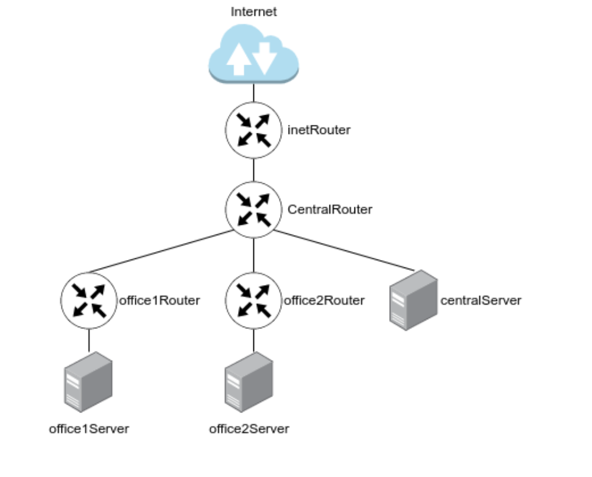
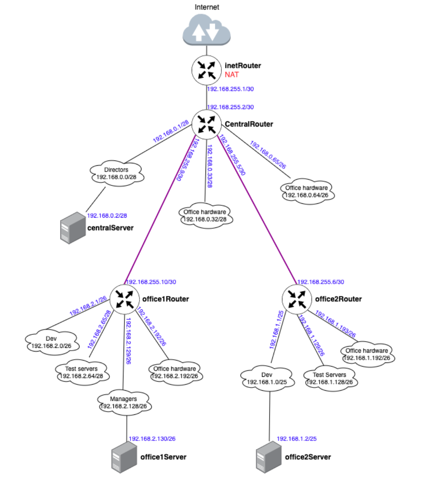

# Administrator Linux. Professional

## Урок 28. Домашнее задание

Vagrant-стенд c сетевой лабораторией

### Описание домашнего задания

Развернуть Vagrant-стенд

Построить следующую сетевую архитектуру:

#### Сеть office1

- 192.168.2.0/26      - dev
- 192.168.2.64/26     - test servers
- 192.168.2.128/26    - managers
- 192.168.2.192/26    - office hardware

#### Сеть office2

- 192.168.1.0/25      - dev
- 192.168.1.128/26    - test servers
- 192.168.1.192/26    - office hardware

#### Сеть central

- 192.168.0.0/28     - directors
- 192.168.0.32/28    - office hardware
- 192.168.0.64/26    - wifi

Итого должны получиться следующие сервера:

- inetRouter
- centralRouter
- office1Router
- office2Router
- centralServer
- office1Server
- office2Server



Выполнить теоретическую и практическую части

В теоретической части требуется:

- Найти свободные подсети
- Посчитать количество узлов в каждой подсети, включая свободные
- Указать Broadcast-адрес для каждой подсети
- Проверить, нет ли ошибок при разбиении

В практической части требуется:

- Соединить офисы в сеть согласно логической схеме и настроить роутинг
- Интернет-трафик со всех серверов должен ходить через inetRouter
- Все сервера должны видеть друг друга (должен проходить ping)
- У всех новых серверов отключить дефолт на NAT (eth0), который vagrant поднимает для связи
- Добавить дополнительные сетевые интерфейсы, если потребуется

### Теоретическая часть

На основании исходных данных составим таблицу, где будут перечислены все сети организации с указанием адреса сети, маски сети, количества узлов в сети, адреса первого и последнеого хота в сети и широковещательный адрес сети.


| Имя сети | Сеть | Маска сети | Кол-во узлов | Начальный адрес узла | Конечный адрес узла | Широковещательный адрес |
| ---  | --- | --- | --- | --- | --- | --- |
| Сеть Central |
| Directors | 192.168.0.0/28 | 255.255.255.240 | 14 | 192.168.0.1 | 192.168.0.14 | 192.168.0.15 |
| Office hardware | 192.168.0.32/28 | 255.255.255.240 | 14 | 192.168.0.33 | 192.168.0.46 | 192.168.0.47 |
| Wifi (mgt network) | 192.168.0.64/26 | 255.255.255.192 | 62 | 192.168.0.65 | 192.168.0.126 | 192.168.0.127 |
| Сеть Office1 |
| Dev | 192.168.2.0/26 | 255.255.255.192 | 62 | 192.168.2.1 | 192.168.2.62 | 192.168.2.63 |
| Test | 192.168.2.64/26 | 255.255.255.192 | 62 | 192.168.2.65 | 192.168.2.126 | 192.168.2.127 |
| Managers | 192.168.2.128/26 | 255.255.255.192 | 62 | 192.168.2.129 | 192.168.2.190 | 192.168.2.191 |
| Office hardware | 192.168.2.192/26 | 255.255.255.192 | 62 | 192.168.2.193 | 192.168.2.254 | 192.168.2.255 |
| Сеть Office2 |
| Dev | 192.168.1.0/25 | 255.255.255.128 | 126 | 192.168.1.1 | 192.168.1.126 | 192.168.1.127 |
| Test | 192.168.1.128/26 | 255.255.255.192 | 62 | 192.168.1.129 | 192.168.1.190 | 192.168.1.191 |
| Ofiice | 192.168.1.192/26 | 255.255.255.192 | 62 | 192.168.1.193 | 192.168.1.254 | 192.168.1.255 |
| Сеть inetRouter - centralRouter |
| Inet - central | 192.168.255.0/30 | 255.255.255.252 | 2 | 192.168.255.1 | 192.168.255.2 | 192.168.255.3 |

#### Свободные подсети

- 192.168.0.16/28
- 192.168.0.48/28
- 192.168.0.128/25

- 192.168.255.64/26
- 192.168.255.32/27
- 192.168.255.16/28
- 192.168.255.8/29
- 192.168.255.4/30

#### количество узлов в каждой подсети

Указан в таблице 

#### Broadcast-адрес для каждой подсети

Указан в таблице

#### Проверить, нет ли ошибок при разбиении
 
Ошибок нет


### Практическая часть

Схема сети



Будем разворачивать 7 ВМ на ОС Ubuntu 22.04

Подготовим [Vagrantfile](https://github.com/anashoff/otus/blob/master/lesson28/Vagrantfile)

```ruby
# -*- mode: ruby -*-
# vim: set ft=ruby :

MACHINES = {
  :router1 => {
        :box_name => "ubuntu/focal64",
        :vm_name => "router1",
        :net => [
                   ["10.0.10.1", 2, "255.255.255.252", "r1-r2"],
                   ["10.0.12.1", 3, "255.255.255.252", "r1-r3"],
                   ["192.168.10.1", 4, "255.255.255.0", "net1"],
                   ["192.168.50.10", 5],
                ]
  },

  :router2 => {
        :box_name => "ubuntu/focal64",
        :vm_name => "router2",
        :net => [
                   ['10.0.10.2', 2, "255.255.255.252", "r1-r2"],
                   ['10.0.11.2', 3, "255.255.255.252", "r2-r3"],
                   ['192.168.20.1', 4, "255.255.255.0", "net2"],
                   ['192.168.50.11', 5]
                ]
  },

  :router3 => {
        :box_name => "ubuntu/focal64",
        :vm_name => "router3",
        :net => [
                   ['10.0.11.1', 2, "255.255.255.252", "r2-r3"],
                   ['10.0.12.2', 3, "255.255.255.252", "r1-r3"],
                   ['192.168.30.1', 4, "255.255.255.0", "net3"],
                   ['192.168.50.12', 5]
                ]
  }

}

ssh_pub_key = File.readlines("#{Dir.home}/.ssh/id_ed25519.pub").first.strip


Vagrant.configure("2") do |config|

  MACHINES.each do |boxname, boxconfig|
    
    config.vm.define boxname do |box|
   
      box.vm.box = boxconfig[:box_name]
      box.vm.host_name = boxconfig[:vm_name]
      box.vm.provision 'shell', inline: 'mkdir -p /root/.ssh'
      box.vm.provision 'shell', inline: "echo #{ssh_pub_key} >> /root/.ssh/authorized_keys"
      box.vm.provision 'shell', inline: "echo #{ssh_pub_key} >> /home/vagrant/.ssh/authorized_keys", privileged: false
      boxconfig[:net].each do |ipconf|
        box.vm.network("private_network", ip: ipconf[0], adapter: ipconf[1], netmask: ipconf[2], virtualbox__intnet: ipconf[3])
      end


     end
  end
end
```

#### Подготовка плейбука ansible

Подготовим плейбук ansible для выполнения работы

Структура плейбука

```text
├── ansible
│   ├── ansible.cfg
│   ├── defaults
│   │   └── main.yml
│   ├── hosts
│   ├── provision.yml
│   └── template
│       ├── daemons
│       └── frr.conf.j2
```

Файл конфигурации [ansible.cfg](https://github.com/anashoff/otus/blob/master/lesson33/ansible.cfg)

```ini
[defaults]
#Отключение проверки ключа хоста
host_key_checking = false
#Указываем имя файла инвентаризации
inventory = hosts
#Отключаем игнорирование предупреждений
command_warnings= false
```

Файл настроек хостов [hosts](https://github.com/anashoff/otus/blob/master/lesson33/hosts)

```ini
[routers]
router1 ansible_host=192.168.50.10 ansible_user=vagrant router_id=1.1.1.1
router2 ansible_host=192.168.50.11 ansible_user=vagrant router_id=2.2.2.2
router3 ansible_host=192.168.50.12 ansible_user=vagrant router_id=3.3.3.3
```

Файл шаблона конфигурации FRR template/frr.conf.j2

```jinja
!Указание версии FRR
frr version 10.2.1
frr defaults traditional
!Указываем имя машины
hostname {{ ansible_hostname }}
log syslog informational
no ipv6 forwarding
service integrated-vtysh-config
!
!Добавляем информацию об интерфейсе enp0s8
interface enp0s8
 !Указываем имя интерфейса
 description r1-r2
 !Указываем ip-aдрес и маску 
 ip address {{ ansible_enp0s8['ipv4']['address'] }}/30
 !Указываем параметр игнорирования MTU
 ip ospf mtu-ignore
 !Если потребуется, можно указать «стоимость» интерфейса
 !ip ospf cost 1000
 !Указываем параметры hello-интервала для OSPF пакетов
 ip ospf hello-interval 10
 !Указываем параметры dead-интервала для OSPF пакетов
 !Должно быть кратно предыдущему значению
 ip ospf dead-interval 30
!
interface enp0s9
 description r1-r3
 ip address {{ ansible_enp0s9['ipv4']['address'] }}/30
 ip ospf mtu-ignore
 !ip ospf cost 45
 ip ospf hello-interval 10
 ip ospf dead-interval 30

interface enp0s10
 description net_{{ ansible_hostname }}
 ip address {{ ansible_enp0s10['ipv4']['address'] }}/24
 ip ospf mtu-ignore
 !ip ospf cost 45
 ip ospf hello-interval 10
 ip ospf dead-interval 30 
!
!Начало настройки OSPF
router ospf
 !Указываем router-id 
 !router-id {{ router_id }}
 !Указываем сети, которые хотим анонсировать соседним роутерам
 network {{ ansible_enp0s8['ipv4']['network'] }}/30 area 0
 network {{ ansible_enp0s9['ipv4']['network'] }}/30 area 0
 network {{ ansible_enp0s10['ipv4']['network'] }}/24 area 0 

!Указываем адрес log-файла
log file /var/log/frr/frr.log
default-information originate always
```

Файл шаблона настройки демона ospfd в FRR [template/daemons](https://github.com/anashoff/otus/blob/master/lesson33/daemons)

Включаем демон ospfd. Судя по описанию демон zebra запущен всегда

```ini
# This file tells the frr package which daemons to start.
#
# Sample configurations for these daemons can be found in
# /usr/share/doc/frr/examples/.
#
# ATTENTION:
#
# When activating a daemon for the first time, a config file, even if it is
# empty, has to be present *and* be owned by the user and group "frr", else
# the daemon will not be started by /etc/init.d/frr. The permissions should
# be u=rw,g=r,o=.
# When using "vtysh" such a config file is also needed. It should be owned by
# group "frrvty" and set to ug=rw,o= though. Check /etc/pam.d/frr, too.
#
# The watchfrr, zebra and staticd daemons are always started.
#

bgpd=no
ospfd=yes
ospf6d=no
ripd=no
ripngd=no
isisd=no
pimd=no
pim6d=no
ldpd=no
nhrpd=no
eigrpd=no
babeld=no
sharpd=no
pbrd=no
bfdd=no
fabricd=no
vrrpd=no
pathd=no

#
# If this option is set the /etc/init.d/frr script automatically loads
# the config via "vtysh -b" when the servers are started.
# Check /etc/pam.d/frr if you intend to use "vtysh"!
#
vtysh_enable=yes
zebra_options="  -A 127.0.0.1 -s 90000000"
mgmtd_options="  -A 127.0.0.1"
bgpd_options="   -A 127.0.0.1"
ospfd_options="  -A 127.0.0.1"
ospf6d_options=" -A ::1"
ripd_options="   -A 127.0.0.1"
ripngd_options=" -A ::1"
isisd_options="  -A 127.0.0.1"
pimd_options="   -A 127.0.0.1"
pim6d_options="  -A ::1"
ldpd_options="   -A 127.0.0.1"
nhrpd_options="  -A 127.0.0.1"
eigrpd_options=" -A 127.0.0.1"
babeld_options=" -A 127.0.0.1"
sharpd_options=" -A 127.0.0.1"
pbrd_options="   -A 127.0.0.1"
staticd_options="-A 127.0.0.1"
bfdd_options="   -A 127.0.0.1"
fabricd_options="-A 127.0.0.1"
vrrpd_options="  -A 127.0.0.1"
pathd_options="  -A 127.0.0.1"

# If you want to pass a common option to all daemons, you can use the
# "frr_global_options" variable.
#
#frr_global_options=""


# The list of daemons to watch is automatically generated by the init script.
# This variable can be used to pass options to watchfrr that will be passed
# prior to the daemon list.
#
# To make watchfrr create/join the specified netns, add the the "--netns"
# option here. It will only have an effect in /etc/frr/<somename>/daemons, and
# you need to start FRR with "/usr/lib/frr/frrinit.sh start <somename>".
#
#watchfrr_options=""


# configuration profile
#
#frr_profile="traditional"
#frr_profile="datacenter"


# This is the maximum number of FD's that will be available.  Upon startup this
# is read by the control files and ulimit is called.  Uncomment and use a
# reasonable value for your setup if you are expecting a large number of peers
# in say BGP.
#
#MAX_FDS=1024

# Uncomment this option if you want to run FRR as a non-root user. Note that
# you should know what you are doing since most of the daemons need root
# to work. This could be useful if you want to run FRR in a container
# for instance.
# FRR_NO_ROOT="yes"

# For any daemon, you can specify a "wrap" command to start instead of starting
# the daemon directly. This will simply be prepended to the daemon invocation.
# These variables have the form daemon_wrap, where 'daemon' is the name of the
# daemon (the same pattern as the daemon_options variables).
#
# Note that when daemons are started, they are told to daemonize with the `-d`
# option. This has several implications. For one, the init script expects that
# when it invokes a daemon, the invocation returns immediately. If you add a
# wrap command here, it must comply with this expectation and daemonize as
# well, or the init script will never return. Furthermore, because daemons are
# themselves daemonized with -d, you must ensure that your wrapper command is
# capable of following child processes after a fork() if you need it to do so.
#
# If your desired wrapper does not support daemonization, you can wrap it with
# a utility program that daemonizes programs, such as 'daemonize'. An example
# of this might look like:
#
# bgpd_wrap="/usr/bin/daemonize /usr/bin/mywrapper"
#
# This is particularly useful for programs which record processes but lack
# daemonization options, such as perf and rr.
#
# If you wish to wrap all daemons in the same way, you may set the "all_wrap"
# variable.
#
#all_wrap=""
```

Файл плейбука provision.yml

```yaml
---
#Начало файла provision.yml
- name: OSPF
  #Указываем имя хоста или группу, которые будем настраивать
  hosts: all
  #Параметр выполнения модулей от root-пользователя
  become: yes
  #Указание файла с дополнителыми переменными (понадобится при добавлении темплейтов)
  vars_files:
    - defaults/main.yml
  tasks:
  # Обновление пакетов и установка vim, traceroute, tcpdump, net-tools
  - name: install base tools
    apt:
      name:
        - vim
        - traceroute
        - tcpdump
        - net-tools
      state: present
      update_cache: true
  #Отключаем UFW и удаляем его из автозагрузки
  - name: disable ufw service
    service:
      name: ufw
      state: stopped
      enabled: false
  # Добавляем gpg-key репозитория
  - name: add gpg frrouting.org
    apt_key:
      url: "https://deb.frrouting.org/frr/keys.asc"
      state: present
  # Добавляем репозиторий https://deb.frrouting.org/frr
  - name: add frr repo
    apt_repository:
      repo: 'deb https://deb.frrouting.org/frr {{ ansible_distribution_release }} frr-stable'
      state: present
  # Обновляем пакеты и устанавливаем FRR
  - name: install FRR packages
    apt:
      name: 
        - frr
        - frr-pythontools
      state: present
      update_cache: true
  # Включаем маршрутизацию транзитных пакетов
  - name: set up forward packages across routers
    sysctl:
      name: net.ipv4.conf.all.forwarding
      value: '1'
      state: present
  # Копируем файл daemons на хосты, указываем владельца и права
  - name: base set up OSPF 
    template:
      src: template/daemons
      dest: /etc/frr/daemons
      owner: frr
      group: frr
      mode: 0640
  # Копируем файл frr.conf на хосты, указываем владельца и права
  - name: set up OSPF 
    template:
      src: template/frr.conf.j2
      dest: /etc/frr/frr.conf
      owner: frr
      group: frr
      mode: 0640
    tags:
      - setup_ospf
  # Перезапускам FRR и добавляем в автозагрузку
  - name: restart FRR
    service:
      name: frr
      state: restarted
      enabled: true
    tags:
      - setup_ospf
```

## Выполнение работы

### Настроить OSPF между машинами

Запускаем Vagrantfile

```zsh
┬─[anasha@otus:~/less28]─[15:36:28]
╰─o$ vagrant up
Bringing machine 'inetRouter' up with 'virtualbox' provider...
Bringing machine 'centralRouter' up with 'virtualbox' provider...
Bringing machine 'centralServer' up with 'virtualbox' provider...
Bringing machine 'office1Router' up with 'virtualbox' provider...
Bringing machine 'office1Server' up with 'virtualbox' provider...
Bringing machine 'office2Router' up with 'virtualbox' provider...
Bringing machine 'office2Server' up with 'virtualbox' provider...

...........................................................

```

Затем плейбук

```ini
┬─[anasha@otus:~/l/ansible]─[15:43:54]
╰─o$ ansible-playbook provision.yml

PLAY [network lab] **************************************************************************************************************

TASK [Gathering Facts] **************************************************************************************************************
ok: [inetRouter]
ok: [office2Router]
ok: [centralServer]
ok: [office1Router]
ok: [centralRouter]
ok: [office1Server]
ok: [office2Server]

TASK [install base tools] **************************************************************************************************************
changed: [centralRouter]
changed: [inetRouter]
changed: [centralServer]
changed: [office2Router]
changed: [office1Router]
changed: [office1Server]
changed: [office2Server]

TASK [disable ufw service] **************************************************************************************************************
skipping: [centralRouter]
skipping: [office1Router]
skipping: [office2Router]
skipping: [centralServer]
skipping: [office1Server]
skipping: [office2Server]
changed: [inetRouter]

TASK [Set up NAT on inetRouter] ***********************************************************************************************************
skipping: [centralRouter] => (item={'src': 'iptables_rules.ipv4', 'dest': '/etc/iptables_rules.ipv4', 'mode': '0644'}) 
skipping: [centralRouter] => (item={'src': 'iptables_restore', 'dest': '/etc/network/if-pre-up.d/iptables', 'mode': '0755'}) 
skipping: [centralRouter]
skipping: [office1Router] => (item={'src': 'iptables_rules.ipv4', 'dest': '/etc/iptables_rules.ipv4', 'mode': '0644'}) 
skipping: [office1Router] => (item={'src': 'iptables_restore', 'dest': '/etc/network/if-pre-up.d/iptables', 'mode': '0755'}) 
skipping: [office1Router]
skipping: [office2Router] => (item={'src': 'iptables_rules.ipv4', 'dest': '/etc/iptables_rules.ipv4', 'mode': '0644'}) 
skipping: [office2Router] => (item={'src': 'iptables_restore', 'dest': '/etc/network/if-pre-up.d/iptables', 'mode': '0755'}) 
skipping: [centralServer] => (item={'src': 'iptables_rules.ipv4', 'dest': '/etc/iptables_rules.ipv4', 'mode': '0644'}) 
skipping: [office2Router]
skipping: [centralServer] => (item={'src': 'iptables_restore', 'dest': '/etc/network/if-pre-up.d/iptables', 'mode': '0755'}) 
skipping: [centralServer]
skipping: [office1Server] => (item={'src': 'iptables_rules.ipv4', 'dest': '/etc/iptables_rules.ipv4', 'mode': '0644'}) 
skipping: [office1Server] => (item={'src': 'iptables_restore', 'dest': '/etc/network/if-pre-up.d/iptables', 'mode': '0755'}) 
skipping: [office1Server]
skipping: [office2Server] => (item={'src': 'iptables_rules.ipv4', 'dest': '/etc/iptables_rules.ipv4', 'mode': '0644'}) 
skipping: [office2Server] => (item={'src': 'iptables_restore', 'dest': '/etc/network/if-pre-up.d/iptables', 'mode': '0755'}) 
skipping: [office2Server]
changed: [inetRouter] => (item={'src': 'iptables_rules.ipv4', 'dest': '/etc/iptables_rules.ipv4', 'mode': '0644'})
changed: [inetRouter] => (item={'src': 'iptables_restore', 'dest': '/etc/network/if-pre-up.d/iptables', 'mode': '0755'})

TASK [set up forward packages across routers] *********************************************************************************************
skipping: [centralServer]
skipping: [office1Server]
skipping: [office2Server]
changed: [centralRouter]
changed: [inetRouter]
changed: [office2Router]
changed: [office1Router]

TASK [disable default route] **************************************************************************************************************
skipping: [inetRouter]
changed: [office1Router]
changed: [centralRouter]
changed: [office2Router]
changed: [office1Server]
changed: [centralServer]
changed: [office2Server]

TASK [add default gateway for centralRouter] **********************************************************************************************
changed: [inetRouter]
changed: [office1Router]
changed: [centralRouter]
changed: [centralServer]
changed: [office2Router]
changed: [office1Server]
changed: [office2Server]

TASK [restart all hosts] **************************************************************************************************************
changed: [centralRouter]
changed: [office2Router]
changed: [office1Router]
changed: [inetRouter]
changed: [office2Server]
changed: [office1Server]
changed: [centralServer]

PLAY RECAP *************************************************************************************************************
centralRouter              : ok=6    changed=5    unreachable=0    failed=0    skipped=2    rescued=0    ignored=0   
centralServer              : ok=5    changed=4    unreachable=0    failed=0    skipped=3    rescued=0    ignored=0   
inetRouter                 : ok=7    changed=6    unreachable=0    failed=0    skipped=1    rescued=0    ignored=0   
office1Router              : ok=6    changed=5    unreachable=0    failed=0    skipped=2    rescued=0    ignored=0   
office1Server              : ok=5    changed=4    unreachable=0    failed=0    skipped=3    rescued=0    ignored=0   
office2Router              : ok=6    changed=5    unreachable=0    failed=0    skipped=2    rescued=0    ignored=0   
office2Server              : ok=5    changed=4    unreachable=0    failed=0    skipped=3    rescued=0    ignored=0   

┬─[anasha@otus:~/l/ansible]─[15:47:01]

```

Проверим работу сетевой лаборатории

Подключаемся к  router_1 и проверяем сервис FRR


Сервис запущен

Проверяем прохождение пинга по сетям


Видим, что все сети доступны

Посмотрим маршруты до 192.168.30.0 сети с включенным и выключенным интерфейсом enp0s9


Видим, что при отключении интерфейса марштрут изменяется

Посмотрим таблицу маршрутов роутера


Убеждаемся, что все маршгруты построены верно

Аналогично проверяем router_2 и router_3

Подключаемся к  router_2 и проверяем сервис FRR


Сервис запущен

Проверяем прохождение пинга по сетям


Видим, что все сети доступны

Посмотрим маршруты до 192.168.30.0 сети с включенным и выключенным интерфейсом enp0s9


Видим, что при отключении интерфейса марштрут изменяется

Посмотрим таблицу маршрутов роутера


Убеждаемся, что все маршгруты построены верно

Подключаемся к  router_3 и проверяем сервис FRR


Сервис запущен

Проверяем прохождение пинга по сетям


Видим, что все сети доступны

Посмотрим маршруты до 192.168.10.0 сети с включенным и выключенным интерфейсом enp0s9


Видим, что при отключении интерфейса марштрут изменяется

Посмотрим таблицу маршрутов роутера


Убеждаемся, что все маршгруты построены верно

### Изобразить ассиметричный роутинг

Добавим в плейбук натройку ассиметричного роутинга

```yaml
 # Отключаем запрет ассиметричного роутинга 
  - name: set up asynchronous routing
    sysctl:
      name: net.ipv4.conf.all.rp_filter
      value: '0'
      state: present
```

В файле шаблона frr.conf.j2 изменяем настроки интерфейса enp0s8, добавляем условие

```jinja

 ip ospf cost 1000

 !ip ospf cost 450

```

Запускаем плейбук

```zsh
┬─[anasha@otus:~/less33]─[16:32:55]
╰─o$ ansible-playbook -i ansible/hosts -l all ansible/provision.yml -e "host_key_checking=false"

PLAY [OSPF] **************************************************************************************************************

TASK [Gathering Facts] **************************************************************************************************************
ok: [router1]
ok: [router2]
ok: [router3]

...............................................

TASK [set up asynchronous routing] ********************************************************************************************************
changed: [router1]
changed: [router3]
changed: [router2]

TASK [set up OSPF] **************************************************************************************************************
ok: [router2]
ok: [router3]
changed: [router1]

TASK [restart FRR] **************************************************************************************************************
changed: [router3]
changed: [router1]
changed: [router2]

PLAY RECAP **************************************************************************************************************
router1                    : ok=11   changed=3    unreachable=0    failed=0    skipped=0    rescued=0    ignored=0   
router2                    : ok=11   changed=2    unreachable=0    failed=0    skipped=0    rescued=0    ignored=0   
router3                    : ok=11   changed=2    unreachable=0    failed=0    skipped=0    rescued=0    ignored=0   
```

Проверяем работу маршрутизаторов

Заходим на router_1 и запускаем ping от 192.168.10.1 до 192.168.20.1


Заходим на router_2 и запускаем tcpdump на интерфейсе enp0s9


А затем на интерфейсе enp0s8


Видим, что интерфейс enp0s9 только получает трафик с адреса 192.168.10.1, а интерфейс enp0s8 - только отправляет трафик на адрес 192.168.10.1

Таким образом мы видим  ассиметричный роутинг

### Сделать один из линков "дорогим", но что бы при этом роутинг был симметричным

Снова изменим шаблон настроек frr.conf.j2, поменяв условие

```jinja

 !ip ospf cost 1000

 !ip ospf cost 1000

 !ip ospf cost 450

```

В файл переменных плейбука добавим переменную **symmetric_routing**. Для включения симметричного роутинга присвоим ей значение **true**

Чтобы не выполнять весь плейбук запустим его с тегом **setup_ospf**, благодаря котоому будет выполнени только перенастройка и перезапуск FRR

```zsh
┬─[anasha@otus:~/less33]─[16:48:10]
╰─o$ ansible-playbook -i ansible/hosts -l all ansible/provision.yml -e "host_key_checking=false" -t setup_ospf

PLAY [OSPF] **************************************************************************************************************

TASK [Gathering Facts] **************************************************************************************************************
ok: [router2]
ok: [router1]
ok: [router3]

TASK [set up OSPF] **************************************************************************************************************
ok: [router1]
ok: [router3]
changed: [router2]

TASK [restart FRR] **************************************************************************************************************
changed: [router3]
changed: [router1]
changed: [router2]

PLAY RECAP **************************************************************************************************************
router1                    : ok=3    changed=1    unreachable=0    failed=0    skipped=0    rescued=0    ignored=0   
router2                    : ok=3    changed=2    unreachable=0    failed=0    skipped=0    rescued=0    ignored=0   
router3                    : ok=3    changed=1    unreachable=0    failed=0    skipped=0    rescued=0    ignored=0   
```

Запускаем ping на router_1 от 192.168.10.1 до 192.168.20.1


Заходим на router_2 и запускаем tcpdump на интерфейсе enp0s9


Видим, что интерфейс enp0s9 и получает трафик с адреса 192.168.10.1, и отправляет трафик на него же

Трафик между роутерами ходит симметрично

Задание на этом выполнено.

Все файлы работы, использованные в задании, доступны на [github](https://github.com/anashoff/otus/blob/master/lesson33)
