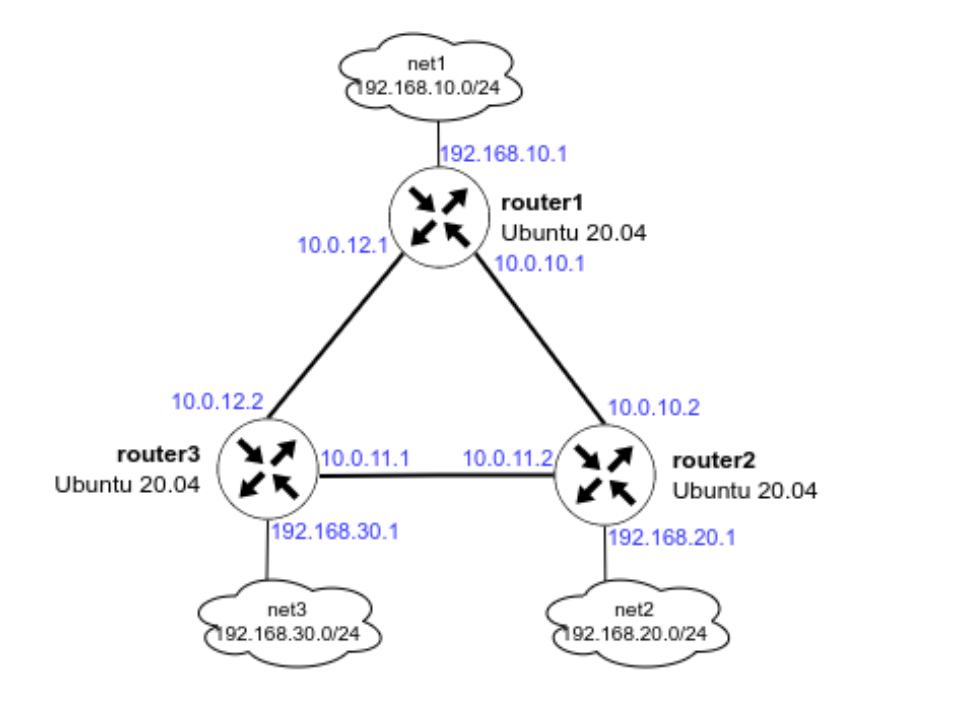

# Administrator Linux. Professional

## Урок 33. Домашнее задание

Vagrant-стенд c OSPF

### Описание домашнего задания

 Создать домашнюю сетевую лабораторию. Научится настраивать протокол OSPF в Linux-based системах

1. Развернуть 3 виртуальные машины
2. Объединить их разными vlan
- настроить OSPF между машинами на базе Quagga;
- изобразить ассиметричный роутинг;
- сделать один из линков "дорогим", но что бы при этом роутинг был симметричным.
### Подготовка среды выполнения

Для выполнения задания развернем 3 виртуальные машины, соединенные между собой разными VLAN. 

Схема сети



Подготовим [Vagrantfile](https://github.com/anashoff/otus/blob/master/lesson33/Vagrantfile)

```ruby
# -*- mode: ruby -*-
# vim: set ft=ruby :

MACHINES = {
  :router1 => {
        :box_name => "ubuntu/focal64",
        :vm_name => "router1",
        :net => [
                   ["10.0.10.1", 2, "255.255.255.252", "r1-r2"],
                   ["10.0.12.1", 3, "255.255.255.252", "r1-r3"],
                   ["192.168.10.1", 4, "255.255.255.0", "net1"],
                   ["192.168.50.10", 5],
                ]
  },

  :router2 => {
        :box_name => "ubuntu/focal64",
        :vm_name => "router2",
        :net => [
                   ['10.0.10.2', 2, "255.255.255.252", "r1-r2"],
                   ['10.0.11.2', 3, "255.255.255.252", "r2-r3"],
                   ['192.168.20.1', 4, "255.255.255.0", "net2"],
                   ['192.168.50.11', 5]
                ]
  },

  :router3 => {
        :box_name => "ubuntu/focal64",
        :vm_name => "router3",
        :net => [
                   ['10.0.11.1', 2, "255.255.255.252", "r2-r3"],
                   ['10.0.12.2', 3, "255.255.255.252", "r1-r3"],
                   ['192.168.30.1', 4, "255.255.255.0", "net3"],
                   ['192.168.50.12', 5]
                ]
  }

}

ssh_pub_key = File.readlines("#{Dir.home}/.ssh/id_ed25519.pub").first.strip


Vagrant.configure("2") do |config|

  MACHINES.each do |boxname, boxconfig|
    
    config.vm.define boxname do |box|
   
      box.vm.box = boxconfig[:box_name]
      box.vm.host_name = boxconfig[:vm_name]
      box.vm.provision 'shell', inline: 'mkdir -p /root/.ssh'
      box.vm.provision 'shell', inline: "echo #{ssh_pub_key} >> /root/.ssh/authorized_keys"
      box.vm.provision 'shell', inline: "echo #{ssh_pub_key} >> /home/vagrant/.ssh/authorized_keys", privileged: false
      boxconfig[:net].each do |ipconf|
        box.vm.network("private_network", ip: ipconf[0], adapter: ipconf[1], netmask: ipconf[2], virtualbox__intnet: ipconf[3])
      end


     end
  end
end
```

#### Подготовка плейбука ansible

Подготовим плейбук ansible для выполнения работы

Структура плейбука

```text
├── ansible
│   ├── ansible.cfg
│   ├── defaults
│   │   └── main.yml
│   ├── hosts
│   ├── provision.yml
│   └── template
│       ├── daemons
│       └── frr.conf.j2
```

Файл конфигурации [ansible.cfg](https://github.com/anashoff/otus/blob/master/lesson33/ansible.cfg)

```ini
[defaults]
#Отключение проверки ключа хоста
host_key_checking = false
#Указываем имя файла инвентаризации
inventory = hosts
#Отключаем игнорирование предупреждений
command_warnings= false
```

Файл настроек хостов [hosts](https://github.com/anashoff/otus/blob/master/lesson33/hosts)

```ini
[routers]
router1 ansible_host=192.168.50.10 ansible_user=vagrant router_id=1.1.1.1
router2 ansible_host=192.168.50.11 ansible_user=vagrant router_id=2.2.2.2
router3 ansible_host=192.168.50.12 ansible_user=vagrant router_id=3.3.3.3
```

Файл шаблона конфигурации FRR [template/frr.conf..j2](https://github.com/anashoff/otus/blob/master/lesson33/frr.conf.j2)

```jinja
!Указание версии FRR
frr version 10.2.1
frr defaults traditional
!Указываем имя машины
hostname {{ ansible_hostname }}
log syslog informational
no ipv6 forwarding
service integrated-vtysh-config
!
!Добавляем информацию об интерфейсе enp0s8
interface enp0s8
 !Указываем имя интерфейса
 description r1-r2
 !Указываем ip-aдрес и маску 
 ip address {{ ansible_enp0s8['ipv4']['address'] }}/30
 !Указываем параметр игнорирования MTU
 ip ospf mtu-ignore
 !Если потребуется, можно указать «стоимость» интерфейса

 !ip ospf cost 1000

 !ip ospf cost 1000

 !ip ospf cost 450

 !Указываем параметры hello-интервала для OSPF пакетов
 ip ospf hello-interval 10
 !Указываем параметры dead-интервала для OSPF пакетов
 !Должно быть кратно предыдущему значению
 ip ospf dead-interval 30
!
interface enp0s9
 description r1-r3
 ip address {{ ansible_enp0s9['ipv4']['address'] }}/30
 ip ospf mtu-ignore
 !ip ospf cost 45
 ip ospf hello-interval 10
 ip ospf dead-interval 30

interface enp0s10
 description net_{{ ansible_hostname }}
 ip address {{ ansible_enp0s10['ipv4']['address'] }}/24
 ip ospf mtu-ignore
 !ip ospf cost 45
 ip ospf hello-interval 10
 ip ospf dead-interval 30 
!
!Начало настройки OSPF
router ospf
 !Указываем router-id 
 !router-id {{ router_id }}
 !Указываем сети, которые хотим анонсировать соседним роутерам
 network {{ ansible_enp0s8['ipv4']['network'] }}/30 area 0
 network {{ ansible_enp0s9['ipv4']['network'] }}/30 area 0
 network {{ ansible_enp0s10['ipv4']['network'] }}/24 area 0 

!Указываем адрес log-файла
log file /var/log/frr/frr.log
default-information originate always
```

Файл шаблона настройки демона ospfd в FRR [template/daemons](https://github.com/anashoff/otus/blob/master/lesson33/daemons)

```ini
# This file tells the frr package which daemons to start.
#
# Sample configurations for these daemons can be found in
# /usr/share/doc/frr/examples/.
#
# ATTENTION:
#
# When activating a daemon for the first time, a config file, even if it is
# empty, has to be present *and* be owned by the user and group "frr", else
# the daemon will not be started by /etc/init.d/frr. The permissions should
# be u=rw,g=r,o=.
# When using "vtysh" such a config file is also needed. It should be owned by
# group "frrvty" and set to ug=rw,o= though. Check /etc/pam.d/frr, too.
#
# The watchfrr, zebra and staticd daemons are always started.
#

bgpd=no
ospfd=yes
ospf6d=no
ripd=no
ripngd=no
isisd=no
pimd=no
pim6d=no
ldpd=no
nhrpd=no
eigrpd=no
babeld=no
sharpd=no
pbrd=no
bfdd=no
fabricd=no
vrrpd=no
pathd=no

#
# If this option is set the /etc/init.d/frr script automatically loads
# the config via "vtysh -b" when the servers are started.
# Check /etc/pam.d/frr if you intend to use "vtysh"!
#
vtysh_enable=yes
zebra_options="  -A 127.0.0.1 -s 90000000"
mgmtd_options="  -A 127.0.0.1"
bgpd_options="   -A 127.0.0.1"
ospfd_options="  -A 127.0.0.1"
ospf6d_options=" -A ::1"
ripd_options="   -A 127.0.0.1"
ripngd_options=" -A ::1"
isisd_options="  -A 127.0.0.1"
pimd_options="   -A 127.0.0.1"
pim6d_options="  -A ::1"
ldpd_options="   -A 127.0.0.1"
nhrpd_options="  -A 127.0.0.1"
eigrpd_options=" -A 127.0.0.1"
babeld_options=" -A 127.0.0.1"
sharpd_options=" -A 127.0.0.1"
pbrd_options="   -A 127.0.0.1"
staticd_options="-A 127.0.0.1"
bfdd_options="   -A 127.0.0.1"
fabricd_options="-A 127.0.0.1"
vrrpd_options="  -A 127.0.0.1"
pathd_options="  -A 127.0.0.1"

# If you want to pass a common option to all daemons, you can use the
# "frr_global_options" variable.
#
#frr_global_options=""


# The list of daemons to watch is automatically generated by the init script.
# This variable can be used to pass options to watchfrr that will be passed
# prior to the daemon list.
#
# To make watchfrr create/join the specified netns, add the the "--netns"
# option here. It will only have an effect in /etc/frr/<somename>/daemons, and
# you need to start FRR with "/usr/lib/frr/frrinit.sh start <somename>".
#
#watchfrr_options=""


# configuration profile
#
#frr_profile="traditional"
#frr_profile="datacenter"


# This is the maximum number of FD's that will be available.  Upon startup this
# is read by the control files and ulimit is called.  Uncomment and use a
# reasonable value for your setup if you are expecting a large number of peers
# in say BGP.
#
#MAX_FDS=1024

# Uncomment this option if you want to run FRR as a non-root user. Note that
# you should know what you are doing since most of the daemons need root
# to work. This could be useful if you want to run FRR in a container
# for instance.
# FRR_NO_ROOT="yes"

# For any daemon, you can specify a "wrap" command to start instead of starting
# the daemon directly. This will simply be prepended to the daemon invocation.
# These variables have the form daemon_wrap, where 'daemon' is the name of the
# daemon (the same pattern as the daemon_options variables).
#
# Note that when daemons are started, they are told to daemonize with the `-d`
# option. This has several implications. For one, the init script expects that
# when it invokes a daemon, the invocation returns immediately. If you add a
# wrap command here, it must comply with this expectation and daemonize as
# well, or the init script will never return. Furthermore, because daemons are
# themselves daemonized with -d, you must ensure that your wrapper command is
# capable of following child processes after a fork() if you need it to do so.
#
# If your desired wrapper does not support daemonization, you can wrap it with
# a utility program that daemonizes programs, such as 'daemonize'. An example
# of this might look like:
#
# bgpd_wrap="/usr/bin/daemonize /usr/bin/mywrapper"
#
# This is particularly useful for programs which record processes but lack
# daemonization options, such as perf and rr.
#
# If you wish to wrap all daemons in the same way, you may set the "all_wrap"
# variable.
#
#all_wrap=""
```


Файл [playbook.yaml](https://github.com/anashoff/otus/blob/master/lesson22/playbook.yaml)

```yaml
---
- hosts: pam
  gather_facts: true
  become: yes
  tasks:
  - name: Create group admin
    group: 
      name: admin
      state: present
  - name: Create user otusadm and add it to group admin
    user: 
      name: otusadm
      create_home: yes
      shell: /bin/bash
      groups: admin
      append: yes
      password: "$6$rounds=656000$mysecretsalt$04wVf1FbaGRszgZJRYTZw/STBfYl3vioDMj9iN8W6vFPH7V1vNqb3BQkZoS.diohjkix6EKU5AR5wYXt5oVnz1"
  - name: Create user otus
    user: 
      name: otus
      create_home: yes
      shell: /bin/bash
      password: "$6$rounds=656000$mysecretsalt$04wVf1FbaGRszgZJRYTZw/STBfYl3vioDMj9iN8W6vFPH7V1vNqb3BQkZoS.diohjkix6EKU5AR5wYXt5oVnz1"
  - name: Add user root to group admin
    user:
      name: root
      groups: admin
      append: yes
  - name: Add user vagrant to group admin
    user:
      name: vagrant
      groups: admin
      append: yes 
  - name: write script
    ansible.builtin.template:
       src: script.j2
       dest: /usr/local/bin/login.sh
       mode: 755
  - name: Modify config file
    lineinfile:
      line: 'auth required pam_exec.so debug /usr/local/bin/login.sh'
      path: /etc/pam.d/sshd
```

Плейбук выполняет следующие команды

- Создает группу admin
- Создает пользователей otus и otusadm. Пользователь otusadm входит в группу admin. Пароль для пользователей ***Otus2022!***. Для использования в плейбуке создадим парольною строку при помощи команды

```ansible all -i localhost, -m debug -a "msg={{ 'Otus2022!' | password_hash('sha512', 'mysecretsalt') }}"```

- Создает скрипт /usr/local/bin/login.sh, назначает права на выполнение
- Добавляет в конфигурационный файл /ets/pam.d/sshd строку вызова скрипта при аутентификации в ssh

#### Выполнение работы

Запускаем виртуальную машину

```zsh
┬─[anasha@otus:~/less22]─[12:05:49]
╰─o$ vagrant up
Bringing machine 'pam' up with 'virtualbox' provider...
==> pam: Importing base box 'ubuntu/jammy64'...
==> pam: Matching MAC address for NAT networking...
==> pam: Setting the name of the VM: less22_pam_1733044629580_30889
==> pam: Clearing any previously set network interfaces...
==> pam: Preparing network interfaces based on configuration...
    pam: Adapter 1: nat
    pam: Adapter 2: hostonly
==> pam: Forwarding ports...
    pam: 22 (guest) => 2222 (host) (adapter 1)
==> pam: Running 'pre-boot' VM customizations...
==> pam: Booting VM...
==> pam: Waiting for machine to boot. This may take a few minutes...
    pam: SSH address: 127.0.0.1:2222
    pam: SSH username: vagrant
    pam: SSH auth method: private key
    pam: 
    pam: Vagrant insecure key detected. Vagrant will automatically replace
    pam: this with a newly generated keypair for better security.
    pam: 
    pam: Inserting generated public key within guest...
    pam: Removing insecure key from the guest if it's present...
    pam: Key inserted! Disconnecting and reconnecting using new SSH key...
==> pam: Machine booted and ready!
==> pam: Checking for guest additions in VM...
    pam: The guest additions on this VM do not match the installed version of
    pam: VirtualBox! In most cases this is fine, but in rare cases it can
    pam: prevent things such as shared folders from working properly. If you see
    pam: shared folder errors, please make sure the guest additions within the
    pam: virtual machine match the version of VirtualBox you have installed on
    pam: your host and reload your VM.
    pam: 
    pam: Guest Additions Version: 6.0.0 r127566
    pam: VirtualBox Version: 7.0
==> pam: Setting hostname...
==> pam: Configuring and enabling network interfaces...
==> pam: Running provisioner: shell...
    pam: Running: inline script
```

Затем плейбук

```zsh
┬─[anasha@otus:~/less22]─[12:17:41]
╰─o$ ansible-playbook playbook.yaml

PLAY [pam] **************************************************************************************************************

TASK [Gathering Facts] **************************************************************************************************************
ok: [pam]

TASK [Create group admin] **************************************************************************************************************
ok: [pam]

TASK [Create user otusadm and add it to group admin] **************************************************************************************************************
changed: [pam]

TASK [Create user otus] **************************************************************************************************************
changed: [pam]

TASK [Add user root to group admin] **************************************************************************************************************
changed: [pam]

TASK [Add user vagrant to group admin] **************************************************************************************************************
changed: [pam]

TASK [write script] **************************************************************************************************************
changed: [pam]

TASK [Modify config file] **************************************************************************************************************
changed: [pam]

PLAY RECAP **************************************************************************************************************
pam                        : ok=8    changed=6    unreachable=0    failed=0    skipped=0    rescued=0    ignored=0   
```

Проверяем работу.

Сегодня воскресение, так что пользователь otusadm должен зайти в сеанс, а пользователь otus - нет.

```zsh
┬─[anasha@otus:~/less22]─[12:18:06]
╰─o$ ssh otus@192.168.57.10
otus@192.168.57.10's password: 
Permission denied, please try again.
```

Пользователь otus не может войти

```zsh
┬─[anasha@otus:~/less22]─[12:20:38]
╰─o$ ssh otusadm@192.168.57.10
otusadm@192.168.57.10's password: 
Welcome to Ubuntu 22.04.5 LTS (GNU/Linux 5.15.0-119-generic x86_64)

 * Documentation:  https://help.ubuntu.com
 * Management:     https://landscape.canonical.com
 * Support:        https://ubuntu.com/pro

 System information as of Sun Dec  1 09:20:49 UTC 2024

  System load:  0.02              Processes:               106
  Usage of /:   3.7% of 38.70GB   Users logged in:         0
  Memory usage: 22%               IPv4 address for enp0s3: 10.0.2.15
  Swap usage:   0%


Expanded Security Maintenance for Applications is not enabled.

0 updates can be applied immediately.

Enable ESM Apps to receive additional future security updates.
See https://ubuntu.com/esm or run: sudo pro status


The list of available updates is more than a week old.
To check for new updates run: sudo apt update
New release '24.04.1 LTS' available.
Run 'do-release-upgrade' to upgrade to it.


The programs included with the Ubuntu system are free software;
the exact distribution terms for each program are described in the
individual files in /usr/share/doc/*/copyright.

Ubuntu comes with ABSOLUTELY NO WARRANTY, to the extent permitted by
applicable law.

To run a command as administrator (user "root"), use "sudo <command>".
See "man sudo_root" for details.

otusadm@pam:~$ 
```

Пользователь otusadm зашел. Посмотрим лог авторизации ssh

```zsh
otusadm@pam:~$ sudo cat /var/log/auth.log
[sudo] password for otusadm: 

........

Dec  1 09:20:17 ubuntu-jammy sshd[2377]: pam_exec(sshd:auth): Calling /usr/local/bin/login.sh ...
Dec  1 09:20:17 ubuntu-jammy sshd[2375]: pam_exec(sshd:auth): /usr/local/bin/login.sh failed: exit code 1
Dec  1 09:20:19 ubuntu-jammy sshd[2375]: Failed password for otus from 192.168.57.1 port 58176 ssh2
Dec  1 09:20:38 ubuntu-jammy sshd[2375]: Connection closed by authenticating user otus 192.168.57.1 port 58176 [preauth]
Dec  1 09:20:49 ubuntu-jammy sshd[2384]: pam_exec(sshd:auth): Calling /usr/local/bin/login.sh ...
Dec  1 09:20:49 ubuntu-jammy sshd[2382]: Accepted password for otusadm from 192.168.57.1 port 52448 ssh2
Dec  1 09:20:49 ubuntu-jammy sshd[2382]: pam_unix(sshd:session): session opened for user otusadm(uid=1002) by (uid=0)
Dec  1 09:20:49 ubuntu-jammy systemd-logind[692]: New session 6 of user otusadm.
Dec  1 09:20:49 ubuntu-jammy systemd: pam_unix(systemd-user:session): session opened for user otusadm(uid=1002) by (uid=0)

.........

otusadm@pam:~$ 
```

По логам видно, что скрипт не разрешает вход пользователю otus, так как он не входит в группу admin, и пускает пользователя otusadm.

Задание на этом выполнено.

Все файлы работы, использованные в задании, доступны на [github](https://github.com/anashoff/otus/blob/master/lesson22)
