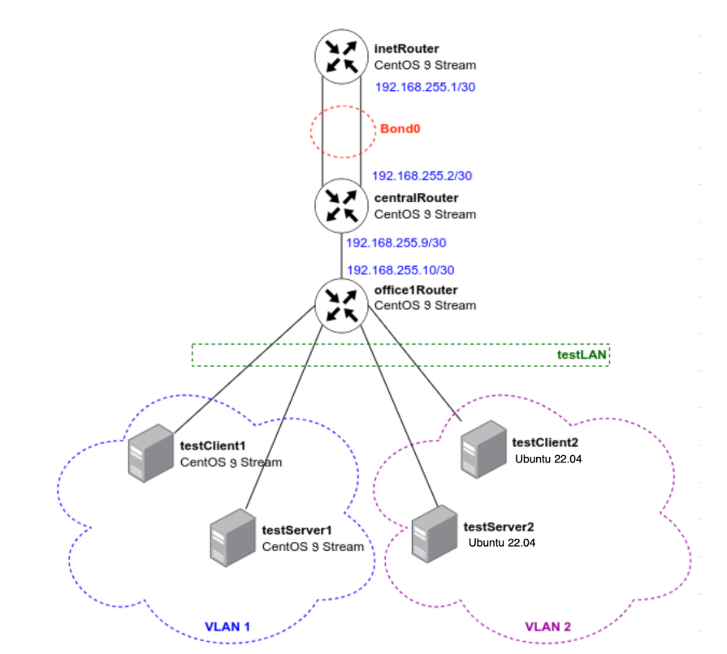
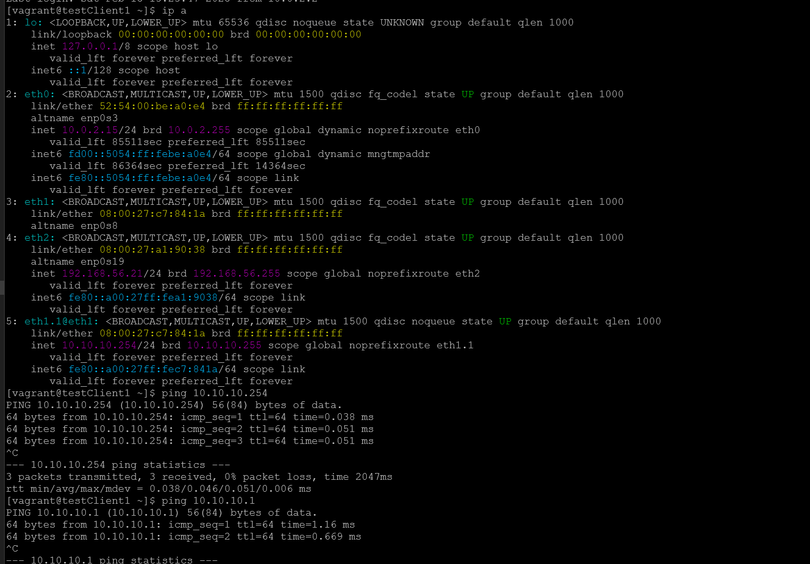
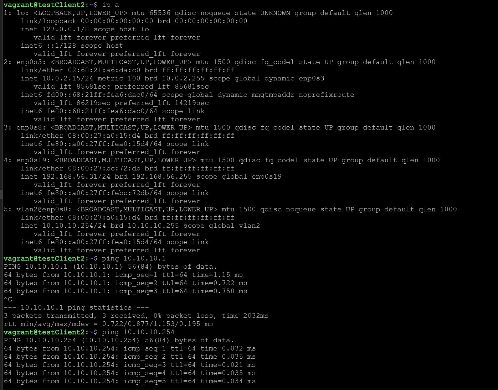
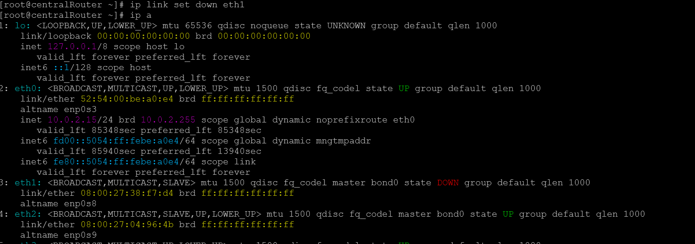
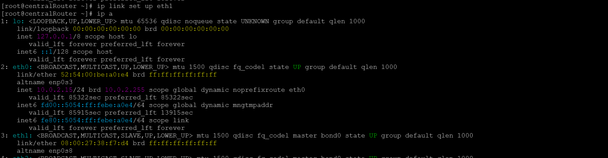
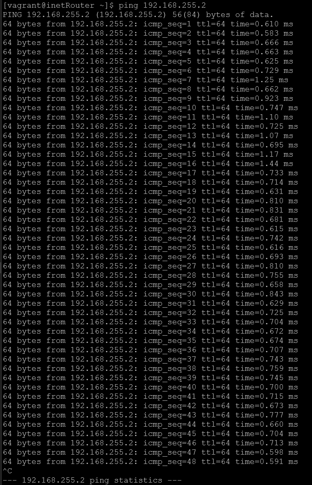

# Administrator Linux. Professional

## Урок 37. Домашнее задание

Vagrant-стенд c VLAN и LACP

### Описание домашнего задания

в Office1 в тестовой подсети появляется сервера с доп интерфейсами и адресами
в internal сети testLAN: 
- testClient1 - 10.10.10.254
- testClient2 - 10.10.10.254
- testServer1- 10.10.10.1 
- testServer2- 10.10.10.1

Развести вланами:

- testClient1 <-> testServer1
- testClient2 <-> testServer2

Между centralRouter и inetRouter "пробросить" 2 линка (общая inernal сеть) и объединить их в бонд, проверить работу c отключением интерфейсов

### Подготовка среды выполнения

Для выполнения задания развернем 7 виртуальных машин.

Схема сети



Подготовим [Vagrantfile](https://github.com/anashoff/otus/blob/master/lesson37/Vagrantfile)

```ruby
# -*- mode: ruby -*-
# vim: set ft=ruby :
MACHINES = {
  :inetRouter => {
        :box_name => "centos/stream9",
        :vm_name => "inetRouter",
        :net => [
                   {adapter: 2, auto_config: false, virtualbox__intnet: "router-net"},
                   {adapter: 3, auto_config: false, virtualbox__intnet: "router-net"},
                   {ip: '192.168.56.10', adapter: 8},
                ]
  },
  :centralRouter => {
        :box_name => "centos/stream9",
        :vm_name => "centralRouter",
        :net => [
                   {adapter: 2, auto_config: false, virtualbox__intnet: "router-net"},
                   {adapter: 3, auto_config: false, virtualbox__intnet: "router-net"},
                   {ip: '192.168.255.9', adapter: 6, netmask: "255.255.255.252", virtualbox__intnet: "office1-central"},
                   {ip: '192.168.56.11', adapter: 8},
                ]
  },

  :office1Router => {
        :box_name => "centos/stream9",
        :vm_name => "office1Router",
        :net => [
                   {ip: '192.168.255.10', adapter: 2, netmask: "255.255.255.252", virtualbox__intnet: "office1-central"},
                   {adapter: 3, auto_config: false, virtualbox__intnet: "vlan1"},
                   {adapter: 4, auto_config: false, virtualbox__intnet: "vlan1"},
                   {adapter: 5, auto_config: false, virtualbox__intnet: "vlan2"},
                   {adapter: 6, auto_config: false, virtualbox__intnet: "vlan2"},
                   {ip: '192.168.56.20', adapter: 8},
                ]
  },

  :testClient1 => {
        :box_name => "centos/stream9",
        :vm_name => "testClient1",
        :net => [
                   {adapter: 2, auto_config: false, virtualbox__intnet: "testLAN"},
                   {ip: '192.168.56.21', adapter: 8},
                ]
  },

  :testServer1 => {
        :box_name => "centos/stream9",
        :vm_name => "testServer1",
        :net => [
                   {adapter: 2, auto_config: false, virtualbox__intnet: "testLAN"},
                   {ip: '192.168.56.22', adapter: 8},
            ]
  },

  :testClient2 => {
        :box_name => "ubuntu/jammy64",
        :vm_name => "testClient2",
        :net => [
                   {adapter: 2, auto_config: false, virtualbox__intnet: "testLAN"},
                   {ip: '192.168.56.31', adapter: 8},
                ]
  },

  :testServer2 => {
        :box_name => "ubuntu/jammy64",
        :vm_name => "testServer2",
        :net => [
                   {adapter: 2, auto_config: false, virtualbox__intnet: "testLAN"},
                   {ip: '192.168.56.32', adapter: 8},
                ]
  },

}

Vagrant.configure("2") do |config|

  MACHINES.each do |boxname, boxconfig|

    config.vm.define boxname do |box|

      box.vm.box = boxconfig[:box_name]
      box.vm.host_name = boxconfig[:vm_name]
      box.vm.box_version = boxconfig[:box_version]

      config.vm.provider "virtualbox" do |v|
        v.memory = 1024
        v.cpus = 2
       end

      if boxconfig[:vm_name] == "testServer2"
       box.vm.provision "ansible" do |ansible|
        ansible.playbook = "playbook.yaml"
        ansible.inventory_path = "hosts.ini"
        ansible.host_key_checking = "false"
        ansible.become = "true"
        ansible.limit = "all"
       end
      end

      boxconfig[:net].each do |ipconf|
        box.vm.network "private_network", **ipconf
      end

    end
  end
end
```
Данный Vagrantfile развернет 7 виртуальных машин:
- 5 ВМ на CentOS 9 Stream
- 2 ВМ на Ubuntu 22.04 
После развертывания виртуальных машин начнется выполнения плейбука Ansible

#### Подготовка плейбука ansible

Подготовим плейбук ansible для выполнения работы

Структура плейбука

```text
├── ansible.cfg
├── hosts.ini
├── playbook.yaml
├── templates
│   ├── 50-cloud-init.yaml.j2
│   ├── ifcfg-bond0.j2
│   ├── ifcfg-eth1
│   ├── ifcfg-eth2
│   └── ifcfg-vlan1.j2
```

Файл конфигурации [ansible.cfg](https://github.com/anashoff/otus/blob/master/lesson37/ansible.cfg)

```ini
[defaults]
#Отключение проверки ключа хоста
host_key_checking = false
#Указываем имя файла инвентаризации
inventory = hosts
#Отключаем игнорирование предупреждений
command_warnings= false
```

Файл настроек хостов [hosts.ini](https://github.com/anashoff/otus/blob/master/lesson37/hosts.ini)

```ini
[nets]
inetRouter ansible_host=192.168.56.10 ansible_user=vagrant ansible_ssh_private_key_file=./.vagrant/machines/inetRouter/virtualbox/private_key bond_ip=192.168.255.1
centralRouter ansible_host=192.168.56.11 ansible_user=vagrant ansible_ssh_private_key_file=./.vagrant/machines/centralRouter/virtualbox/private_key bond_ip=192.168.255.2
office1Router ansible_host=192.168.56.20 ansible_user=vagrant ansible_ssh_private_key_file=./.vagrant/machines/office1Router/virtualbox/private_key 
testClient1 ansible_host=192.168.56.21 ansible_user=vagrant ansible_ssh_private_key_file=./.vagrant/machines/testClient1/virtualbox/private_key vlan_id=1 vlan_ip=10.10.10.254 
testServer1 ansible_host=192.168.56.22 ansible_user=vagrant ansible_ssh_private_key_file=./.vagrant/machines/testServer1/virtualbox/private_key vlan_id=1 vlan_ip=10.10.10.1 
testClient2 ansible_host=192.168.56.31 ansible_user=vagrant ansible_ssh_private_key_file=./.vagrant/machines/testClient2/virtualbox/private_key vlan_id=2 vlan_ip=10.10.10.254
testServer2 ansible_host=192.168.56.32 ansible_user=vagrant ansible_ssh_private_key_file=./.vagrant/machines/testServer2/virtualbox/private_key vlan_id=2 vlan_ip=10.10.10.1
```

Файлы шаблонов конфигурации сетевыйх интерфейсов


[template/50-cloud-init.yaml.j2](https://github.com/anashoff/otus/blob/master/lesson37/templates/50-cloud-init.yaml.j2)

```jinja
# This file is generated from information provided by the datasource.  Changes
# to it will not persist across an instance reboot.  To disable cloud-init's
# network configuration capabilities, write a file
# /etc/cloud/cloud.cfg.d/99-disable-network-config.cfg with the following:
# network: {config: disabled}
network:
    version: 2
    ethernets:
        enp0s3:
            dhcp4: true

        enp0s8: {}

    vlans:
        vlan{{ vlan_id }}:
          id: {{ vlan_id }}
          link: enp0s8
          dhcp4: no
          addresses: [{{ vlan_ip }}/24]
```

[template/ifcfg-vlan1.j2](https://github.com/anashoff/otus/blob/master/lesson37/templates/ifcfg-vlan1.j2)

```jinja
VLAN=yes
TYPE=Vlan
PHYSDEV=eth1
VLAN_ID={{ vlan_id }}
VLAN_NAME_TYPE=DEV_PLUS_VID_NO_PAD
PROXY_METHOD=none
BROWSER_ONLY=no
BOOTPROTO=none
IPADDR={{ vlan_ip }}
PREFIX=24
NAME=vlan{{ vlan_id }}
DEVICE=eth1.{{ vlan_id }}
ONBOOT=yes
```

[template/ifcfg-bond0.j2](https://github.com/anashoff/otus/blob/master/lesson37/templates/ifcfg-bond0.j2)

```jinja
DEVICE=bond0
NAME=bond0
TYPE=Bond
BONDING_MASTER=yes
IPADDR={{ bond_ip }}
NETMASK=255.255.255.252
ONBOOT=yes
BOOTPROTO=static
BONDING_OPTS="mode=1 miimon=100 fail_over_mac=1"
NM_CONTROLLED=yes
USERCTL=no
```

[template/ifcfg-eth1](https://github.com/anashoff/otus/blob/master/lesson37/templates/ifcfg-eth1)

```jinja
Имя физического интерфейса
DEVICE=eth1
#Включать интерфейс при запуске системы
ONBOOT=yes
#Отключение DHCP-клиента
BOOTPROTO=none
#Указываем, что порт часть bond-интерфейса
MASTER=bond0
#Указываем роль bond
SLAVE=yes
NM_CONTROLLED=yes
USERCTL=no

```

[template/ifcfg-eth2](https://github.com/anashoff/otus/blob/master/lesson37/templates/ifcfg-eth2)

```jinja
Имя физического интерфейса
DEVICE=eth2
#Включать интерфейс при запуске системы
ONBOOT=yes
#Отключение DHCP-клиента
BOOTPROTO=none
#Указываем, что порт часть bond-интерфейса
MASTER=bond0
#Указываем роль bond
SLAVE=yes
NM_CONTROLLED=yes
USERCTL=no
```

Файл плейбука [playbook.yaml](https://github.com/anashoff/otus/blob/master/lesson37/templates/playbook.yaml)

```yaml
# Предварительная настройка
- name: Base set up
  #Настройка производится на всех хостах
  hosts: all
  become: yes
  tasks:
    #Установка приложений на RedHat-based системах
    - name: install software on CentOS
      yum:
        name:
          - vim
          - traceroute
          - tcpdump
          - net-tools
        state: present
        update_cache: true
      when: (ansible_os_family == "RedHat")
    #Установка приложений на Debian-based системах
    - name: install software on Debian-based
      apt:
        name:
          - vim
          - traceroute
          - tcpdump
          - net-tools
        state: present
        update_cache: true
      when: (ansible_os_family == "Debian")
# Настройка VLAN1
- name: set up vlan1
  #Настройка будет производиться на хостах testClient1 и testServer1
  hosts: testClient1,testServer1
  become: yes
  tasks:
    #Добавление темплейта в файл /etc/sysconfig/network-scripts/ifcfg-vlan1
    - name: set up vlan1
      template:
        src: ifcfg-vlan1.j2
        dest: /etc/sysconfig/network-scripts/ifcfg-vlan1
        owner: root
        group: root
        mode: 0644
    #Перезапуск службы NetworkManager
    - name: restart network for vlan1
      service:
        name: NetworkManager
        state: restarted
# Рфстройка VLAN2
- name: set up vlan2
  #Настройка будет производиться на хостах testClient2 и testServer2
  hosts: testClient2,testServer2
  become: yes
  tasks:
    #Добавление темплейта в файл /etc/sysconfig/network-scripts/ifcfg-vlan2
    - name: set up vlan2
      template:
        src: 50-cloud-init.yaml.j2
        dest: /etc/netplan/50-cloud-init.yaml
        owner: root
        group: root
        mode: 0644
    # Применение новых настроек в netplan
    - name: apply set up vlan2
      shell: netplan apply
      become: true
# Настройка LACP
- name: set up bond0
  #Настройка будет производиться на хостах inetRouter и centralRouter
  hosts: inetRouter,centralRouter
  become: yes
  tasks:
    #Добавление темплейта в файл /etc/sysconfig/network-scripts/ifcfg-bond0
    - name: set up ifcfg-bond0
      template:
        src: ifcfg-bond0.j2
        dest: /etc/sysconfig/network-scripts/ifcfg-bond0
        owner: root
        group: root
        mode: 0644
    # настройка конфигураций для интерфейсов eth1 и eth2
    - name: set up eth1,eth2
      copy:
        src: "{{ item }}"
        dest: /etc/sysconfig/network-scripts/
        owner: root
        group: root
        mode: 0644
      with_items:
        - templates/ifcfg-eth1
        - templates/ifcfg-eth2
    #Перезагрузка хостов
    - name: restart hosts for bond0
      reboot:
        reboot_timeout: 3600

```
Запускаем стенд командой 

```bash
┬─[anasha@otus:~/less37]─[16:09:25]
╰─o$ vagrant up
```

```zsh
Bringing machine 'inetRouter' up with 'virtualbox' provider...
Bringing machine 'centralRouter' up with 'virtualbox' provider...
Bringing machine 'office1Router' up with 'virtualbox' provider...
Bringing machine 'testClient1' up with 'virtualbox' provider...
Bringing machine 'testServer1' up with 'virtualbox' provider...
Bringing machine 'testClient2' up with 'virtualbox' provider...
Bringing machine 'testServer2' up with 'virtualbox' provider...

.................................

==> testServer2: Running provisioner: ansible...
    testServer2: Running ansible-playbook...

PLAY [Base set up] *************************************************************

TASK [Gathering Facts] *********************************************************

ok: [office1Router]
ok: [testClient1]
ok: [centralRouter]
ok: [inetRouter]
ok: [testServer1]
ok: [testServer2]
ok: [testClient2]

TASK [install software on CentOS] **********************************************
changed: [office1Router]
skipping: [testClient2]
skipping: [testServer2]
changed: [inetRouter]
changed: [testServer1]
changed: [testClient1]
changed: [centralRouter]

TASK [install software on Debian-based] ****************************************
skipping: [inetRouter]
skipping: [centralRouter]
skipping: [office1Router]
skipping: [testClient1]
skipping: [testServer1]
changed: [testClient2]
changed: [testServer2]

PLAY [set up vlan1] ************************************************************

TASK [Gathering Facts] *********************************************************
ok: [testServer1]
ok: [testClient1]

TASK [set up vlan1] ************************************************************
changed: [testClient1]
changed: [testServer1]

TASK [restart network for vlan1] ***********************************************
changed: [testServer1]
changed: [testClient1]

PLAY [set up vlan2] ************************************************************

TASK [Gathering Facts] *********************************************************
ok: [testServer2]
ok: [testClient2]

TASK [set up vlan2] ************************************************************
changed: [testServer2]
changed: [testClient2]

TASK [apply set up vlan2] ******************************************************
changed: [testServer2]
changed: [testClient2]

PLAY [set up bond0] ************************************************************

TASK [Gathering Facts] *********************************************************
ok: [inetRouter]
ok: [centralRouter]

TASK [set up ifcfg-bond0] ******************************************************
changed: [inetRouter]
changed: [centralRouter]

TASK [set up eth1,eth2] ********************************************************
changed: [inetRouter] => (item=templates/ifcfg-eth1)
changed: [centralRouter] => (item=templates/ifcfg-eth1)
changed: [centralRouter] => (item=templates/ifcfg-eth2)
changed: [inetRouter] => (item=templates/ifcfg-eth2)

TASK [restart hosts for bond0] *************************************************
changed: [centralRouter]
changed: [inetRouter]

PLAY RECAP *********************************************************************
centralRouter              :ok=6changed=4 unreachable=0    failed=0skipped=1 rescued=0    ignored=0
inetRouter                 :ok=6changed=4 unreachable=0    failed=0skipped=1 rescued=0    ignored=0
office1Router              :ok=2changed=1 unreachable=0    failed=0skipped=1 rescued=0    ignored=0
testClient1                :ok=5changed=3 unreachable=0    failed=0skipped=1 rescued=0    ignored=0
testClient2                :ok=5changed=3 unreachable=0    failed=0skipped=1 rescued=0    ignored=0
testServer1                :ok=5changed=3 unreachable=0    failed=0skipped=1 rescued=0    ignored=0
testServer2                :ok=5changed=3 unreachable=0    failed=0skipped=1 rescued=0    ignored=0
```
Стенд установлен и настроен

Проверим работу стенда

#### Настройка VLAN1

Подключаемся к testClient1 и проверяем интерфейсы и ping



VLAN1 настроен

#### Настройка VLAN2

Подключаемся к testClient2 и проверяем интерфейсы и ping



VLAN2 настроен

#### Настройка LACP 

Подключаемся к хосту inetRouter (192.168.255.1) и запускаем ping до centralRouter (192.168.255.2)

```text
[vagrant@inetRouter ~]$ ping 192.168.255.2
PING 192.168.255.2 (192.168.255.2) 56(84) bytes of data.
64 bytes from 192.168.255.2: icmp_seq=1 ttl=64 time=0.610 ms
```

Затем в другом окне терминала на хосте inetRouter отключаем интерфейс eth1



Ждем 10 секунд и включаем интерфейс eth1 обратно



Возвращаемся, на первый терминал и убеждаемся, что пинг всё это время проходил без прерываний.



Задание на этом выполнено.

Все файлы работы, использованные в задании, доступны на [github](https://github.com/anashoff/otus/blob/master/lesson37)

