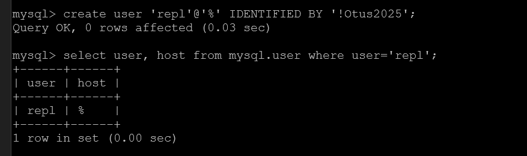
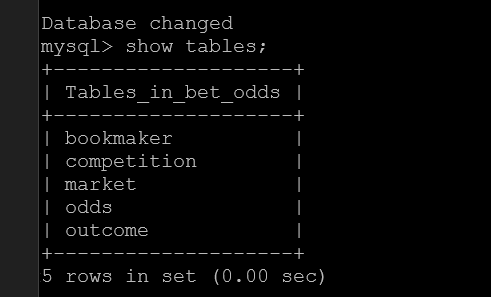

# Administrator Linux. Professional

## Урок 44. Домашнее задание

Репликация MySQL

### Описание домашнего задания

В материалах приложены ссылки на Vagrantfile для репликации и дамп базы bet.dmp

Базу развернуть на мастере и настроить так, чтобы реплицировались таблицы:

```text
| bookmaker          |
| competition        |
| market             |
| odds               |
| outcome            |
```

Настроить GTID репликацию

### Подготовка среды выполнения

Для выполнения задания развернём 2 виртуальныe машины.

Используем [Vagrantfile](https://github.com/anashoff/otus/blob/master/lesson44/Vagrantfile)

```ruby
Vagrant.configure(2) do |config|

    N = 2
    (1..N).each do |i|
      config.vm.define "mysql#{i}" do |node|
        node.vm.box = "bento/ubuntu-22.04"
        node.vm.synced_folder ".", "/vagrant", disabled: true
        node.vm.hostname = "mysql#{i}"
        node.vm.network "private_network", ip:"10.0.26.10#{i}"
        node.vm.provider "virtualbox" do |vb|
          vb.memory = "1024"
          vb.name = "mysql#{i}"
          vb.cpus = 2
        end
      end
    end
 
end
```

#### Подготовка плейбука ansible

Для развертывания стенда используем [плейбук ansible](https://github.com/anashoff/otus/blob/master/lesson44/provision/playbooks/environment.yml)

Разворачиваем среду выполнения

```$ vagrant up```

```$ cd provision```

```$ ansible-playbook playbooks/environment.yml```


#### Настраиваем хост mysql1


```$ vagrant ssh mysql1```

Подготовим файлы конфигурации для mysql

### 01-master.cnt

```ini
[mysqld]
server-id = 1
log-bin = mysql-bin
binlog_format = row
gtid-mode=ON
enforce-gtid-consistency
log-replica-updates
```

### 05-binlog.cnf

```ini
[mysqld]
log-bin = mysql-bin
expire-logs-days = 7
max-binlog-size = 16M
binlog-format = "MIXED"
# GTID replication config
log-slave-updates = On
gtid-mode = On
enforce-gtid-consistency = On
```

Кладём их в ***/etc/mysql/conf.d/***

Перезапускаем mysql 

```systemctl restart mysql```


Заходим в mysql.

Проверяем server-id и что GTID включен


Создаём базу данных ```bet_odds```


Загружаем базу из дампа


Создадим пользователя для репликации и даем ему права на репликацию




Сделаем дамп базы для первоначального залива ее на slave, игнорирую таблицы по заданию


Переносим дамп на mysql2


#### Настраиваем хост mysql2


```$ vagrant ssh mysql2```

Подготовим файлы конфигурации для mysql

### 02-slave.cnt

```ini
[mysqld]
server-id = 2
log-bin = mysql-bin
relay-log = relay-log-server
read-only = ON
gtid-mode=ON
enforce-gtid-consistency
log-replica-updates
```

### 05-binlog.cnf

```ini
[mysqld]
log-bin = mysql-bin
expire-logs-days = 7
max-binlog-size = 16M
binlog-format = "MIXED"
# GTID replication config
log-slave-updates = On
gtid-mode = On
enforce-gtid-consistency = On
# Эта часть только для слэйва - исключаем репликацию таблиц
replicate-ignore-table=bet_odds.events_on_demand
replicate-ignore-table=bet_odds.v_same_event
```

Кладём их в ***/etc/mysql/conf.d/***

Перезапускаем mysql 

```systemctl restart mysql```

Заходим в mysql.

Проверяем server-id и что GTID включен


Создаем базу и заливаем туда дамп с mysql1


Проверям, что в базе только нужные таблицы


Подключаем slave и запускаем репликацию


Проверяем статус репликации ```mysql> SHOW SLAVE STATUS\G``` и видим ошибку


для исправления ошибки в интернетах советуют использовать команду

```CHANGE MASTER TO GET_MASTER_PUBLIC_KEY=1;```

останавливаем репликацию, исправляем ошибку и запускаем репликацию


проверяем 


Видим, что репликация заработала, таблицы events_on_demand  и v_same_event игнорируются



### Проверка репликации

На master добавим в таблицу bookmaker записи


Проверяем на slave


Видим, что таблица реплицировалась.

Посмотрим binlog


```text
.............................
```


Видим команду **INSERT INTO bookmaker (id,bookmaker_name) VALUES(11,'boom-boom-booooooommm-1xbet');**

Задание на этом выполнено.

Все файлы работы, использованные в задании, доступны на [github](https://github.com/anashoff/otus/blob/master/lesson44)
