# Administrator Linux. Professional

## Урок 46. Домашнее задание

Репликация postgres

### Описание домашнего задания

Что нужно сделать?

- настроить hot_standby репликацию с использованием слотов
- настроить правильное резервное копирование

### Подготовка среды выполнения

Для выполнения задания развернём 3 виртуальныe машины.

Используем [Vagrantfile](https://github.com/anashoff/otus/blob/master/lesson46/Vagrantfile)

```ruby
Vagrant.configure("2") do |config|
  config.vm.box = "ubuntu/jammy64"
  config.vm.provider :virtualbox do |v|
    v.memory = 1024
    v.cpus = 2
  end
  boxes = [
    { :name => "node1",
      :ip => "192.168.57.11",
    },
    { :name => "node2",
    :ip => "192.168.57.12",
    },
    { :name => "barman",
      :ip => "192.168.57.13",
    },
  ]
  boxes.each do |opts|
    config.vm.define opts[:name] do |config|
      config.vm.hostname = opts[:name]
      config.vm.network "private_network", ip: opts[:ip]
   end
  end
end
```

#### Подготовка плейбука ansible

Для развертывания стенда используем [плейбук ansible](https://github.com/anashoff/otus/blob/master/lesson46/playbook.yaml)

Плайбук содержит 3 роли
- postgres_install - начальная настройка хостов node1 и node2
- postgres_replication - настройка репликации node1 и node2 для первой части задания
- install-barman - настройка резервного копирования для второй части задания

Структура плейбука

```text
├── ansible.cfg
├── hosts.ini
├── playbook.yaml
├── roles
│   ├── install-barman
│   │   ├── defaults
│   │   │   └── main.yml
│   │   ├── tasks
│   │   │   └── main.yml
│   │   └── templates
│   │       ├── .pgpass.j2
|   |       ├── barman.conf.j2
│   │       └── node1.conf.j2
│   ├── postgres_install
│   │   └── tasks
│   │       └── main.yaml
│   └── postgres_replication
│       ├── defaults
│       │   └── main.yml
│       ├── tasks
│       │   └── main.yml
│       └── templates
│           ├── pg_hba.conf.j2
│           └── postgresql.conf.j2
```

Файл плейбука [playbook.yaml](https://github.com/anashoff/otus/blob/master/lesson46/playbook.yaml)

```yaml
---
- name: Общая настройка хостов
  hosts: all
  become: yes
  tasks:
  - name: install base tools
    apt:
      name:
        - mc
        - telnet
      state: present
      update_cache: true

- name: Установка Postgresql
  hosts: node1, node2
  gather_facts: true
  become: yes
  roles:
   - postgres_install
   - postgres_replication
- name: Настройка barman
  hosts: all
  gather_facts: true
  become: yes
  roles:
   - install-barman
  tags: barman
...
```

Файл конфигурации [ansible.cfg](https://github.com/anashoff/otus/blob/master/lesson46/ansible.cfg)

```ini
[defaults]
inventory = hosts.ini
remote_user = vagrant
host_key_checking = false
```

Файл настроек хостов [hosts.ini](https://github.com/anashoff/otus/blob/master/lesson46/hosts.ini)

```ini
[all]
node1 ansible_host=192.168.57.11 ansible_user=vagrant ansible_ssh_private_key_file=./.vagrant/machines/node1/virtualbox/private_key
node2 ansible_host=192.168.57.12 ansible_user=vagrant ansible_ssh_private_key_file=./.vagrant/machines/node2/virtualbox/private_key
barman ansible_host=192.168.57.13 ansible_user=vagrant ansible_ssh_private_key_file=./.vagrant/machines/barman/virtualbox/private_key
```

Файл роли [postgres_install/tasks/main.yaml](https://github.com/anashoff/otus/blob/master/lesson46/roles/postgres_install/tasks/main.yaml)

```yaml
---
- name: Установка Postgresql
  apt:
    update_cache: yes
    name:
      - acl
      - postgresql
      - postgresql-contrib
      - barman-cli
    state: present
- name: управление сервисом
  service:
    name: postgresql
    state: started
    enabled: true
...
```

Файл роли [postgres_replication/tasks/main.yaml](https://github.com/anashoff/otus/blob/master/lesson46/roles/postgres_replication/tasks/main.yaml)

```yaml
---
  - name: Установка утилит для управление Postgresql
    apt:
      name:
        - python3-psycopg2
      state: present
      update_cache: true
  - name: Создание пользователя для репликации
    become_user: postgres
    postgresql_user:
      name: replication
      password: '{{ replicator_password }}'
      role_attr_flags: REPLICATION
    ignore_errors: true
    when: (ansible_hostname == "node1")
  #Останавливаем postgresql-14 на хосте node2
  - name: stop postgresql-server on node2
    service:
      name: postgresql
      state: stopped
    when: (ansible_hostname == "node2")

  #Копируем конфигурационный файл postgresql.conf
  - name: copy postgresql.conf
    template:
      src: postgresql.conf.j2
      dest: /etc/postgresql/14/main/postgresql.conf
      owner: postgres
      group: postgres
      mode: '0600'
    when: (ansible_hostname == "node1")

  #Копируем конфигурационный файл pg_hba.conf
  - name: copy pg_hba.conf
    template:
      src: pg_hba.conf.j2
      dest: /etc/postgresql/14/main/pg_hba.conf
      owner: postgres
      group: postgres
      mode: '0600'
    when: (ansible_hostname == "node1")
   #Перезапускаем службу  postgresql-14
  - name: restart postgresql-server on node1
    service:
      name: postgresql
      state: restarted
    when: (ansible_hostname == "node1")
 #Удаляем содержимое каталога /var/lib/postgresql/14/main/
  - name: Remove files from data catalog
    file:
      path: /var/lib/postgresql/14/main/
      state: absent
    when: (ansible_hostname == "node2")

  #Копируем данные с node1 на node2
  - name: copy files from master to slave
    become_user: postgres
    expect:
      command: 'pg_basebackup -h {{ master_ip }} -U  replication -p 5432 -D /var/lib/postgresql/14/main/ -R -P'
      responses:
        '.*Password*': "{{ replicator_password }}"
    when: (ansible_hostname == "node2")

  #Копируем конфигурационный файл postgresql.conf
  - name: copy postgresql.conf
    template:
      src: postgresql.conf.j2
      dest:  /etc/postgresql/14/main/postgresql.conf
      owner: postgres
      group: postgres
      mode: '0600'
    when: (ansible_hostname == "node2")

  #Копируем конфигурационный файл pg_hba.conf
  - name: copy pg_hba.conf
    template:
      src: pg_hba.conf.j2
      dest:  /etc/postgresql/14/main/pg_hba.conf
      owner: postgres
      group: postgres
      mode: '0600'
    when: (ansible_hostname == "node2")

  #Запускаем службу postgresql-14 на хосте node2
  - name: start postgresql-server on node2
    service:
      name: postgresql
      state: started
    when: (ansible_hostname == "node2")
...
```

Файл переменных [postgres_replication/defults/main.yaml](https://github.com/anashoff/otus/blob/master/lesson46/roles/postgres_replication/defaults/main.yaml)

```yaml
---
# defaults file for postgres_replication
replicator_password: '!Otus2025'
master_ip: '192.168.57.11'
slave_ip: '192.168.57.12'
...
```

Шаблон [postgres_replication/templates/pg_hba.conf.j2](https://github.com/anashoff/otus/blob/master/lesson46/roles/postgres_replication/templates/pg_hba.conf.j2)

```jinja
# TYPE  DATABASE        USER            ADDRESS                 METHOD
# "local" is for Unix domain socket connections only
local   all                  all                                                peer
# IPv4 local connections:
host    all                  all             127.0.0.1/32              scram-sha-256
# IPv6 local connections:
host    all                  all             ::1/128                       scram-sha-256
# Allow replication connections from localhost, by a user with the
# replication privilege.
local   replication      all                                                peer
host    replication     all             127.0.0.1/32               scram-sha-256
host    replication     all             ::1/128                        scram-sha-256
host    replication replication    {{ master_ip }}/32        scram-sha-256
host    replication replication    {{ slave_ip }}/32        scram-sha-256
```

Шаблон [postgres_replication/templates/postgresql.conf.j2](https://github.com/anashoff/otus/blob/master/lesson46/roles/postgres_replication/templates/postgresql.conf.j2)

```jinja
data_directory = '/var/lib/postgresql/14/main'		# use data in another directory
					# (change requires restart)
hba_file = '/etc/postgresql/14/main/pg_hba.conf'	# host-based authentication file
					# (change requires restart)
ident_file = '/etc/postgresql/14/main/pg_ident.conf'	# ident configuration file
					# (change requires restart)

# If external_pid_file is not explicitly set, no extra PID file is written.
#external_pid_file = ''			# write an extra PID file
					# (change requires restart)
#Указываем ip-адреса, на которых postgres будет слушать трафик на порту 5432 (параметр port)
listen_addresses = '*'
#Указываем порт порт postgres
port = 5432
#Устанавливаем максимально 100 одновременных подключений
max_connections = 100
log_directory = 'log'
log_filename = 'postgresql-%a.log'
log_rotation_age = 1d
log_rotation_size = 0
log_truncate_on_rotation = on
max_wal_size = 1GB
min_wal_size = 80MB
log_line_prefix = '%m [%p] '
#Указываем часовой пояс для Москвы
log_timezone = 'UTC+3'
timezone = 'UTC+3'
datestyle = 'iso, mdy'
lc_messages = 'en_US.UTF-8'
lc_monetary = 'en_US.UTF-8'
lc_numeric = 'en_US.UTF-8'
lc_time = 'en_US.UTF-8'
default_text_search_config = 'pg_catalog.english'
#можно или нет подключаться к postgresql для выполнения запросов в процессе восстановления;
hot_standby = on
#Включаем репликацию
wal_level = replica
#Количество планируемых слейвов
max_wal_senders = 3
#Максимальное количество слотов репликации
max_replication_slots = 3
#будет ли сервер slave сообщать мастеру о запросах, которые он выполняет.
hot_standby_feedback = on
#Включаем использование зашифрованных паролей
password_encryption = scram-sha-256
```

Файл роли [install-barman/tasks/main.yaml](https://github.com/anashoff/otus/blob/master/lesson46/roles/install-barman/tasks/main.yaml)

```yaml
---
# Установка необходимых пакетов для работы с postgres и пользователями
  - name: install base tools
    apt:
      name:
        - python3-psycopg2
        - bash-completion
        - wget
      state: present
      update_cache: true

  #  Установка пакетов barman и postgresql-client на сервер barman
  - name: install barman and postgresql packages on barman
    apt:
      name:
        - barman
        - barman-cli
        - postgresql
        - acl
      state: present
      update_cache: true
    when: (ansible_hostname == "barman")

 #  Установка пакетов barman-cli на серверах node1 и node2
  - name: install barman-cli and postgresql packages on nodes
    apt:
      name:
        - barman-cli
      state: present
      update_cache: true
    when: (ansible_hostname != "barman")

#  Генерируем SSH-ключ для пользователя postgres на хосте node1
  - name: generate SSH key for postgres
    user:
      name: postgres
      generate_ssh_key: yes
      ssh_key_type: rsa
      ssh_key_bits: 4096
      force: no
    when: (ansible_hostname == "node1")

#  Генерируем SSH-ключ для пользователя barman на хосте barman
  - name: generate SSH key for barman
    user:
      name: barman
      uid: 994
      shell: /bin/bash
      generate_ssh_key: yes
      ssh_key_type: rsa
      ssh_key_bits: 4096
      force: no
    when: (ansible_hostname == "barman")

  #  Забираем содержимое открытого ключа postgres c хоста node1
  - name: fetch all public ssh keys node1
    shell: cat /var/lib/postgresql/.ssh/id_rsa.pub
    register: ssh_keys
    when: (ansible_hostname == "node1")

  #  Копируем ключ с barman на node1
  - name: transfer public key to barman
    delegate_to: barman
    authorized_key:
      key: "{{ ssh_keys.stdout }}"
      comment: "{{ansible_hostname}}"
      user: barman
    when: (ansible_hostname == "node1")

  #  Забираем содержимое открытого ключа barman c хоста barman
  - name: fetch all public ssh keys barman
    shell: cat /var/lib/barman/.ssh/id_rsa.pub
    register: ssh_keys
    when: (ansible_hostname == "barman")

 #  Копируем ключ с node1 на barman
  - name: transfer public key to barman
    delegate_to: node1
    authorized_key:
      key: "{{ ssh_keys.stdout }}"
      comment: "{{ansible_hostname}}"
      user: postgres
    when: (ansible_hostname == "barman")

  #CREATE USER barman SUPERUSER;
  - name: Create barman user
    become_user: postgres
    postgresql_user:
      name: barman
      password: '{{ barman_user_password }}'
      role_attr_flags: SUPERUSER
    ignore_errors: true
    when: (ansible_hostname == "node1")

   # Добавляем разрешения для подключения с хоста barman
  - name: Add permission for barman
    lineinfile:
      path: /etc/postgresql/14/main/pg_hba.conf
      line: 'host    all   {{ barman_user }}    {{ barman_ip }}/32    scram-sha-256'
    when: (ansible_hostname == "node1") or
          (ansible_hostname == "node2")

  # Добавляем разрешения для подключения с хоста barman
  - name: Add permission for barman
    lineinfile:
      path: /etc/postgresql/14/main/pg_hba.conf
      line: 'host    replication   {{ barman_user }}    {{ barman_ip }}/32    scram-sha-256'
    when: (ansible_hostname == "node1") or
          (ansible_hostname == "node2")

  # Перезагружаем службу postgresql-server
  - name: restart postgresql-server on node1
    service:
      name: postgresql
      state: restarted
    when: (ansible_hostname == "node1")

  # Создаём БД otus;
  - name: Create DB for backup
    become_user: postgres
    postgresql_db:
      name: otus
      encoding: UTF-8
      template: template0
      state: present
    when: (ansible_hostname == "node1")

  # Создаем таблицу test1 в БД otus;
  - name: Add tables to otus_backup
    become_user: postgres
    postgresql_table:
      db: otus
      name: test1
      state: present
    when: (ansible_hostname == "node1")

  # Копируем файл .pgpass
  - name: copy .pgpass
    template:
      src: .pgpass.j2
      dest: /var/lib/barman/.pgpass
      owner: barman
      group: barman
      mode: '0600'
    when: (ansible_hostname == "barman")

  # Копируем файл barman.conf
  - name: copy barman.conf
    template:
      src: barman.conf.j2
      dest: /etc/barman.conf
      owner: barman
      group: barman
      mode: '0755'
    when: (ansible_hostname == "barman")

 # Копируем файл node1.conf
  - name: copy node1.conf
    template:
      src: node1.conf.j2
      dest: /etc/barman.d/node1.conf
      owner: barman
      group: barman
      mode: '0755'
    when: (ansible_hostname == "barman")

  - name: barman switch-wal node1
    become_user: barman
    shell: barman switch-wal node1
    when: (ansible_hostname == "barman")

  - name: barman cron
    become_user: barman
    shell: barman cron
    when: (ansible_hostname == "barman")
...
```

Файл переменных [install-barman/defults/main.yaml](https://github.com/anashoff/otus/blob/master/lesson46/roles/install-barman/defaults/main.yaml)

```yaml
---
# defaults file for install_barman
master_ip: '192.168.57.11'
master_user: 'postgres'
barman_ip: '192.168.57.13'
barman_user: 'barman'
barman_user_password: 'Otus2025'
...
```

Шаблон [install-barman/templates/.pgpass.j2](https://github.com/anashoff/otus/blob/master/lesson46/roles/install-barman/templates/.pgpass.conf.j2)

```jinja
192.168.57.11:5432:*:barman:Otus2025
```

Шаблон [install-barman/templates/barman.conf.j2](https://github.com/anashoff/otus/blob/master/lesson46/roles/install-barman/templates/barman.conf.j2)

```jinja
[barman]
#Указываем каталог, в котором будут храниться бекапы
barman_home = /var/lib/barman
#Указываем каталог, в котором будут храниться файлы конфигурации бекапов
configuration_files_directory = /etc/barman.d
#пользователь, от которого будет запускаться barman
barman_user = barman
#расположение файла с логами
log_file = /var/log/barman/barman.log
#Используемый тип сжатия
compression = gzip
#Используемый метод бекапа
backup_method = rsync
archiver = on
retention_policy = REDUNDANCY 3
immediate_checkpoint = true
#Глубина архива
last_backup_maximum_age = 4 DAYS
minimum_redundancy = 1
```

Шаблон [install-barman/templates/node1.conf.j2](https://github.com/anashoff/otus/blob/master/lesson46/roles/install-barman/templates/node1.conf.j2)

```jinja
[node1]
#Описание задания
description = "backup node1"
#Команда подключения к хосту node1
ssh_command = ssh postgres@192.168.57.11
#Команда для подключения к postgres-серверу
conninfo = host=192.168.57.11 user=barman port=5432 dbname=postgres
retention_policy_mode = auto
retention_policy = RECOVERY WINDOW OF 7 days
wal_retention_policy = main
streaming_archiver=on
#Указание префикса, который будет использоваться как $PATH на хосте node1
path_prefix = /usr/pgsql-14/bin/
#настройки слота
create_slot = auto
slot_name = node1
#Команда для потоковой передачи от postgres-сервера
streaming_conninfo = host=192.168.57.11 user=barman
#Тип выполняемого бекапа
backup_method = postgres
archiver = off
```

#### Разворачиваем среду выполнения

```$ vagrant up```

```$ ansible-playbook playbooks.yaml```


Ожидаем выполнения и начинаем проверки

### Проверка hot_standby репликации с использованием слотов


Заходим на node1 и создаём базу test

```text
─[anasha@otus:~/less46-2]─[18:40:24]
╰─o$ vagrant ssh node1
```
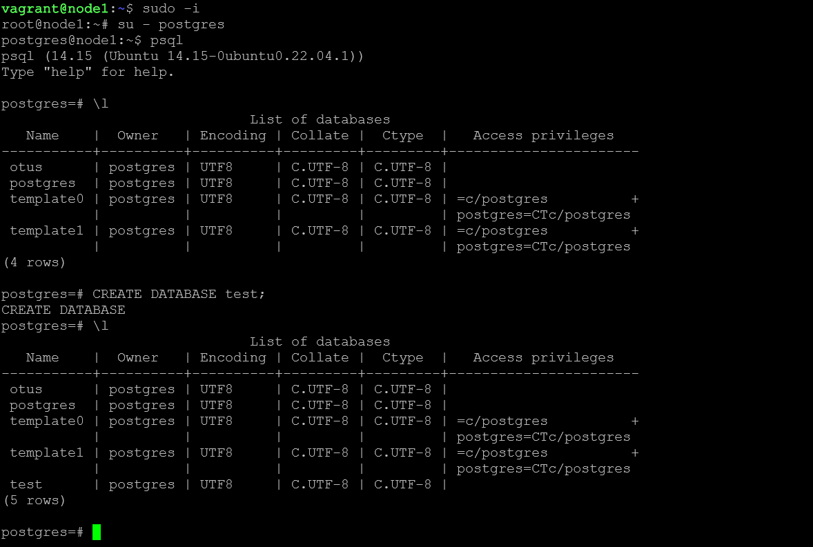

Заходим на node2 и проверяем создание базы

```text
┬─[anasha@otus:~/less46-2]─[18:41:18]
╰─o$ vagrant ssh node2
```

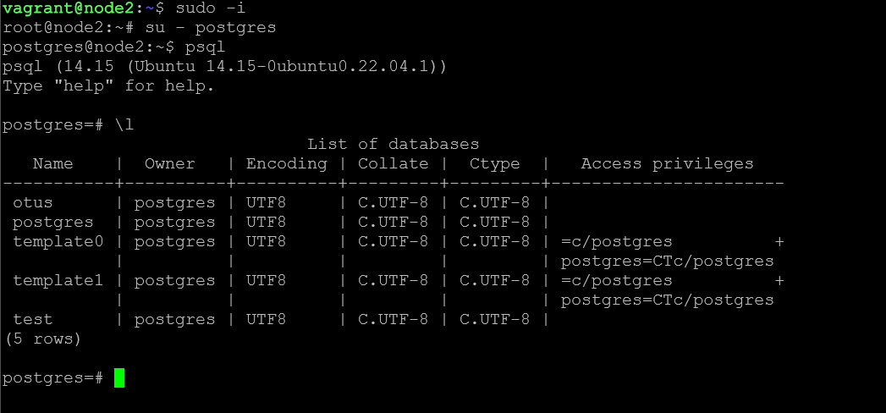

Также можно проверить репликацию другим способом: 

На хосте node1 в psql вводим команду: select * from pg_stat_replication;

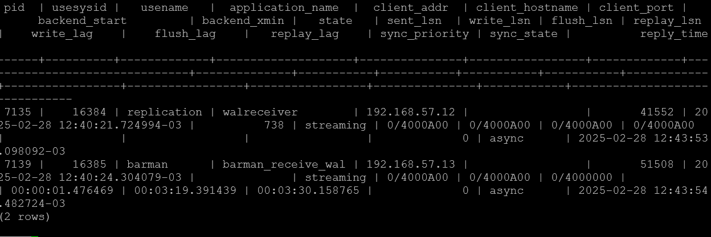

На хосте node2 в psql вводим команду: select * from pg_stat_wal_receiver;

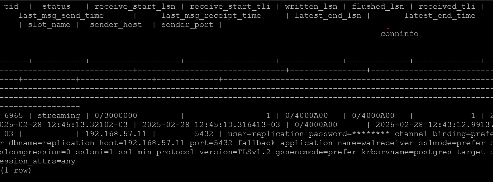

Репликация работает

### Проверка резервного копирования

Проверим работу barman. Заходим на хост barman

```text
┬─[anasha@otus:~/less46-2]─[18:50:38]
╰─o$ vagrant ssh barman
```

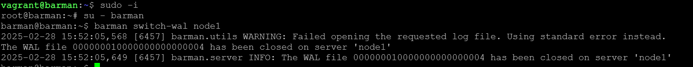

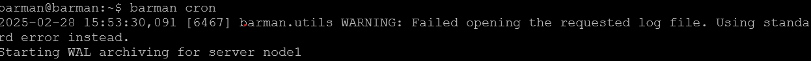

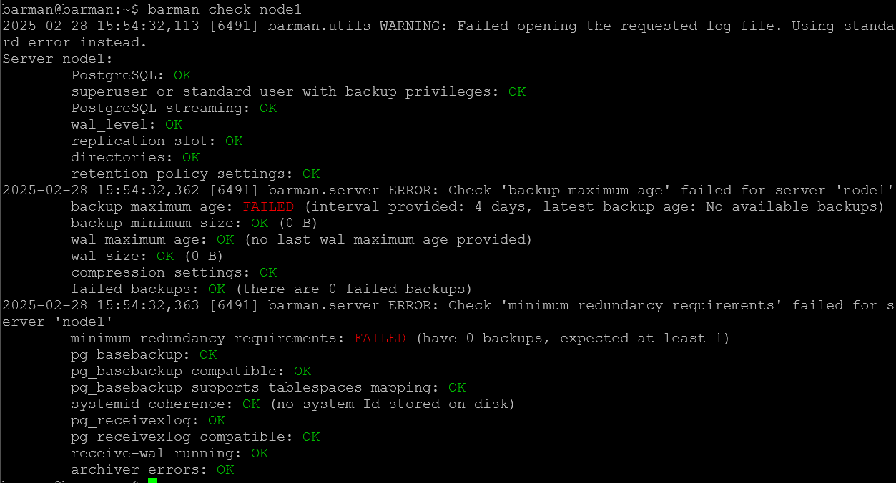

 После этого запускаем резервную копию: 

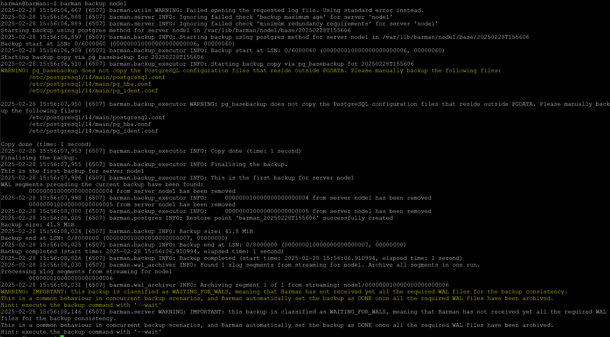

На этом процесс настройки бекапа закончен

Проверка восстановления из бекапов:

На хосте node1 в psql удаляем базы otus и test: 

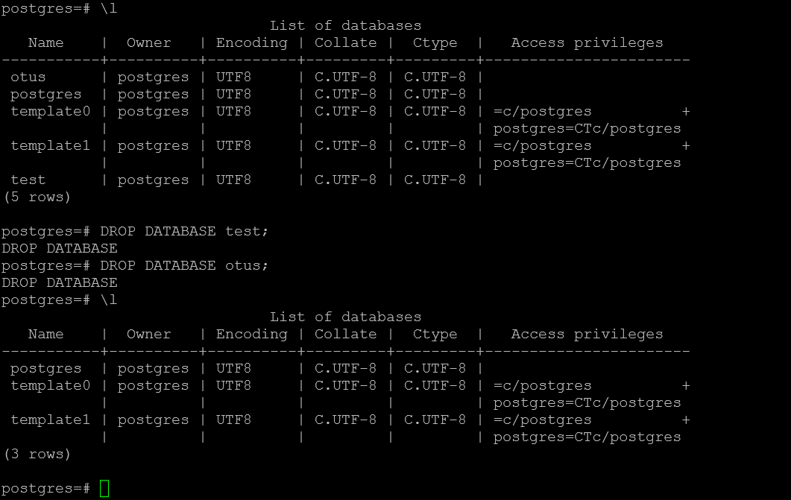

Далее на хосте barman запустим восстановление: 

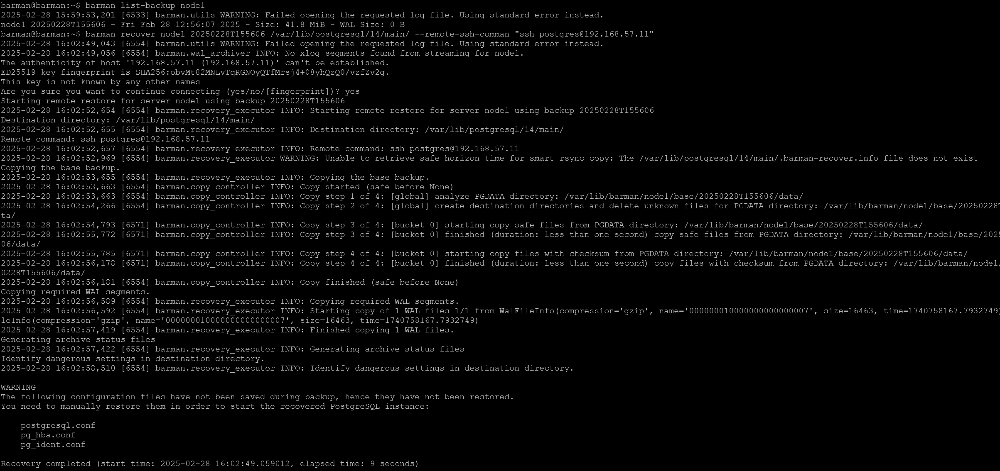


Далее на хосте node1 потребуется перезапустить postgresql-сервер и снова проверить список БД. Базы otus должны вернуться обратно… 

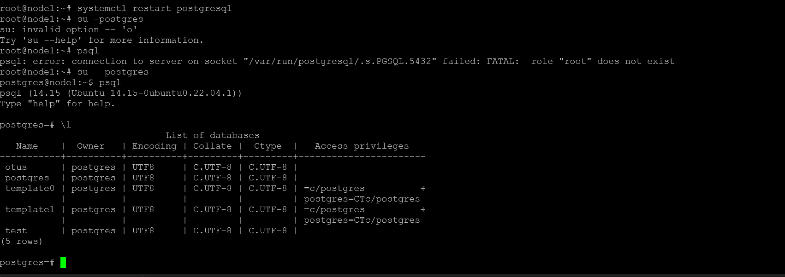

Базы вщсстановились

Задание на этом выполнено.

Все файлы работы, использованные в задании, доступны на [github](https://github.com/anashoff/otus/blob/master/lesson44)
