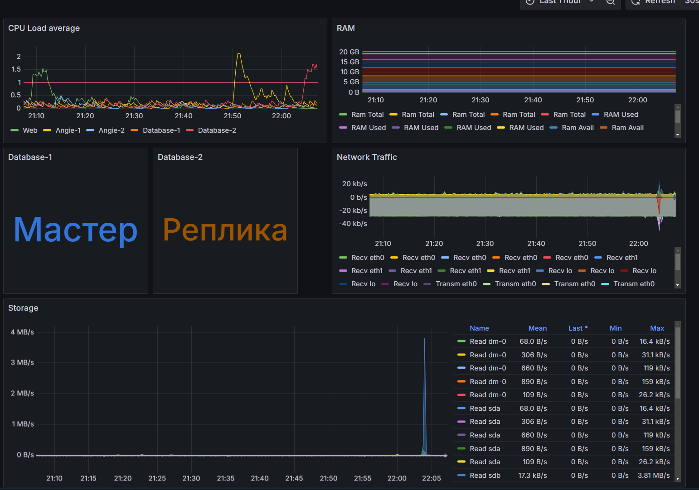

# Administrator Linux. Professional

## Проектная работа

Реализация информационного сервиса с балансировкой нагрузки, репликацией баз данных и автоматическим восстановлением сбойного узла

### Описание проектной работы

Целью данной работы является демонстрация навыков и знаний, полученных при прохождении курса Administrator Linux. Professional. 

В проектной работе выполняется развёртывание информационного сервиса, функционал которго уже начал внедряться в производственную среду. Сервис используется в деятельности испытательной лаборатории для ускоренного вывода лабораторной инфомации в браузер в удобной форме минуя тежеловесную систему управления лабораторной информацией. В работе используется реальная тестовая база данных и часть рабочего информационного веб-сервиса. 

Информационный комплекс состоит из сервера фронтненда, двух серверов бекенда, работающих в режиме балансировки нагрузки, двух серверов баз данных, с резервированием базы и системы мониторинга и логирования с уведомлениями в Telegram. На фронтенде используется HTTPS, включен файрвол.

Стенд разворачивается на шести виртуальных машинах с использованием vigrant и ansible.


Схема стенда

Пользователь обращается к фронтенд серверу WEB, который перенаправляет запрос на один из бекенд серверов angie, где уже непосредственно рабтает связка Angie - FastCGI через php-fpm. 
Выбор бекенд сервера происходит автоматически по принципу round-robin. 

Php-приложения на бекенд сервере выполняют запросы к базе данных PostgreSQL через stream прокси, через сокет 192.168.1.50:5432

В данном случае нет автоматической балансировки, текущий активный сервер баз данных указывается явно в настройках прокси.

Между серверами баз данных настроена физическая репликация. В случае выхода из строя мастер сервера баз данных администратор должен запустить плейбук чтобы поднять реплику до мастера и переключить stream прокси.

Для сбора метрик на серверы установлен node exporter. Для сбора логов - Grafana Alloy
Данные поступают на сервер Prometheus-Loki и визуализируются Grafana

### Описание среды выполнения

Стенд разворачивается при выполнении [Vagrantfile](https://github.com/anashoff/otus/blob/master/project/Vagrantfile).

```ruby
Vagrant.configure("2") do |config|
  boxes = [
    { :name => "db1",    :ip => "192.168.1.53", :disk => true },
    { :name => "db2",    :ip => "192.168.1.54", :disk => true },
    { :name => "web",    :ip => "192.168.1.50", :disk => false },
    { :name => "angie1", :ip => "192.168.1.51", :disk => false },
    { :name => "angie2", :ip => "192.168.1.52", :disk => false },
    { :name => "monilog",:ip => "192.168.1.56", :disk => false }
  ]

  boxes.each do |machine|
    config.vm.define machine[:name] do |node|
      node.vm.box = "bento/ubuntu-22.04"
      node.vm.hostname = machine[:name]

      # Настройка сети
      node.vm.network "public_network", ip: machine[:ip]

      # Базовые параметры VirtualBox
      node.vm.provider "virtualbox" do |vb|
        vb.memory = 4096
        vb.cpus = 4

        # Добавляем диск только для db1 и db2
        if machine[:disk]
          disk_path = File.expand_path("/ssd_storage/extra_disk_#{machine[:name]}")

          # Создаем виртуальный диск
          vb.customize [
            "createhd",
            "--filename", disk_path,
            "--size", 100 * 1024,  # 150 ГБ в MB
            "--variant", "Fixed"
          ]

          # Прикрепляем диск
          vb.customize [
            "storageattach", :id,
            "--storagectl", "SATA Controller",
            "--port", 1,
            "--device", 0,
            "--type", "hdd",
            "--medium", "#{disk_path}.vdi"
          ]
        end
      end
     # Автоматическое монтирование диска
      if machine[:disk]
        node.vm.provision "shell", privileged: true, inline: <<-SHELL
          # Проверяем наличие диска
          if [ -b /dev/sdb ]; then
            # Создаем раздел
            echo -e "n\\np\\n1\\n\\n\\nw\\n" | fdisk /dev/sdb
            # Форматируем в ext4
            mkfs.ext4 /dev/sdb1
            # Создаем точку монтирования
            mkdir -p /storage
            # Добавляем в fstab
            echo "/dev/sdb1 /storage ext4 defaults 0 0" >> /etc/fstab
            # Монтируем все
            mount -a
            # Даем права на папку
            chmod 0777 /storage
          else
            echo "Дополнительный диск не обнаружен!"
          fi
        SHELL
      end
      # Провижининг Ansible только для control-ноды
#      if machine[:name] == "control"
#        node.vm.provision "ansible" do |ansible|
#          ansible.playbook = "playbook.yaml"
#          ansible.inventory_path = "hosts.ini"
#          ansible.host_key_checking = false
#          ansible.become = true
#          ansible.limit = "all"
#        end
#      end
    end
  end
end
```

Дополнительные диски подключаются для размещения на них кластера базы данных.

Настройка стенда выполняется с помощью ролей ansible

[playbook.yaml](https://github.com/anashoff/otus/blob/master/project/playbook.yaml)

```yaml
---
- name: Развертывание хоста monilog
  hosts: monilog
  gather_facts: true
  become: yes
  roles:
    - monilog
  tags: ml

- name: Развертывание хоста web
  hosts: web
  gather_facts: true
  become: yes
  roles:
    - web
  tags: web

- name: Развертывание хоста angie-1
  hosts: angie1
  gather_facts: true
  become: yes
  roles:
    - angie1
  tags: an1

- name: Развертывание хоста angie-2
  hosts: angie2
  gather_facts: true
  become: yes
  roles:
    - angie2
  tags: an2

- name: Развертывание хоста database-1
  hosts: db1
  gather_facts: true
  become: yes
  roles:
    - db1-master
  tags: db1

- name: Развертывание хоста database-2
  hosts: db2
  gather_facts: true
  become: yes
  roles:
    - db2-slave
  tags: db2
...
```

Запуск отдельных ролей возможен с использованием тэгов.

Описания ролей

- [monilog](https://github.com/anashoff/otus/blob/master/project/roles/monilog/README.md) - Сервер мониторинга и сбора логов
- [web](https://github.com/anashoff/otus/blob/master/project/roles/web/README.md) - Сервер фронтенда 
- [angie1](https://github.com/anashoff/otus/blob/master/project/roles/angie1/README.md) -Сервер бекенда 1
- [angie2](https://github.com/anashoff/otus/blob/master/project/roles/angie2/README.md) - Сервер бекенда 2
- [db1-master](https://github.com/anashoff/otus/blob/master/project/roles/db1-master/README.md) - Сервер базы данных-1 в режиме мастера
- [db1-slave](https://github.com/anashoff/otus/blob/master/project/roles/db1-slave/README.md) - Сервер базы данных-1 в режиме реплики
- [db2-slave](https://github.com/anashoff/otus/blob/master/project/roles/db2-slave/README.md) - Сервер базы данных-2 в режиме реплики

Кроме основного плейбука в работе используются вспомогательные

- deploy_db.yml - первоначальное развертывание базы данных
- start_db1_as_slave.yaml - настраивает сервер database-1 как реплику
- promote_db1.yml - поднимает Database-1 из реплики до мастера
- promote_db2.yml - поднимает Database-2 из реплики до мастера


[deploy_db.yml](https://github.com/anashoff/otus/blob/master/project/base/deploy_db.yml)

```yaml
---
- name: Разворачивание базы из физического бакапа
  hosts: all
  become: yes
  gather_facts: true
  vars:
    - pg_data_dir: "/storage/postgres/"
    - pg_backup_path: "../files/base.tar.gz"
    - postgres_service: "postgresql"
    - wal_archive: "../files/pg_wal.tar.gz"


  tasks:
    - name: Остановка службы PostgreSQL 
      ansible.builtin.service:
        name: postgresql
        state: stopped

    - name: Удаление каталога с базой данных
      ansible.builtin.file:
        path: "{{ pg_data_dir }}"
        state: absent

    - name: Создание каталога базы данных
      ansible.builtin.file:
        path: "{{ pg_data_dir }}"
        state: directory
        owner: postgres
        group: postgres
        mode: '0700'

    - name: Распаковка базы данных
      ansible.builtin.unarchive:
        src: "{{ pg_backup_path }}"
        dest: "{{ pg_data_dir }}"
        owner: postgres
        group: postgres

    - name: Актуализация журнала транзакций
      ansible.builtin.unarchive:
        src: "{{ wal_archive }}"
        dest: "{{ pg_data_dir }}/pg_wal/"
        owner: postgres
        group: postgres

    - name: Запуск службы PostgreSQL
      ansible.builtin.service:
        name: "{{ postgres_service }}"
        state: started
```

[start_db1_as_slave.yaml](https://github.com/anashoff/otus/blob/master/project/start_db1_as_slave.yaml)

```yaml
---
- name: Развертывание хоста database-1
  hosts: db1
  gather_facts: true
  become: yes
  roles:
    - db1-slave
...
```
Описание роли

- [db1-slave](https://github.com/anashoff/otus/blob/master/project/roles/db1-slave/README.md) - Запуск сервера Database-1 в роли реплики
  
  
[promote_db1.yml](https://github.com/anashoff/otus/blob/master/project/promote_db1.yml)

```yaml
---
- name: Продвижние реплики PostgreSQL Database-1 до мастера
  hosts: db1
  become: yes
  vars:
    postgres_user: lims
    postgres_password: "qq1qq2qq3"
    postgres_db: postgres
    postgres_port: 5432

  tasks:
    - name: Продвигаем реплику до мастера
      become_user: postgres
      community.postgresql.postgresql_query:
        query: "SELECT pg_promote(true, 60);"  # Ждать 60 секунд
        login_host: "{{ ansible_eth1.ipv4.address }}"
        login_user: "{{ postgres_user }}"
        login_password: "{{ postgres_password }}"
        login_db: "{{ postgres_db }}"
        port: "{{ postgres_port }}"

- name: Настраиваем L4 Proxy на работу с Database-1
  hosts: web
  become: yes
  tasks:
  - name: Загружаем конфигурацию
    template:
      src: "pgstream53.conf.j2"
      dest: "/etc/angie/stream-enabled/pgstream.conf"
      mode: 0644
  - name: Перезагружаем Angie
    systemd:
      name: angie
      state: reloaded
```

[promote_db1.yml](https://github.com/anashoff/otus/blob/master/project/promote_db2.yml)

```yaml
---
- name: Продвижние реплики PostgreSQL Database-2 до мастера
  hosts: db2
  become: yes
  vars:
    postgres_user: lims
    postgres_password: "qq1qq2qq3"
    postgres_db: postgres
    postgres_port: 5432

  tasks:

  - name: Продвигаем реплику  до мастера
    become_user: postgres
    community.postgresql.postgresql_query:
      query: "SELECT pg_promote(true, 60);"
      login_host: "{{ ansible_eth1.ipv4.address }}"
      login_user: "{{ postgres_user }}"
      login_password: "{{ postgres_password }}"
      login_db: "{{ postgres_db }}"
      port: "{{ postgres_port }}"

- name: Настраиваем L4 Proxy на работу с Database-2
  hosts: web
  become: yes
  tasks:
  - name: Загружаем конфигурацию
    template:
      src: "pgstream54.conf.j2"
      dest: "/etc/angie/stream-enabled/pgstream.conf"
      mode: 0644
  - name: Перезагружаем Angie
    systemd:
      name: angie
      state: reloaded
```
Файлы конфигурации

[pgstream53.conf.j2](https://github.com/anashoff/otus/blob/master/project/templates/pgstream53.conf.j2)

```ruby

    upstream postgres_servers {
        server 192.168.1.53:5432;    # Активный сервер (работает по умолчанию)
        server 192.168.1.54:5432 down; # Резервный (отключен)
    }

    server {
        listen 192.168.1.50:5432;
        proxy_pass postgres_servers;
    }
```

 [pgstream54.conf.j2](https://github.com/anashoff/otus/blob/master/project/templates/pgstream54.conf.j2)

```ruby

      upstream postgres_servers {
        server 192.168.1.53:5432 down; # Резервный (отключен)
        server 192.168.1.54:5432;    # Активный сервер (работает по умолчанию)
    }

    server {
        listen 192.168.1.50:5432;
        proxy_pass postgres_servers;
    }  
```

База данных - это сильнопорезанная версия отладочной базы информационной системы. За счет очистки определенных таблиц, неиспользуемых в нашем демо стенде, размер базы с 90 Гб удалось уменьшить до 11 Гб. Размер же актуальной рабочей базы ИС - около 400 Гб


### Выполнение работы

Для развертывания стенда запускаем Vagrainfile


```text
┬─[anasha@otus:~/project]─[20:24:13]
╰─o$ vagrant up
```

Стенд запиускается примерно 7 минут

После создания и запуска ВМ нужно развернуть на них конфигурации с помощью ansible.
При первом запуске нам также будет нужно развернуть на сервер Database-1 дамп базы, поэтому, чтобы на Database-2 норамльно запустилась репликация первый запуск ролей делаем без Database-2

```text
┬─[anasha@otus:~/project]─[20:24:13]
╰─o$ ansible-playbook playbook.yaml --skip-tags db2
```
Плейбук работает около 15 минут

Стенд развернут с пустой базой данных. Продолжаем? разворачиваем базу из бекапа

```text
┬─[anasha@otus:~/project]─[20:24:13]
╰─o$ cd base
┬─[anasha@otus:~/p/base]─[20:33:37]
╰─o$ ansible-playbook deploy_db.yml
```
Этот плейбук работает около 17 минут

Делее запускаем настройку и репликацию Database-2

```text
┬─[anasha@otus:~/p/base]─[20:48:51]
╰─o$ cd ..
┬─[anasha@otus:~/project]─[20:48:55]
╰─o$ ansible-playbook playbook.yaml --tags db2
```
Плейбук работает около 7 минут

Теперь у нам полностью рабочий стенд

Для имитации выхода из строя серверов можно с помощью vagrant удалить любой сервер, а затем с помощью vagrant и ansible запустить его снова

| Сервер | Удаление | Запуск |
|--------|----------|--------|
| Web    | vagrant destroy web | vagrant up web + ansible-playbook playbook.yaml --tag web |
| Angie-1 | vagrant destroy angie1 | vagrant up angie1 + ansible-playbook playbook.yaml --tag an1 |
| Angie-2 | vagrant destroy angie2 | vagrant up angie2 + ansible-playbook playbook.yaml --tag an2 |
| Monilog | vagrant destroy monilog | vagrant up monilog + ansible-playbook playbook.yaml --tag ml |

В случае выхода из строя (удаления) серверов баз данных кроме того нужно учитывать режим работы серверов чтобы переключить реплику в режим мастера и перенастроить прокси L4

Так при остановке сервера Database-1  мастером нужно сделать Database-2

Для этого 

(имитируем отказ Database-1)
```text
┬─[anasha@otus:~/project]─[21:07:31]
╰─o$ vagrant destroy db1
```

Ззапускаем плейбук 

```text
┬─[anasha@otus:~/project]─[21:07:31]
╰─o$ ansible-playbook promote_db2.yml
```
Теперь у нас Databese-2 стал мастером, и прокси направляет запросы к нему.

Возвращаем Database-1

```text
┬─[anasha@otus:~/project]─[21:07:31]
╰─o$ vagrant up db1

┬─[anasha@otus:~/project]─[21:07:31]
╰─o$ ansible-playbook start_db1_as_slave.yaml
```
После чего Database-1 работает в режиме реплики.

Если мы хотим вернуть все к исходному состоянию, нужно удалить Database-2, поднять Database-1 до мастера и заново развернуть Database-2

Это делается цепочкой команд

```text
┬─[anasha@otus:~/project]─[21:07:31]
╰─o$ vagrant destroy db2

┬─[anasha@otus:~/project]─[21:07:31]
╰─o$ ansible-playbook promote_db1.yml

┬─[anasha@otus:~/project]─[21:07:31]
╰─o$ vagrant up db2

┬─[anasha@otus:~/project]─[21:07:31]
╰─o$ ansible-playbook playbook.yaml --tags db2
```

### Интерфейсы стенда

Пользовательская точка входа

Пользователь входит в систему по адресу https://192.168.1.50 и попадает на главную страницу. Далее по кнопкам и ссылкам. 


Администраторские точки входа

Дашборд grafana для просмотра метрик http://192.168.1.56:3000 - далее меню Logs



Интерфейс grafana для просмотра логов http://192.168.1.56:3000 - далее меню Dashboards


Интерфейс Prometheus  http://192.168.1.56:9090/targets?search=


Отладочные интерфейсы Alloy - на 12345 порту, например http://192.168.1.53:12345/graph


