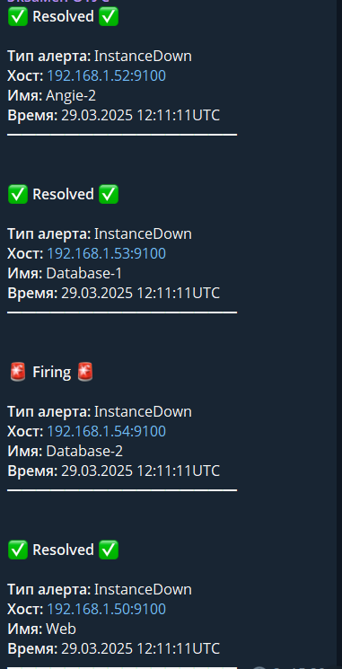

# Administrator Linux. Professional

## Сервер мониторинга и сбора логов

Требования, предъявляемые к серверу

Виртуальная машина обеспечивает функционал:

- Централизованный сбор метрик и логов
- передачу алертов в Telegram
- Отображение метрик и логов на дашбордах

### Описание сервера

В качестве сервера используется виртуальная машина с установленной Ubuntu 22.04. 

Сервер разворачивается с помощью **vagrant и ansible**.

Для сбора метрик использовется связка **Prometheus - Node Exporter**

Алерты выполняет **alertmanager**

Для сбора логов используется **Loki**

Для отображения дашбордов используется **Grafana**. Для автоматической настройки Grafana используется провижионинг настроек источников данных Prometheus, Loki, Postgresql, и преднастроенного дашборда.

Все необходимые сервисы развертываются в docker с помощью docker compose, что в основном обусловлено доступностью нужных приложений в РФ.

### Развертывание среды выполнения

Виртуальная машина развертывается при выполнении [Vagrantfile](https://github.com/anashoff/otus/blob/master/project/Vagrantfile) в составе всего стенда или одельно.

Далее развертывание продолжается при выполнении роли ansible

#### Роль 

 [monilog](https://github.com/anashoff/otus/blob/master/project/roles/monilog/tasks/main.yaml)

```yaml
---
##### Установка утилит
- include_tasks: ../../common/tasks/install_utils.yml
##### Настройка времени
- include_tasks: ../../common/tasks/setup_time.yml

#####  Установка docker
- name: Очистка старых версий Docker
  apt:
    name: "{{ item }}"
    state: absent
    purge: yes
  loop:
    - docker.io
    - docker-doc
    - docker-compose
    - podman-docker
    - containerd
    - runc
  ignore_errors: yes
- name: Установка вспомогательных утилит
  apt:
    name:
      - gnupg
    state: present
    update_cache: yes
- name: Создание каталога для ключа репозитория
  file:
    path: /etc/apt/keyrings
    state: directory
    mode: '0755'
- name: Загрузка ключа  Docker GPG
  ansible.builtin.get_url:
    url: https://download.docker.com/linux/ubuntu/gpg
    dest: /etc/apt/keyrings/docker.asc
    mode: '0644'
- name: Добавление репозитория Docker
  apt_repository:
    repo: >-
      deb [arch=amd64 signed-by=/etc/apt/keyrings/docker.asc]
      https://download.docker.com/linux/ubuntu
      {{ ansible_facts.lsb.codename }}
      stable
    state: present
    filename: docker
    update_cache: yes
- name: Установка Docker
  apt:
    name:
      - docker-ce
      - docker-ce-cli
      - containerd.io
      - docker-buildx-plugin
      - docker-compose-plugin
    state: latest
    update_cache: yes
- name: Запуск сервиса Docker  
  service:
    name: docker
    state: started
    enabled: yes

##### Установка Prometheus, Grafana...
- name: Создание каталога для docker compose
  file:
    path: "{{ compose_dir }}"
    state: directory
    mode: 0755

- name: Передача настроек Prometheus
  template:
    src: prometheus.yml.j2
    dest: "{{ compose_dir }}/{{ prometheus_config }}"
    mode: 0644

- name: Передача настроек источников данных  Prometheus
  template:
    src: datasource.yml.j2
    dest: "{{ compose_dir }}/datasource.yml"
    mode: 0644

- name: Передача настроек Alertmanager
  template:
    src: alertmanager.yml.j2
    dest: "{{ compose_dir }}/{{ alertmanager_config }}"
    mode: 0644

- name: Передача настроек бота Telegram
  template:
    src: telegram.tmpl.j2
    dest: "{{ compose_dir }}/{{ telegram_template }}"
    mode: 0644

- name: Передача настроек правил алертов
  template:
    src: alert.rules.yml.j2
    dest: "{{ compose_dir }}/{{ alert_rules }}"
    mode: 0644

- name: Передача настроек Loki
  template:
    src: loki-config.yaml.j2
    dest: "{{ compose_dir }}/loki-config.yaml"
    mode: 0644

- name: Передача настроек провиженинга дашборда Grafana
  template:
    src: dashboard.yml.j2
    dest: "{{ compose_dir }}/dashboard.yml"
    mode: 0644  

- name: Передача дашборда Grafana
  template:
    src: dashboard.json.j2
    dest: "{{ compose_dir }}/dashboard.json"
    mode: 0644  

##### Запуск docker compose
- name: Передача файла Docker Compose
  template:
    src: docker-compose.yml.j2
    dest: "{{ compose_dir }}/docker-compose.yml"
    mode: 0644
  notify: Restart stack

- name: Запуск контейнеров Docker Compose
  command: docker compose -f docker-compose.yml up -d
  args:
    chdir: "{{ compose_dir }}"
  register: compose_output
  changed_when:
    - "'Creating' in compose_output.stdout"
    - or "'Recreating' in compose_output.stdout"
```

Задачи с директивами include tasks описаны в разделе [Общие задачи](https://github.com/anashoff/otus/tree/master/project/roles/common#readme) 

Функционал остальных задачи развертывания ясен из названия.

#### Файл конфигурации Prometheus

[prometheus.yml.j2](https://github.com/anashoff/otus/blob/master/project/roles/monilog/templates/prometheus.yml.j2)

```yaml
global:
  scrape_interval: 10s
  evaluation_interval: 10s

alerting:
  alertmanagers:
  - static_configs:
    - targets:
      - alertmanager:9093

rule_files:
  - /etc/prometheus/alert.rules.yml

scrape_configs:
  - job_name: 'Prometheus Monitoring Server'
    scrape_interval: 5s
    static_configs:
      - targets: ['prometheus:9090']
  - job_name: 'Web'
    scrape_interval: 5s
    static_configs:
      - targets: ['192.168.1.50:9100']
  - job_name: 'Angie-1'
    scrape_interval: 5s
    static_configs:
      - targets: ['192.168.1.51:9100']
  - job_name: 'Angie-2'
    scrape_interval: 5s
    static_configs:
      - targets: ['192.168.1.52:9100']
  - job_name: 'Database-1'
    scrape_interval: 5s
    static_configs:
      - targets: ['192.168.1.53:9100']
  - job_name: 'Database-2'
    scrape_interval: 5s
    static_configs:
      - targets: ['192.168.1.54:9100']
```

#### Файл настройки правил алертов

[alert.rules.yml.j2](https://github.com/anashoff/otus/blob/master/project/roles/monilog/templates/alert.rules.yml.j2)

```yaml

groups:
- name: example
  rules:
  - alert: InstanceDown
    expr: up == 0
    for: 10s
    labels:
      severity: critical
    annotations:
      summary: "Instance {{ $labels.instance }} down"
      description: "{{ $labels.instance }} of job {{ $labels.job }} has been down for more than 30 seconds."

```

#### Файл конфигурации alertmanager

[alertmanager.yml.j2](https://github.com/anashoff/otus/blob/master/project/roles/monilog/templates/alertmanager.yml.j2)

```yaml

route:
  group_by: ['alertname']
  group_wait: 10s
  group_interval: 1m
  repeat_interval: 3h
  receiver: 'telegram-notifications'
templates:
  - '/etc/alertmanager/telegram.tmpl'
receivers:
- name: 'telegram-notifications'
  telegram_configs:
  - bot_token: "76104"
    chat_id: -1002390
    api_url: "https://api.telegram.org"
    message: '{{ template "telegram.default" . }}'
    parse_mode: HTML
    send_resolved: true

```

#### Файл шаблона сообщения в telegram

[telegram.tmpl.j2](https://github.com/anashoff/otus/blob/master/project/roles/monilog/templates/telegram.tmpl.j2)

```jinja

{{ define "telegram.default" }}
{{ if gt (len .Alerts) 0 }}
{{ range .Alerts }}
{{ if eq .Status "firing"}}
<b>🚨 {{ .Status | title }} 🚨</b>
{{ else }}
<b>✅ {{ .Status | title }} ✅</b>
{{ end }}
<b>Тип алерта:</b> {{ .Labels.alertname  }}
<b>Хост:</b> {{ .Labels.instance  }}
<b>Имя:</b> {{ .Labels.job  }}
<b>Время:</b> {{ .StartsAt.Format "02.01.2006 15:04:05" }}UTC
━━━━━━━━━━━━━━━━
{{ end }}
{{ end }}
{{ end }}

```

#### Файл конфигурации Loki

[loki-config.yaml.j2](https://github.com/anashoff/otus/blob/master/project/roles/monilog/templates/loki-config.yaml.j2)

```yaml
auth_enabled: false

server:
  http_listen_port: 3100
  grpc_listen_port: 9096
  log_level: debug
  grpc_server_max_concurrent_streams: 1000

common:
  instance_addr: 0.0.0.0  # Важно для Docker!
  path_prefix: /loki
  storage:
    filesystem:
      chunks_directory: /loki/chunks
      rules_directory: /loki/rules
  replication_factor: 1
  ring:
    kvstore:
      store: inmemory

limits_config:
  allow_structured_metadata: true
  volume_enabled: true

schema_config:
  configs:
    - from: 2020-10-24
      store: tsdb
      object_store: filesystem
      schema: v13
      index:
        prefix: index_
        period: 24h

storage_config:
  tsdb_shipper:
    active_index_directory: /loki/index
    cache_location: /loki/cache
```

#### Файл провижионинга шаблона дашборда для grafana

[dashboard.json.j2](https://github.com/anashoff/otus/blob/master/project/roles/monilog/templates/dashboard.json.j2) 

Доступен по ссылке

#### Файл провижионинга настройки дашборда для grafana

[dashboard.yml.j2](https://github.com/anashoff/otus/blob/master/project/roles/monilog/templates/dashboard.yml.j2)

```yaml
apiVersion: 1

providers:
- name: 'default'
  orgId: 1
  folder: ''
  type: file
  disableDeletion: false
  editable: true
  options:
    path: /etc/grafana/provisioning/dashboards
```
#### Файл провижионинга источников данных для grafana

[datasource.yml.j2](https://github.com/anashoff/otus/blob/master/project/roles/monilog/templates/datasource.yml.j2)

```yaml
apiVersion: 1
datasources:
  - name: Prometheus
    type: prometheus
    access: proxy
    url: http://192.168.1.56:9090
    isDefault: true  # Сделать источником по умолчанию
    uid: prometheusdatasource
    jsonData:
    version: 1

  - name: postgresql53
    type: postgres
    access: proxy
    url: 192.168.1.53:5432
    database: postgres
    user: lims
    secureJsonData:
      password: qq1qq2qq3
    uid: postgresql53datasources
    jsonData:
      sslmode: disable
      maxOpenConns: 100
      maxIdleConns: 100
      maxIdleConnsAuto: true
      connMaxLifetime: 14400
      postgresVersion: 1400
      timescaledb: false
    editable: true
  - name: postgresql54
    type: grafana-postgresql-datasource
    access: proxy
    url: 192.168.1.54:5432
    uid: postgresql54datasources
    database: postgres
    user: lims
    secureJsonData:
      password: qq1qq2qq3
    jsonData:
      sslmode: disable
      maxOpenConns: 100
      maxIdleConns: 100
      maxIdleConnsAuto: true
      connMaxLifetime: 14400
      postgresVersion: 1400
      timescaledb: false
    editable: true
  - name: Loki
    type: loki
    access: proxy
    url: http://192.168.1.56:3100
    uid: lokidatasource 
    jsonData:
      maxLines: 1000
      derivedFields:
        - datasourceUid: prometheusdatasource
          matcherRegex: (?:pod|container)=("?)([^"]*)\1
          name: Prometheus
          url: http://192.168.1.56:9090
```

### Файл docker compose

[docker-compose.yml.j2](https://github.com/anashoff/otus/blob/master/project/roles/monilog/templates/docker-compose.yml.j2)

```yaml
version: '3.8'

services:
  prometheus:
    image: prom/prometheus:latest
    container_name: prometheus
    ports:
      - "9090:9090"
    volumes:
      - ./{{ prometheus_config }}:/etc/prometheus/prometheus.yml
      - ./alert.rules.yml:/etc/prometheus/alert.rules.yml
    networks:
      - monitoring
    restart: unless-stopped
    depends_on:
      - alertmanager

  alertmanager:
    image: prom/alertmanager:latest
    container_name: alertmanager
    ports:
      - "9093:9093"
    volumes:
      - ./alertmanager.yml:/etc/alertmanager/alertmanager.yml
      - ./telegram.tmpl:/etc/alertmanager/telegram.tmpl
    networks:
      - monitoring
    restart: unless-stopped

  node_exporter:
    image: prom/node-exporter:latest
    container_name: node_exporter
    ports:
      - "9100:9100"
    networks:
      - monitoring
    restart: unless-stopped

  loki:
    image: grafana/loki:latest
    container_name: loki
    ports:
      - "3100:3100"
    networks:
      - monitoring
    command: -config.file=/etc/loki/local-config.yaml
    volumes:
      - loki-data:/loki
      - ./loki-config.yaml:/etc/loki/local-config.yaml
    restart: unless-stopped

  grafana:
    image: grafana/grafana-enterprise:latest
    container_name: grafana
    ports:
      - "3000:3000"
    volumes:
      - grafana-storage:/var/lib/grafana
      - ./datasource.yml:/etc/grafana/provisioning/datasources/datasource.yml
      - ./dashboard.yml:/etc/grafana/provisioning/dashboards/dashboard.yml
      - ./dashboard.json:/etc/grafana/provisioning/dashboards/dashboard.json
      
    networks:
      - monitoring
    environment:
      - GF_FEATURE_TOGGLES_ENABLE=tempoSearch,lokiLive
    restart: unless-stopped

networks:
  monitoring:
    driver: bridge

volumes:
  grafana-storage:
  loki-data:
```
#### Хендлеры

[main.yaml](https://github.com/anashoff/otus/blob/master/project/roles/monilog/handlers/main.yaml)

```yaml
- name: Restart stack
  command: docker compose -f docker-compose.yml restart
  args:
    chdir: "{{ compose_dir }}"
```
#### Переменные

```yaml
compose_dir: /opt/monitoring
compose_file: docker-compose.yml
prometheus_config: prometheus.yml
alertmanager_config: alertmanager.yml
alert_rules: alert.rules.yml
telegram_template: telegram.tmpl
loki_version: "2.9.4"
promtail_version: "2.9.4"
grafana_repo_url: "https://apt.grafana.com"
```

### Работа с сервером

Запуск сервера происходит при выполнении [Vagrantfile](https://github.com/anashoff/otus/blob/master/project/Vagrantfile) в составе всего стенда или отдельно по команде

```vagrant up monilog```

Настройка серера выполняеться в составе всего стенда или одельно по команде

```ansible-pleybook playbook.yml --tag ml```

Общее время развертывания сервера ~ 5 минут.

Выключение сервера 

```vagrant halt monilog```

Стирание виртуальной машины

```vagrant destroy monilog```

### Приложение. Настройка Telegram на прием алертов

Для приемка алертов из Alertmanager нужно настроить телеграм-бота

Находим в телеграме отца всех ботов @BotFather и пишем ему:

``` /start```

В ответ бот выдаст список всех команд, с помощью которых можно создать и управлять своим ботом. Начинаем с создания бота:

```/newbot```

BotFather запросит имя для этого бота и его юзернейм в телеграм. 

Введем, например, имя

```my_otus_alert```

Юзернейм должен заканчиваться на bot

```my_otus_alert_bot```

@BotFather напишет нам токен, его мы вставляем в файл alertmanager.yml в поле

``` 
telegram_configs:
  - bot_token: "_токен_вставляем_сюда_"
```

Далее создаем канал в Telegram, куда будут приходить сообщения, добавляем в этот канал нашего бота и даем ему права администратора.

Теперь отправляем в канал любое сообщение и переходим по ссылке https://api.telegram.org/bot<ВАШ_ТОКЕН>/getUpdates и ищем поле id: 

``` id: -10028736298746```

Значение у этого поля обязательно должно быть отрицательным. Это будет ID канала, его мы  вставляем  в файл alertmanager.yml в поле

```
  chat_id: -10028736298746
```
После этого наши алерты начнут поступать в наш канал

Пример вида алерта


